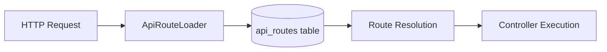
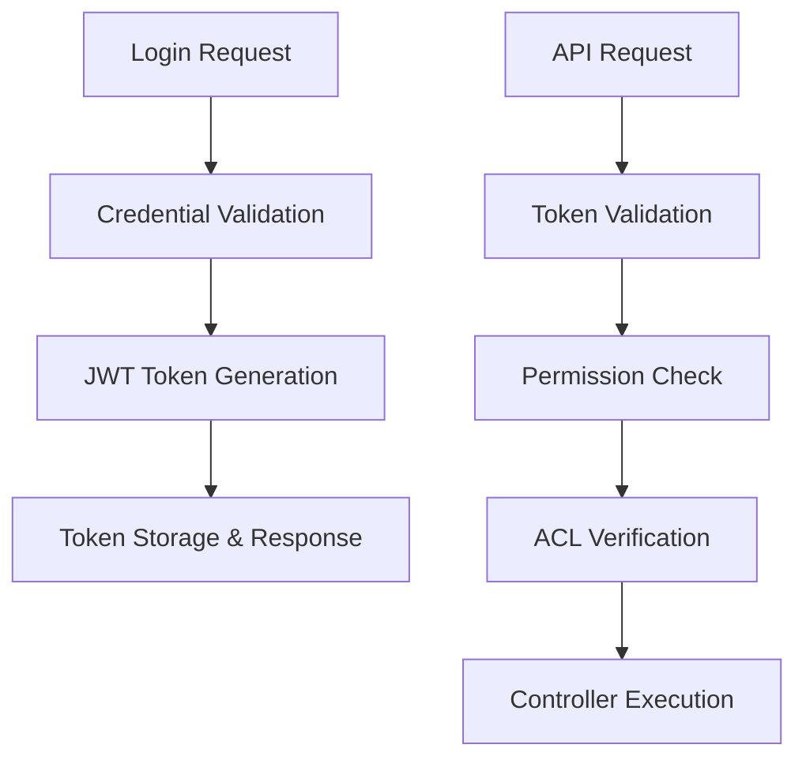
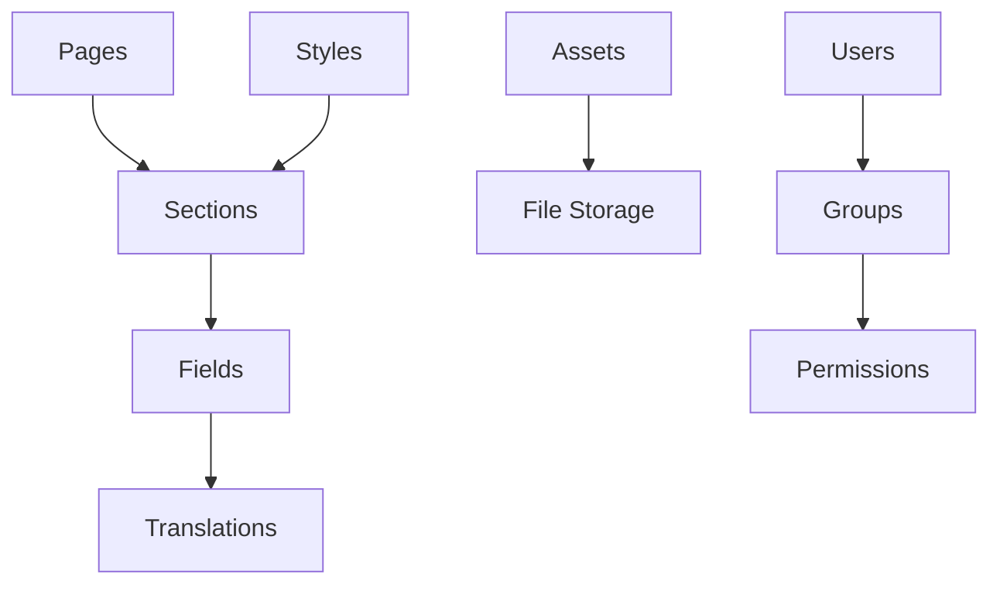

# SelfHelp Symfony Backend - Core Patterns & Best Practices Summary

## 🚀 Project Overview
**SelfHelp Symfony Backend** - A sophisticated database-driven REST API system built with Symfony 7.2 and PHP 8.3, implementing dynamic routing, comprehensive security, and strict data integrity patterns.

## 🏗️ Core Architecture Principles

### 1. **Database-Driven Configuration**
- **Dynamic Routing**: All API routes stored in `api_routes` table, loaded at runtime
- **Permission Management**: Route permissions managed through database relationships
- **Configuration Flexibility**: System settings and behavior controlled via database
- **Zero-Downtime Updates**: Route changes without code deployment

### 2. **Multi-Layer Security Architecture**
```
Request → Firewall → JWT Auth → Route Permissions → ACL → Business Logic
```
- **JWT Authentication**: Stateless token-based authentication with refresh tokens
- **Route-Level Permissions**: Database-driven permission checks per endpoint
- **Fine-Grained ACL**: Page-level CRUD permissions using stored procedures
- **Comprehensive Audit**: All operations logged via TransactionService

### 3. **Strict Version Management**
- **Semantic Versioning**: Major (DB changes), Minor (code changes)
- **Database Versioning**: Tracked in `version` table with SQL update scripts
- **API Versioning**: URL-based versioning with namespace separation
- **Backward Compatibility**: Multiple API versions supported simultaneously

### 4. **Transaction Integrity**
- **ACID Compliance**: All CUD operations wrapped in database transactions
- **Audit Trail**: Complete change tracking via TransactionService
- **Rollback Safety**: Automatic rollback on failures
- **Data Consistency**: Entity-database synchronization enforced

## 📊 System Components

### Dynamic Routing System


**Key Features:**
- Routes loaded from database at application boot
- Automatic controller namespace mapping
- Permission integration at route level
- Caching for performance optimization

### Authentication & Authorization


**Security Layers:**
1. **Symfony Security Firewall**: Basic route protection
2. **JWT Token Authentication**: User identity verification
3. **Route Permissions**: Database-driven endpoint access
4. **ACL System**: Fine-grained resource permissions
5. **Business Logic Validation**: Service-level checks

### Content Management System


## 🔧 Development Patterns

### Entity Development Rules
```php
// ✅ CORRECT - Association objects
#[ORM\ManyToOne(targetEntity: User::class)]
private ?User $user = null;

// ❌ WRONG - Primitive foreign keys
private ?int $idUsers = null;
```

**ENTITY RULE**: When designing entities, always use association objects instead of primitive foreign key setters/getters.

### Service Transaction Pattern
```php
public function createResource($data): Entity
{
    $this->entityManager->beginTransaction();
    try {
        // Create entity
        $entity = new Entity();
        $this->entityManager->persist($entity);
        $this->entityManager->flush();

        // Log transaction
        $this->transactionService->logTransaction(
            LookupService::TRANSACTION_TYPES_INSERT,
            LookupService::TRANSACTION_BY_BY_USER,
            'table_name',
            $entity->getId(),
            $entity
        );

        $this->entityManager->commit();
        return $entity;
    } catch (\Exception $e) {
        $this->entityManager->rollback();
        throw $e;
    }
}
```

### Controller Response Pattern
```php
public function createResource(Request $request): JsonResponse
{
    try {
        $validatedData = $this->validateRequest(
            $request,
            'requests/admin/create_resource',
            $this->jsonSchemaValidationService
        );

        $resource = $this->service->createResource($validatedData);

        return $this->responseFormatter->formatSuccess(
            $resource,
            'responses/admin/resource',
            Response::HTTP_CREATED
        );
    } catch (RequestValidationException $e) {
        return $this->responseFormatter->formatError(
            'Validation failed',
            Response::HTTP_BAD_REQUEST,
            $e->getValidationErrors()
        );
    }
}
```

## 🔄 ReworkedCacheService - Generation-Based Cache System

### Core Features
1. **ReworkedCacheService** - Advanced tag-based cache service with generation-based invalidation
2. **Builder Pattern** - Immutable service instances with `withCategory()` and `withPrefix()` methods
3. **Generation-Based Invalidation** - O(1) cache invalidation using generation counters
4. **Dual Cache Types** - Separate handling for lists (collections) and items (individual entities)
5. **Automatic Statistics** - Built-in hit/miss/set/invalidate tracking per category
6. **Tag-Based Operations** - Fine-grained invalidation using cache tags

### Usage Pattern
```php
// Builder pattern with automatic cache-or-compute
$data = $this->cache
    ->withCategory(ReworkedCacheService::CATEGORY_ACTIONS)
    ->getList("actions_page_{$page}", fn() => $repository->getData());
```

### Critical Invalidation Rules
**MEMORY RULE**: When using entity scope invalidation (`invalidateEntityScope`), you **MUST** also invalidate all lists in the same category by calling `invalidateAllListsInCategory` for that category.

```php
// ✅ CORRECT: Entity scope + list invalidation
$this->cache->invalidateEntityScope(ReworkedCacheService::ENTITY_SCOPE_USER, $userId);
$this->cache
    ->withCategory(ReworkedCacheService::CATEGORY_USERS)
    ->invalidateAllListsInCategory();
```

### CRUD Invalidation Strategy
- **CREATE**: Only invalidate lists (new entities don't exist in cache)
- **UPDATE**: Entity scope invalidation + list invalidation
- **DELETE**: Entity scope invalidation + list invalidation

### Multi-Entity Relationship Invalidation
When entities have relationships (User ↔ Group, User ↔ Role), updating one entity often affects cache entries that depend on related entities:

```php
// User-Group relationship change
$this->cache->invalidateEntityScope(ReworkedCacheService::ENTITY_SCOPE_USER, $userId);
$this->cache->invalidateEntityScopes(ReworkedCacheService::ENTITY_SCOPE_GROUP, $groupIds);

// Invalidate lists in BOTH categories
$this->cache->withCategory(ReworkedCacheService::CATEGORY_USERS)->invalidateAllListsInCategory();
$this->cache->withCategory(ReworkedCacheService::CATEGORY_GROUPS)->invalidateAllListsInCategory();
```

## 📋 JSON Schema Validation

### Request/Response Validation
- All API requests validated against JSON schemas
- Response validation in debug mode
- Versioned schemas in `config/schemas/api/v1/`
- Automatic error reporting with detailed messages

### Schema Organization
```
config/schemas/api/v1/
├── requests/admin/create_page.json
├── responses/admin/pages/page.json
└── entities/pageEntity.json
```

## 🔄 API Design Principles

### Universal Response Envelope
All API responses follow a consistent JSON envelope structure:

```json
{
    "status": 200,
    "message": "OK",
    "error": null,
    "logged_in": true,
    "meta": {
        "version": "v1",
        "timestamp": "2025-01-23T10:30:00Z"
    },
    "data": { }
}
```

### URL Structure & Naming
```
/cms-api/{version}/{area}/{resource}[/{id}][/{action}]
```

**Examples:**
- `GET /cms-api/v1/admin/pages` - List pages
- `GET /cms-api/v1/admin/pages/123` - Get specific page
- `POST /cms-api/v1/admin/pages` - Create page
- `PUT /cms-api/v1/admin/pages/123` - Update page
- `DELETE /cms-api/v1/admin/pages/123` - Delete page

### HTTP Methods & Status Codes
| Method | Purpose | Request Body | Response Body |
|--------|---------|--------------|---------------|
| GET | Retrieve resource(s) | None | Resource data |
| POST | Create new resource | Resource data | Created resource |
| PUT | Update entire resource | Complete resource | Updated resource |
| PATCH | Partial update | Changed fields | Updated resource |
| DELETE | Remove resource | None | Confirmation |

## 🗄️ Database Architecture

### Core Tables
- **`api_routes`**: Dynamic route definitions
- **`users`, `groups`, `permissions`**: Authentication/authorization
- **`pages`, `sections`, `fields`**: CMS content structure
- **`acl_users`, `acl_groups`**: Fine-grained access control
- **`transactions`**: Audit trail
- **`version`**: Database version tracking

### Key Relationships
- Users belong to Groups
- Groups have Permissions
- Routes require Permissions
- Pages have ACL rules
- All changes logged in Transactions

## 🔐 ACL System

### Two Separate ACL Systems

#### 1. Admin Role-Based System (CMS Backend)
- **Purpose**: Controls access to admin API routes and CMS functionality
- **Users**: Admin users, editors, content managers
- **Tables**: `roles`, `permissions`, `users_roles`, `roles_permissions`, `api_routes_permissions`

#### 2. Frontend User ACL System (Website Access)
- **Purpose**: Fine-grained page-level permissions for website content
- **Users**: Frontend website users, regular users
- **Tables**: `groups`, `users_groups`, `acl_users`, `acl_groups`
- **Scope**: Page visibility and interaction permissions

### ACL Permission Logic
1. **User-Specific Rules**: Direct user-to-page ACL rules take precedence
2. **Group Rules**: User inherits permissions from all groups they belong to
3. **Maximum Permission**: Uses MAX() to grant access if ANY rule allows it
4. **Default Deny**: Returns 0 (deny) if no rules exist for the user/page combination

### ACL Stored Procedure
```sql
CALL get_user_acl(userId, pageId)
-- Returns: acl_select, acl_insert, acl_update, acl_delete
```

## 📈 Transaction Logging

### Transaction Types
- **INSERT**: Record creation
- **UPDATE**: Record modification
- **DELETE**: Record deletion
- **SELECT**: Record access (read)
- **LOGIN**: User login
- **LOGOUT**: User logout

### Transaction Sources
- **USER**: Action performed by user
- **SYSTEM**: System-generated action
- **ADMIN**: Administrative action
- **API**: API-triggered action
- **SCHEDULED**: Scheduled job action
- **MIGRATION**: Database migration

### Transaction Log Structure
```json
{
  "verbal_log": "Page created: welcome-page by user",
  "url": "/cms-api/v1/admin/pages",
  "session": "sess_abc123def456",
  "ip_address": "192.168.1.100",
  "user_agent": "Mozilla/5.0...",
  "table_row_entry": {
    "id": 123,
    "keyword": "welcome-page",
    "url": "/welcome"
  },
  "changes": {
    "before": {"keyword": "old-welcome"},
    "after": {"keyword": "welcome-page"}
  }
}
```

## 🧪 Testing Strategy

### Test Requirements
- **No Data Mocking**: All tests execute against real test database
- **API Testing**: Full integration tests for all endpoints
- **Schema Validation**: Request/response schema compliance
- **Transaction Testing**: Verify rollback behavior
- **Permission Testing**: Security layer validation

### Test Database Setup
- Separate test database with same schema
- Fixtures for consistent test data
- Automatic cleanup between tests
- Real service integration testing

## 📚 Development Guidelines

### When to Increment Versions
- **Major Version** (7.5.1 → 7.6.0): Database schema changes
- **Minor Version** (7.5.1 → 7.5.2): Code-only changes

### Required Development Steps
1. **Plan Changes**: Identify affected components
2. **Create Migration**: SQL update script for DB changes
3. **Update Routes**: Add new routes to `api_routes.sql`
4. **Implement Code**: Follow established patterns
5. **Create Schemas**: JSON validation schemas
6. **Write Tests**: Comprehensive test coverage
7. **Update Documentation**: Keep all docs current

### Code Quality Standards
- Follow PSR-4 autoloading standards
- Use Doctrine ORM best practices
- Implement comprehensive error handling
- Maintain consistent response formats
- Document all public APIs

## 🔑 Key Files & Directories

### Configuration
- `config/packages/security.yaml` - Security configuration
- `config/services.yaml` - Service definitions
- `config/routes/dynamic_api.yaml` - Dynamic route loading

### Database
- `db/structure_db.sql` - Complete database schema
- `db/update_scripts/` - Version migration scripts
- `db/update_scripts/api_routes.sql` - API route definitions

### Schemas
- `config/schemas/api/v1/` - JSON validation schemas
- `config/schemas/api/v1/requests/` - Request schemas
- `config/schemas/api/v1/responses/` - Response schemas

### Source Code
- `src/Controller/Api/V1/` - API controllers
- `src/Service/` - Business logic services
- `src/Entity/` - Doctrine entities
- `src/Security/` - Security components
- `src/Routing/` - Dynamic routing system

## 🚀 Version Management Strategy

### Database Versioning
```sql
-- Major version update (7.5.1 → 7.6.0)
UPDATE version SET version = 'v7.6.0';

-- Schema changes
CREATE TABLE new_feature (...);
ALTER TABLE existing_table ADD COLUMN new_field VARCHAR(255);

-- Data migrations
INSERT INTO lookups (type_code, code, description) VALUES (...);
```

### API Versioning
```
/cms-api/v1/admin/pages  # Version 1
/cms-api/v2/admin/pages  # Version 2
```

## 🧪 Testing Guidelines

### Test Categories
1. **Unit Tests**: Individual service methods
2. **Integration Tests**: Full API endpoint testing
3. **Security Tests**: Permission and authentication validation
4. **Schema Tests**: JSON schema compliance
5. **Transaction Tests**: Database operation integrity

### Test Database Pattern
```php
// No mocking - real database integration
public function testCreateUser(): void
{
    $userData = ['username' => 'testuser', 'email' => 'test@example.com'];
    $user = $this->userService->createUser($userData);

    $this->assertInstanceOf(User::class, $user);
    $this->assertEquals('testuser', $user->getUsername());
}
```

## 📋 Development Workflow

### New Feature Development
1. **Analyze Requirements**: Understand business needs
2. **Database Design**: Plan schema changes if needed
3. **API Design**: Design RESTful endpoints
4. **Schema Creation**: Create JSON validation schemas
5. **Code Implementation**: Follow established patterns
6. **Security Integration**: Add proper permissions and ACL
7. **Testing**: Comprehensive test coverage
8. **Documentation**: Update all relevant docs

### Code Review Checklist
- [ ] Follows established patterns
- [ ] Proper error handling
- [ ] Transaction wrapping for CUD operations
- [ ] Cache invalidation following rules
- [ ] JSON schema validation
- [ ] Comprehensive logging
- [ ] Security considerations
- [ ] Test coverage

## 🎯 Best Practices Summary

### Always Remember These Rules:

1. **ENTITY RULE**: Use association objects, never primitive foreign keys
2. **TRANSACTION RULE**: Wrap all CUD operations in database transactions
3. **CACHE RULE**: When using `invalidateEntityScope()`, always call `invalidateAllListsInCategory()`
4. **RESPONSE RULE**: All responses must use the universal JSON envelope
5. **VALIDATION RULE**: All requests must be validated against JSON schemas
6. **LOGGING RULE**: All operations must be logged via TransactionService
7. **ACL RULE**: Check permissions before performing operations
8. **TESTING RULE**: Never mock data, test against real database

### Critical Patterns to Follow:

- **Builder Pattern**: Use for cache operations (`$cache->withCategory()->getList()`)
- **Transaction Pattern**: Always wrap CUD operations with proper logging
- **Validation Pattern**: JSON schema validation for all requests
- **Response Pattern**: Universal envelope with proper status codes
- **Error Handling Pattern**: Consistent exception handling and error responses
- **ACL Pattern**: Two separate systems for admin and frontend permissions
- **Versioning Pattern**: Semantic versioning with database and API versions

### Key Architectural Decisions:

1. **Database-Driven**: Configuration stored in database for flexibility
2. **Service-Oriented**: Thin controllers, rich services
3. **Event-Driven**: Listeners for cross-cutting concerns
4. **Generation-Based Caching**: O(1) cache invalidation
5. **Stored Procedure ACL**: Efficient permission calculations
6. **Comprehensive Logging**: Complete audit trail
7. **Schema Validation**: Request/response validation in debug mode
8. **Version Management**: Strict semantic versioning

---

**This document serves as the core information reference for all development activities in the SelfHelp Symfony Backend project. All new code must follow these established patterns and best practices.**
