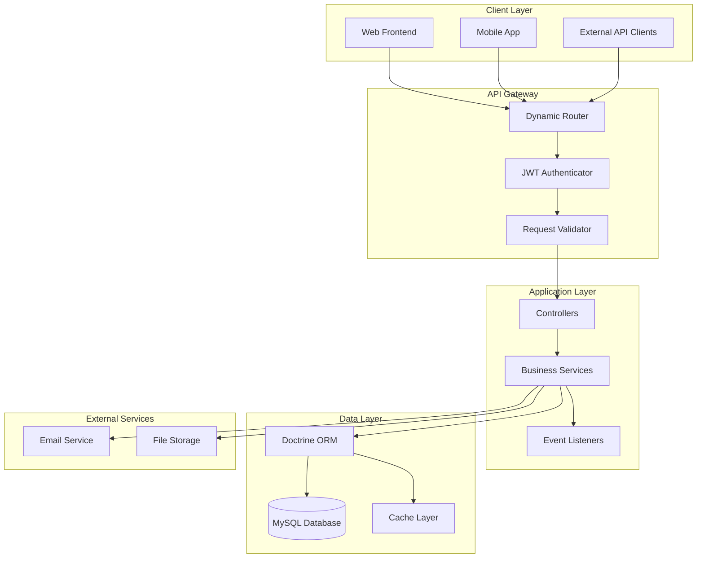
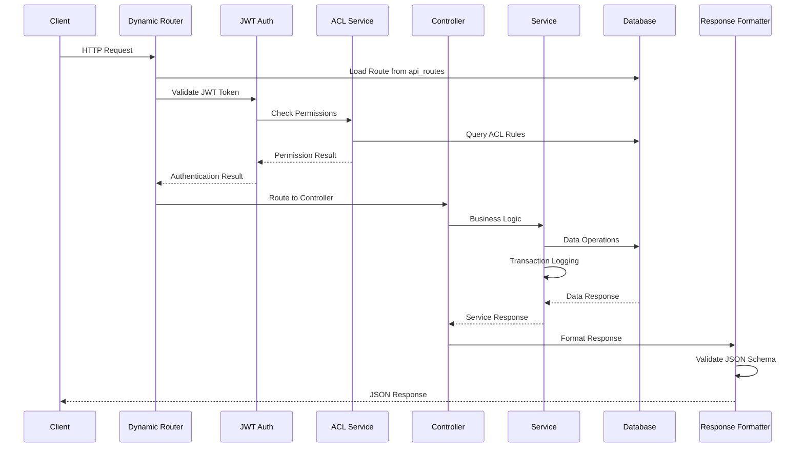
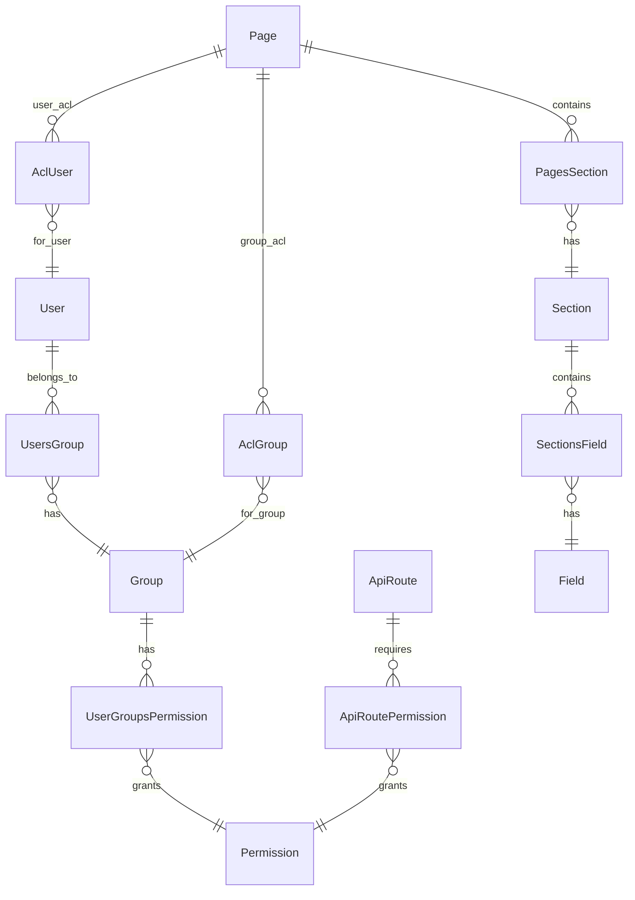

# System Architecture Overview

## 🏗️ High-Level Architecture

The SelfHelp Symfony Backend is built as a modern, database-driven REST API with a dynamic content management system. The architecture emphasizes flexibility, maintainability, and strict data integrity.

## 📊 System Components



## 🔄 Request Flow Architecture



## 🏛️ Architectural Patterns

### 1. **Database-Driven Configuration**
- **API Routes**: All routes stored in `api_routes` table
- **Permissions**: Route permissions managed via database relationships
- **Configuration**: System settings stored in database tables
- **Benefits**: Runtime configuration changes without code deployment

### 2. **Service-Oriented Architecture**
- **Thin Controllers**: Controllers handle HTTP concerns only
- **Rich Services**: Business logic encapsulated in services
- **Service Composition**: Services use other services through dependency injection
- **Transaction Management**: Services handle database transactions

### 3. **Event-Driven Components**
- **Request/Response Events**: Authentication, validation, logging
- **Domain Events**: Business logic triggers
- **Cross-Cutting Concerns**: Security, logging, caching

## 📁 Directory Structure

```
src/
├── Controller/              # HTTP request handlers
│   └── Api/V1/             # Versioned API controllers
│       ├── Admin/          # Administrative endpoints
│       ├── Auth/           # Authentication endpoints
│       └── Frontend/       # Public endpoints
├── Entity/                 # Doctrine ORM entities
├── Repository/             # Data access layer
├── Service/                # Business logic layer
│   ├── ACL/               # Access control services
│   ├── Auth/              # Authentication services
│   ├── CMS/               # Content management services
│   └── Core/              # Core application services
├── Security/              # Security components
├── EventListener/         # Event subscribers
├── Routing/               # Custom route loading
└── Util/                  # Utility classes
```

## 🔧 Core Services

### Authentication & Authorization
- **JWTService**: Token generation, validation, blacklisting
- **JWTTokenAuthenticator**: Symfony authenticator implementation
- **UserContextService**: Current user context management
- **ACLService**: Fine-grained access control

### Content Management
- **AdminPageService**: Page CRUD operations
- **AdminSectionService**: Section management
- **AdminFieldService**: Field content management
- **AdminAssetService**: File upload and asset management

### System Services
- **TransactionService**: Audit trail and change logging
- **JobSchedulerService**: Background task scheduling
- **ApiResponseFormatter**: Standardized response formatting
- **JsonSchemaValidationService**: Request/response validation

### Dynamic Routing
- **ApiRouteLoader**: Database-driven route loading
- **DynamicControllerService**: Dynamic controller resolution
- **ApiVersionResolver**: API version detection

## 💾 Data Architecture

### Entity Relationships


### Key Database Tables
- **`api_routes`**: Dynamic route definitions
- **`users`, `groups`, `permissions`**: Authentication/authorization
- **`pages`, `sections`, `fields`**: CMS content structure
- **`acl_users`, `acl_groups`**: Fine-grained access control
- **`transactions`**: Audit trail
- **`scheduledJobs`**: Background task queue

## 🔐 Security Architecture

### Multi-Layer Security
1. **Firewall Level**: Symfony security configuration
2. **Route Level**: Database-driven permission checks
3. **ACL Level**: Fine-grained page/resource access
4. **Service Level**: Business logic validation

### Authentication Flow
1. User submits credentials to `/cms-api/v1/auth/login`
2. System validates credentials and generates JWT tokens
3. Client includes JWT in `Authorization: Bearer {token}` header
4. `JWTTokenAuthenticator` validates token on each request
5. User context established for the request

### Authorization Flow
1. Route permissions checked via `api_routes_permissions`
2. ACL permissions checked for page-level access
3. Business logic validation in services
4. All operations logged via `TransactionService`

## 📋 API Design Principles

### RESTful Design
- **Resource-Based URLs**: `/api/v1/admin/pages/{id}`
- **HTTP Methods**: GET, POST, PUT, DELETE
- **Status Codes**: Proper HTTP status code usage
- **Content Types**: JSON request/response bodies

### Standardized Response Format
```json
{
    "status": 200,
    "message": "OK",
    "error": null,
    "logged_in": true,
    "meta": {
        "version": "v1",
        "timestamp": "2025-01-23T10:30:00Z"
    },
    "data": { }
}
```

### Validation Strategy
- **Request Validation**: JSON Schema validation for all inputs
- **Response Validation**: Schema validation in debug mode
- **Entity Validation**: Doctrine constraints and custom validators

## 🔄 Version Management Strategy

### Version Types
- **Major Version** (7.5.1 → 7.6.0): Database schema changes
- **Minor Version** (7.5.1 → 7.5.2): Code-only changes

### Version Components
- **Database Version**: Tracked in `version` table
- **API Version**: Included in URLs and route definitions
- **Schema Version**: JSON schemas organized by version
- **Controller Version**: Namespaced by API version

### Migration Process
1. Database changes go in SQL update scripts
2. API routes added to `api_routes.sql`
3. New controllers placed in versioned namespaces
4. JSON schemas updated for new version
5. Version number updated in database

## 🚀 Performance Considerations

### Caching Strategy
- **Route Caching**: Dynamic routes cached in memory
- **ACL Caching**: Permission results cached per request
- **Entity Caching**: Doctrine second-level cache for lookups

### Database Optimization
- **Connection Pooling**: Efficient database connections
- **Query Optimization**: Optimized queries with proper indexes
- **Stored Procedures**: ACL checks use stored procedures

### Response Optimization
- **JSON Schema Validation**: Only in debug mode for performance
- **Response Compression**: Gzip compression enabled
- **Pagination**: Large result sets properly paginated

---

**Next**: [Dynamic Routing System](./02-dynamic-routing.md)