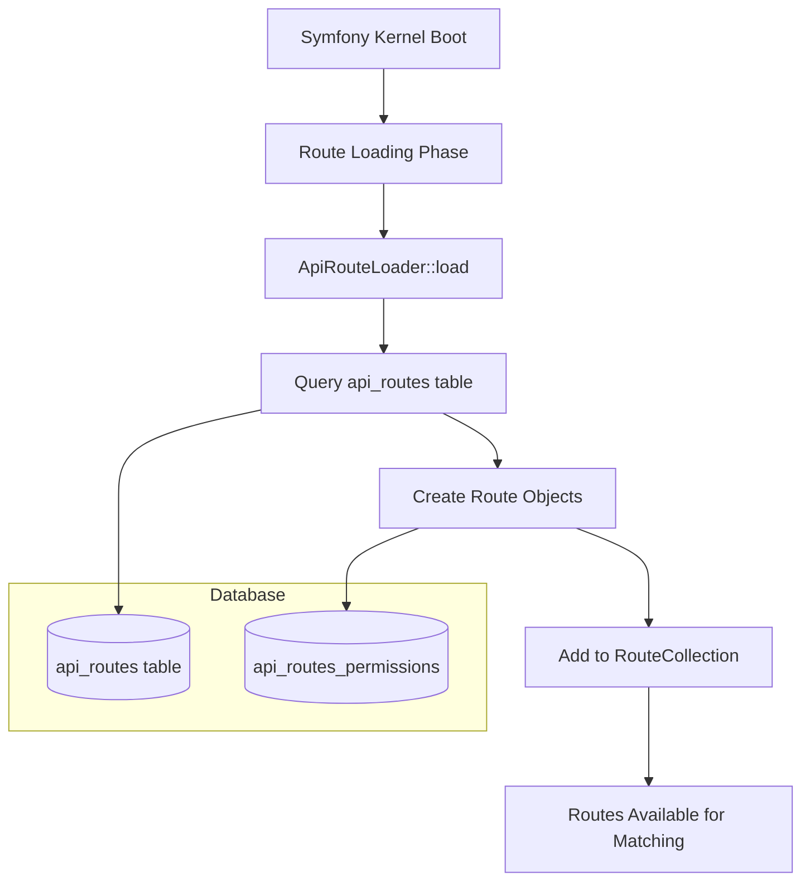
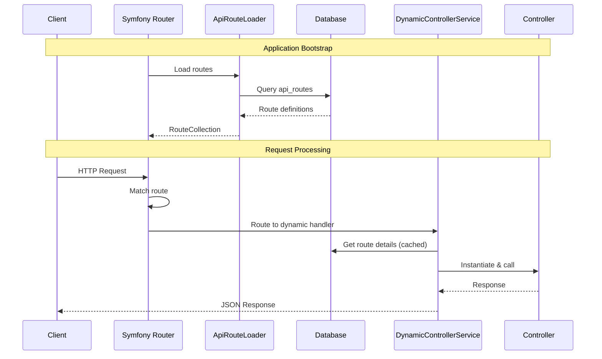

# Dynamic Routing System

## 🔄 Overview

The SelfHelp Symfony Backend uses a revolutionary database-driven routing system that loads all API routes dynamically from the database instead of traditional YAML or PHP route definitions. This provides unprecedented flexibility for runtime route management.

## 🏗️ Architecture Components

### Core Components
1. **`ApiRouteLoader`** - Custom Symfony route loader
2. **`ApiRouteRepository`** - Database access for route definitions
3. **`DynamicControllerService`** - Dynamic controller resolution and execution
4. **`api_routes` table** - Database storage for route definitions

## 📊 Database-Driven Route Loading



## 🗃️ Database Schema

### `api_routes` Table Structure
```sql
CREATE TABLE `api_routes` (
  `id`           INT             NOT NULL AUTO_INCREMENT,
  `route_name`   VARCHAR(100)    NOT NULL,
  `version`      VARCHAR(10)     NOT NULL DEFAULT 'v1',
  `path`         VARCHAR(255)    NOT NULL,
  `controller`   VARCHAR(255)    NOT NULL,
  `methods`      VARCHAR(50)     NOT NULL,
  `requirements` JSON            NULL,
  `params`       JSON            NULL,
  PRIMARY KEY (`id`),
  UNIQUE KEY `uniq_route_name_version` (`route_name`, `version`),
  UNIQUE KEY `uniq_version_path_methods` (`version`, `path`, `methods`)
) ENGINE=InnoDB DEFAULT CHARSET=utf8mb4 COLLATE=utf8mb4_unicode_ci;
```

### Field Descriptions
- **`route_name`**: Unique identifier for the route (e.g., `admin_get_pages`)
- **`version`**: API version (e.g., `v1`, `v2`)
- **`path`**: URL path pattern (e.g., `/admin/pages`)
- **`controller`**: Controller class and method (e.g., `App\\Controller\\AdminPageController::getPages`)
- **`methods`**: HTTP methods (e.g., `GET`, `POST`, `GET,POST`)
- **`requirements`**: JSON object with route parameter requirements
- **`params`**: JSON object describing expected parameters

### Example Route Record
```sql
INSERT INTO `api_routes` (`route_name`, `version`, `path`, `controller`, `methods`, `params`) VALUES
('admin_get_pages', 'v1', '/admin/pages', 'App\\Controller\\AdminPageController::getPages', 'GET', 
'{"locale": {"in": "query", "required": false, "description": "Language locale"}}');
```

## 🔧 ApiRouteLoader Implementation

### Route Loading Process
```php
<?php
// Simplified ApiRouteLoader::load() method
public function load(mixed $resource, string $type = null): RouteCollection
{
    $routes = new RouteCollection();
    
    // Get all available versions
    $versions = $this->apiRouteRepository->findAllVersions();
    
    foreach ($versions as $version) {
        // Load routes for this version
        $dbRoutes = $this->apiRouteRepository->findAllRoutesByVersion($version);
        
        foreach ($dbRoutes as $dbRoute) {
            // Create Symfony Route object
            $path = '/' . $version . $dbRoute->getPath();
            $controller = $this->mapControllerToVersionedNamespace(
                $dbRoute->getController(), 
                $version
            );
            
            $route = new Route(
                $path,
                ['_controller' => $controller, '_version' => $version],
                $dbRoute->getRequirements() ?? [],
                [],
                '',
                [],
                explode(',', $dbRoute->getMethods())
            );
            
            // Add route to collection
            $routes->add($dbRoute->getRouteName() . '_' . $version, $route);
        }
    }
    
    return $routes;
}
```

### Controller Namespace Mapping
The system automatically maps database controller references to versioned namespaces:

```php
// Database: App\Controller\AdminPageController::getPages
// Maps to: App\Controller\Api\V1\Admin\AdminPageController::getPages
```

## 🎯 Dynamic Controller Resolution

### DynamicControllerService
```php
<?php
public function handle(string $routeName, Request $request, array $attributes = []): JsonResponse
{
    // 1. Get route info from database
    $route = $this->getRouteInfo($routeName);
    
    // 2. Perform ACL checks if required
    if ($pageId !== null) {
        $userId = $this->userContextService->getCurrentUser()->getId();
        if (!$this->aclService->hasAccess($userId, $pageId, $accessMode)) {
            return $this->createApiResponse(null, 403, 'Access denied by ACL');
        }
    }
    
    // 3. Parse controller string
    [$controllerClass, $method] = explode('::', $route['controller']);
    
    // 4. Instantiate controller
    $controller = $this->container->has($controllerClass) 
        ? $this->container->get($controllerClass)
        : new $controllerClass();
    
    // 5. Call controller method
    return $controller->$method($request, ...$attributes);
}
```

## 🔐 Permission Integration

### Route-Permission Association
Routes can be associated with permissions through the `api_routes_permissions` table:

```sql
CREATE TABLE `api_routes_permissions` (
  `id_api_routes`   INT NOT NULL,
  `id_permissions`  INT NOT NULL,
  PRIMARY KEY (`id_api_routes`, `id_permissions`),
  CONSTRAINT `FK_arp_api_routes` FOREIGN KEY (`id_api_routes`) 
    REFERENCES `api_routes` (`id`) ON DELETE CASCADE,
  CONSTRAINT `FK_arp_permissions` FOREIGN KEY (`id_permissions`) 
    REFERENCES `permissions` (`id`) ON DELETE CASCADE
) ENGINE=InnoDB DEFAULT CHARSET=utf8mb4 COLLATE=utf8mb4_unicode_ci;
```

### Permission Loading in Routes
```php
// ApiRouteLoader loads permissions as route options
$permissions = $this->getRoutePermissions($dbRoute->getId());
$route->setOption('permissions', $permissions);
```

## 📋 Route Management Workflow

### Adding New Routes
1. **Insert into Database**:
```sql
INSERT INTO `api_routes` (`route_name`, `version`, `path`, `controller`, `methods`, `params`) 
VALUES ('admin_create_user', 'v1', '/admin/users', 'App\\Controller\\AdminUserController::createUser', 'POST', 
'{"user": {"in": "body", "required": true, "description": "User data"}}');
```

2. **Add to Update Script**:
All route changes must be added to `db/update_scripts/api_routes.sql`

3. **Create Controller**:
```php
<?php
namespace App\Controller\Api\V1\Admin;

class AdminUserController extends AbstractController
{
    public function createUser(Request $request): JsonResponse
    {
        // Implementation
    }
}
```

4. **Associate Permissions** (if needed):
```sql
INSERT INTO `api_routes_permissions` (`id_api_routes`, `id_permissions`)
SELECT ar.id, p.id 
FROM `api_routes` ar, `permissions` p
WHERE ar.route_name = 'admin_create_user' 
  AND p.name = 'admin.user.create';
```

### Route Caching
Routes are cached in memory during request processing:

```php
private array $routeCache = [];

private function getRouteInfo(string $routeName): ?array
{
    // Check cache first
    if (isset($this->routeCache[$routeName])) {
        return $this->routeCache[$routeName];
    }
    
    // Get from database and cache
    $route = $this->apiRouteRepository->findOneBy(['name' => $routeName]);
    $this->routeCache[$routeName] = [
        'controller' => $route->getController(),
        'method' => $route->getMethod(),
        'path' => $route->getPath(),
    ];
    
    return $this->routeCache[$routeName];
}
```

## 🔄 Request Processing Flow



## ⚡ Performance Optimizations

### Route Loading Optimization
- Routes loaded once during application bootstrap
- Symfony's route matching cache used for performance
- Route information cached during request processing

### Database Query Optimization
- Single query to load all routes per version
- Proper indexes on `route_name`, `version`, and `path`
- Connection pooling for database efficiency

### Memory Management
- Route cache cleared between requests in development
- Production route cache persisted across requests
- Minimal memory footprint for route storage

## 🚨 Error Handling

### Route Not Found
```php
if (!$route) {
    return $this->createApiResponse(
        null,
        Response::HTTP_NOT_FOUND,
        sprintf('Route "%s" not found', $routeName)
    );
}
```

### Controller Not Found
```php
if (!class_exists($controllerClass)) {
    return $this->createApiResponse(
        null,
        Response::HTTP_INTERNAL_SERVER_ERROR,
        sprintf('Controller "%s" not found', $controllerClass)
    );
}
```

### Method Not Found
```php
if (!method_exists($controller, $method)) {
    return $this->createApiResponse(
        null,
        Response::HTTP_INTERNAL_SERVER_ERROR,
        sprintf('Method "%s" not found in controller "%s"', $method, $controllerClass)
    );
}
```

## 🔧 Configuration

### Route Loader Registration
```yaml
# config/services.yaml
services:
    App\Routing\ApiRouteLoader:
        arguments:
            $env: '%kernel.environment%'
        tags:
            - { name: routing.loader }
```

### Route Loading Configuration
```yaml
# config/routes/dynamic_api.yaml
api_routes:
    resource: .
    type: api_route_loader
```

## 🧪 Testing Dynamic Routes

### Unit Testing Route Loader
```php
public function testRouteLoading(): void
{
    $routes = $this->apiRouteLoader->load('.', 'api_route_loader');
    $this->assertInstanceOf(RouteCollection::class, $routes);
    $this->assertGreaterThan(0, $routes->count());
}
```

### Integration Testing Routes
```php
public function testDynamicRouteExecution(): void
{
    $this->client->request('GET', '/cms-api/v1/admin/pages');
    $this->assertResponseIsSuccessful();
    $this->assertJson($this->client->getResponse()->getContent());
}
```

## 🔮 Future Enhancements

### Planned Features
- **Route Versioning**: Support for route deprecation and migration
- **Route Analytics**: Track route usage and performance
- **Dynamic Middleware**: Database-configurable middleware per route
- **Route Templates**: Reusable route patterns
- **Hot Reloading**: Runtime route updates without restart

---

**Next**: [Authentication & Authorization](./03-authentication-authorization.md)