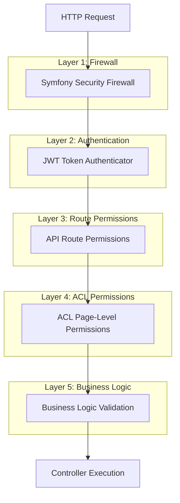
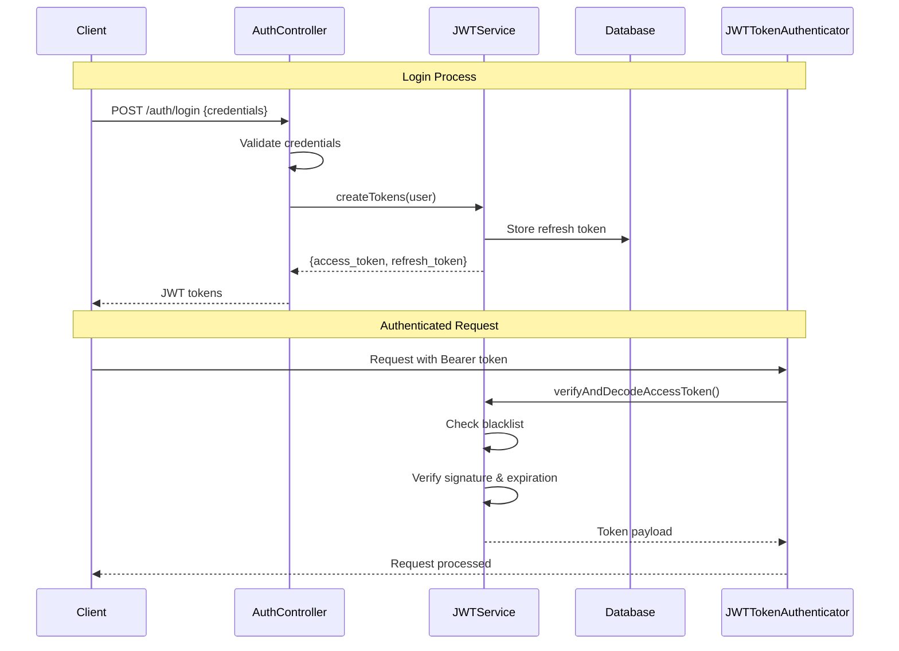
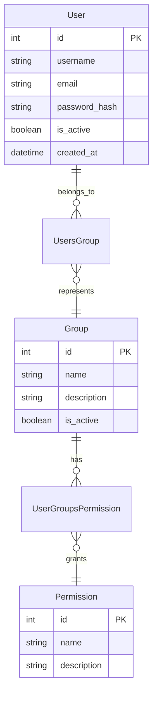

# Authentication & Authorization

## 🔐 Security Architecture Overview

The SelfHelp Symfony Backend implements a comprehensive multi-layer security system combining JWT authentication with database-driven authorization and fine-grained Access Control Lists (ACL).

## 🏗️ Security Layers



## 🎟️ JWT Authentication System

### Authentication Components
- **`JWTService`**: Token lifecycle management
- **`JWTTokenAuthenticator`**: Symfony authenticator implementation
- **`UserContextService`**: Current user context management
- **`RefreshToken` entity**: Refresh token persistence

### JWT Token Structure
```json
{
  "header": {
    "typ": "JWT",
    "alg": "RS256"
  },
  "payload": {
    "iat": 1642680000,
    "exp": 1642683600,
    "roles": ["ROLE_USER"],
    "username": "admin",
    "user_id": 1
  },
  "signature": "..."
}
```

### Authentication Flow


### JWTService Implementation
```php
<?php
namespace App\Service\Auth;

class JWTService
{
    public function createTokens(User $user): array
    {
        // Create access token (short-lived)
        $accessToken = $this->createToken($user);
        
        // Create refresh token (long-lived)
        $refreshToken = $this->createRefreshToken($user);
        
        return [
            'access_token' => $accessToken,
            'refresh_token' => $refreshToken->getTokenHash(),
            'expires_in' => $this->accessTokenTTL
        ];
    }
    
    public function verifyAndDecodeAccessToken(string $token, bool $checkBlacklist = true): array
    {
        // Check blacklist first
        if ($checkBlacklist && $this->isTokenBlacklisted($token)) {
            throw new AuthenticationException('Token is blacklisted');
        }
        
        // Verify and decode token
        return $this->jwtEncoder->decode($token);
    }
    
    public function blacklistToken(string $token): void
    {
        $this->cache->set('blacklist_' . hash('sha256', $token), true, $this->accessTokenTTL);
    }
}
```

### Token Refresh Process
```php
public function processRefreshToken(string $refreshTokenString): array
{
    $tokenEntity = $this->entityManager->getRepository(RefreshToken::class)
        ->findOneBy(['tokenHash' => $refreshTokenString]);

    if (!$tokenEntity || $tokenEntity->getExpiresAt() < new \DateTime()) {
        throw new AuthenticationException('Invalid or expired refresh token.');
    }

    $user = $tokenEntity->getUser();
    
    // Generate new tokens
    $newAccessToken = $this->createToken($user);
    $this->entityManager->remove($tokenEntity); // Invalidate old refresh token
    $newRefreshToken = $this->createRefreshToken($user);

    return [
        'access_token' => $newAccessToken,
        'refresh_token' => $newRefreshToken->getTokenHash(),
    ];
}
```

## 👥 User & Group System

### Entity Relationships


### User Permission Resolution
```php
<?php
// User entity method
public function getPermissionNames(): array
{
    $permissions = [];
    
    foreach ($this->getUsersGroups() as $userGroup) {
        $group = $userGroup->getGroup();
        foreach ($group->getUserGroupsPermissions() as $groupPermission) {
            $permissions[] = $groupPermission->getPermission()->getName();
        }
    }
    
    return array_unique($permissions);
}
```

## 🛡️ Route-Level Permissions

### Database-Driven Route Permissions
Routes are associated with permissions through the `api_routes_permissions` table:

```sql
CREATE TABLE `api_routes_permissions` (
  `id_api_routes`   INT NOT NULL,
  `id_permissions`  INT NOT NULL,
  PRIMARY KEY (`id_api_routes`, `id_permissions`),
  FOREIGN KEY (`id_api_routes`) REFERENCES `api_routes` (`id`) ON DELETE CASCADE,
  FOREIGN KEY (`id_permissions`) REFERENCES `permissions` (`id`) ON DELETE CASCADE
);
```

### Permission Loading in Routes
```php
// ApiRouteLoader loads permissions into route options
foreach ($dbRoutes as $dbRoute) {
    $route = new Route($path, $defaults, $requirements);
    
    // Load associated permissions
    $permissions = $this->getRoutePermissions($dbRoute->getId());
    $route->setOption('permissions', $permissions);
    
    $routes->add($routeName, $route);
}
```

### ApiSecurityListener
```php
<?php
namespace App\EventListener;

class ApiSecurityListener
{
    public function onKernelController(ControllerEvent $event): void
    {
        $request = $event->getRequest();
        $routeName = $request->attributes->get('_route');
        
        // Get route permissions
        $route = $this->router->getRouteCollection()->get($routeName);
        $requiredPermissions = $route->getOption('permissions') ?? [];
        
        if (empty($requiredPermissions)) {
            return; // No permissions required
        }
        
        // Check user permissions
        $user = $this->userContextService->getCurrentUser();
        $userPermissions = $user->getPermissionNames();
        
        // Verify user has at least one required permission
        $hasPermission = !empty(array_intersect($requiredPermissions, $userPermissions));
        
        if (!$hasPermission) {
            throw new AccessDeniedException('Insufficient permissions');
        }
    }
}
```

## 🔒 Access Control Lists (ACL)

### Fine-Grained Page Access Control
The ACL system provides page-level access control with CRUD operations:

```sql
CREATE TABLE `acl_users` (
  `id_users`    INT NOT NULL,
  `id_pages`    INT NOT NULL,
  `acl_select`  TINYINT(1) NOT NULL DEFAULT '1',
  `acl_insert`  TINYINT(1) NOT NULL DEFAULT '0',
  `acl_update`  TINYINT(1) NOT NULL DEFAULT '0',
  `acl_delete`  TINYINT(1) NOT NULL DEFAULT '0',
  PRIMARY KEY (`id_users`, `id_pages`)
);

CREATE TABLE `acl_groups` (
  `id_groups`   INT NOT NULL,
  `id_pages`    INT NOT NULL,
  `acl_select`  TINYINT(1) NOT NULL DEFAULT '1',
  `acl_insert`  TINYINT(1) NOT NULL DEFAULT '0',
  `acl_update`  TINYINT(1) NOT NULL DEFAULT '0',
  `acl_delete`  TINYINT(1) NOT NULL DEFAULT '0',
  PRIMARY KEY (`id_groups`, `id_pages`)
);
```

### ACL Stored Procedure
```sql
DELIMITER //
CREATE PROCEDURE get_user_acl(IN userId INT, IN pageId INT)
BEGIN
    SELECT 
        COALESCE(MAX(au.acl_select), MAX(ag.acl_select), 0) as acl_select,
        COALESCE(MAX(au.acl_insert), MAX(ag.acl_insert), 0) as acl_insert,
        COALESCE(MAX(au.acl_update), MAX(ag.acl_update), 0) as acl_update,
        COALESCE(MAX(au.acl_delete), MAX(ag.acl_delete), 0) as acl_delete
    FROM users u
    LEFT JOIN acl_users au ON u.id = au.id_users AND au.id_pages = pageId
    LEFT JOIN users_groups ug ON u.id = ug.id_users
    LEFT JOIN acl_groups ag ON ug.id_groups = ag.id_groups AND ag.id_pages = pageId
    WHERE u.id = userId;
END //
DELIMITER ;
```

### ACLService Implementation
```php
<?php
namespace App\Service\ACL;

class ACLService
{
    public function hasAccess(int $userId, int $pageId, string $accessType = 'select'): bool
    {
        $connection = $this->entityManager->getConnection();
        
        $sql = 'CALL get_user_acl(:userId, :pageId)';
        $stmt = $connection->prepare($sql);
        $result = $stmt->executeQuery([
            'userId' => $userId,
            'pageId' => $pageId
        ])->fetchAssociative();
        
        if (!$result) {
            return false;
        }
        
        $aclColumn = 'acl_' . $accessType;
        return ((int)$result[$aclColumn] === 1);
    }
    
    public function getUserPagePermissions(int $userId, int $pageId): array
    {
        // Returns array with all CRUD permissions for the page
        $connection = $this->entityManager->getConnection();
        
        $sql = 'CALL get_user_acl(:userId, :pageId)';
        $stmt = $connection->prepare($sql);
        $result = $stmt->executeQuery([
            'userId' => $userId,
            'pageId' => $pageId
        ])->fetchAssociative();
        
        return [
            'select' => (bool)($result['acl_select'] ?? 0),
            'insert' => (bool)($result['acl_insert'] ?? 0),
            'update' => (bool)($result['acl_update'] ?? 0),
            'delete' => (bool)($result['acl_delete'] ?? 0),
        ];
    }
}
```

### ACL Integration in Controllers
```php
<?php
public function updatePage(Request $request, string $pageKeyword): JsonResponse
{
    // Get page
    $page = $this->pageRepository->findOneBy(['keyword' => $pageKeyword]);
    
    // Check ACL permissions
    $userId = $this->userContextService->getCurrentUser()->getId();
    if (!$this->aclService->hasAccess($userId, $page->getId(), 'update')) {
        return $this->responseFormatter->formatError('Access denied', 403);
    }
    
    // Proceed with update
    return $this->adminPageService->updatePage($page, $requestData);
}
```

## 🔧 Permission Management

### Adding New Permissions
1. **Create Permission**:
```sql
INSERT INTO `permissions` (`name`, `description`) 
VALUES ('admin.asset.upload', 'Can upload new assets');
```

2. **Assign to Groups**:
```sql
INSERT INTO `user_groups_permissions` (`id_user_groups`, `id_permissions`)
SELECT ug.id, p.id 
FROM `user_groups` ug, `permissions` p
WHERE ug.name = 'admin' AND p.name = 'admin.asset.upload';
```

3. **Associate with Routes**:
```sql
INSERT INTO `api_routes_permissions` (`id_api_routes`, `id_permissions`)
SELECT ar.id, p.id 
FROM `api_routes` ar, `permissions` p
WHERE ar.route_name = 'admin_upload_asset' AND p.name = 'admin.asset.upload';
```

### Permission Naming Convention
- **Format**: `{area}.{resource}.{action}`
- **Examples**:
  - `admin.page.create` - Create pages in admin
  - `admin.user.delete` - Delete users in admin
  - `frontend.page.view` - View pages on frontend

## 🚨 Security Best Practices

### Token Security
- **Short-lived access tokens** (1 hour default)
- **Long-lived refresh tokens** (2 weeks default)
- **Token blacklisting** on logout
- **Secure token storage** in HTTP-only cookies (recommended)

### Password Security
- **BCrypt hashing** with appropriate cost factor
- **Password complexity** requirements
- **Account lockout** after failed attempts
- **Password reset** with secure tokens

### ACL Security
- **Principle of least privilege** - Default deny
- **User-specific overrides** take precedence over group permissions
- **Audit logging** for all permission changes
- **Regular permission reviews**

### API Security
- **HTTPS only** in production
- **CORS configuration** for browser requests
- **Rate limiting** to prevent abuse
- **Input validation** on all endpoints

## 🧪 Testing Security

### Authentication Testing
```php
public function testLoginWithValidCredentials(): void
{
    $response = $this->client->request('POST', '/cms-api/v1/auth/login', [
        'json' => [
            'username' => 'admin',
            'password' => 'password123'
        ]
    ]);
    
    $this->assertResponseIsSuccessful();
    $data = json_decode($response->getContent(), true);
    $this->assertArrayHasKey('access_token', $data['data']);
    $this->assertArrayHasKey('refresh_token', $data['data']);
}
```

### Permission Testing
```php
public function testAdminRouteRequiresPermission(): void
{
    // Test without permission
    $this->client->request('GET', '/cms-api/v1/admin/pages');
    $this->assertResponseStatusCodeSame(403);
    
    // Test with permission
    $this->loginAsAdmin();
    $this->client->request('GET', '/cms-api/v1/admin/pages');
    $this->assertResponseIsSuccessful();
}
```

### ACL Testing
```php
public function testPageAccessControl(): void
{
    $user = $this->createUser();
    $page = $this->createPage();
    
    // Test default deny
    $this->assertFalse($this->aclService->hasAccess($user->getId(), $page->getId(), 'update'));
    
    // Grant permission
    $this->grantPageAccess($user, $page, 'update');
    $this->assertTrue($this->aclService->hasAccess($user->getId(), $page->getId(), 'update'));
}
```

---

**Next**: [Database Design](./04-database-design.md)