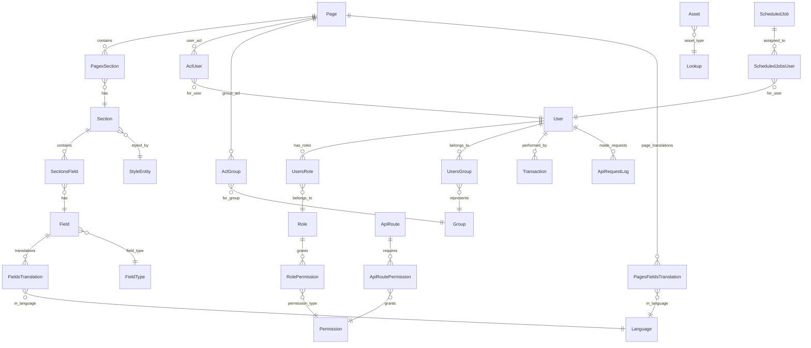
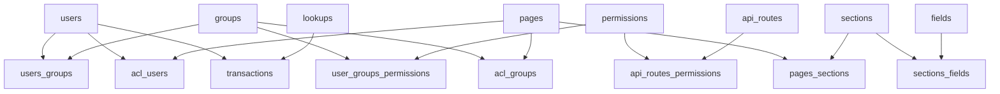

# Database Design

## 🗄️ Database Architecture Overview

The SelfHelp Symfony Backend uses a sophisticated MySQL database design that supports dynamic routing, fine-grained permissions, content management, and comprehensive audit trails.

## 📊 Database Schema Overview



## 🔧 Core Table Groups

### 1. Authentication & Authorization Tables

#### `users` - User Accounts
```sql
CREATE TABLE `users` (
  `id` int NOT NULL AUTO_INCREMENT,
  `username` varchar(100) NOT NULL,
  `email` varchar(255) NOT NULL,
  `password` varchar(255) NOT NULL,
  `is_active` tinyint(1) NOT NULL DEFAULT '1',
  `token` varchar(255) DEFAULT NULL,
  `created_at` datetime DEFAULT CURRENT_TIMESTAMP,
  PRIMARY KEY (`id`),
  UNIQUE KEY `UNIQ_1483A5E9F85E0677` (`username`),
  UNIQUE KEY `UNIQ_1483A5E9E7927C74` (`email`)
) ENGINE=InnoDB DEFAULT CHARSET=utf8mb4;
```

#### `groups` - User Groups
```sql
CREATE TABLE `groups` (
  `id` int NOT NULL AUTO_INCREMENT,
  `name` varchar(100) NOT NULL,
  `description` varchar(255) DEFAULT NULL,
  `is_active` tinyint(1) NOT NULL DEFAULT '1',
  PRIMARY KEY (`id`),
  UNIQUE KEY `UNIQ_F06D39705E237E06` (`name`)
) ENGINE=InnoDB DEFAULT CHARSET=utf8mb3;
```

#### `permissions` - System Permissions
```sql
CREATE TABLE `permissions` (
  `id` int NOT NULL AUTO_INCREMENT,
  `name` varchar(100) NOT NULL,
  `description` varchar(255) DEFAULT NULL,
  PRIMARY KEY (`id`),
  UNIQUE KEY `UNIQ_2DEDCC6F5E237E06` (`name`)
) ENGINE=InnoDB DEFAULT CHARSET=utf8mb4;
```

#### `roles` - Admin Roles
```sql
CREATE TABLE `roles` (
  `id` int NOT NULL AUTO_INCREMENT,
  `name` varchar(100) NOT NULL,
  `description` varchar(255) DEFAULT NULL,
  `is_active` tinyint(1) NOT NULL DEFAULT '1',
  PRIMARY KEY (`id`),
  UNIQUE KEY `UNIQ_B63E2EC75E237E06` (`name`)
) ENGINE=InnoDB DEFAULT CHARSET=utf8mb4;

-- Admin roles for CMS backend access
INSERT INTO `roles` (`name`, `description`) VALUES
('super_admin', 'Super Administrator - Full system access'),
('admin', 'Administrator - Standard admin access'),
('editor', 'Editor - Content management access'),
('viewer', 'Viewer - Read-only access');
```

#### `permissions` - System Permissions
```sql
-- Permissions for API routes and system operations
INSERT INTO `permissions` (`name`, `description`) VALUES
('admin.dashboard.view', 'View admin dashboard'),
('admin.user.view', 'View users'),
('admin.user.create', 'Create users'),
('admin.user.edit', 'Edit users'),
('admin.user.delete', 'Delete users'),
('admin.page.view', 'View pages'),
('admin.page.create', 'Create pages'),
('admin.page.edit', 'Edit pages'),
('admin.page.delete', 'Delete pages'),
('admin.section.manage', 'Manage sections'),
('admin.asset.manage', 'Manage assets'),
('admin.job.manage', 'Manage scheduled jobs'),
('admin.acl.manage', 'Manage ACL permissions'),
('admin.system.manage', 'System administration');
```

#### Junction Tables
- **`users_groups`**: Links users to groups (many-to-many) - **Frontend users only**
- **`users_roles`**: Links users to roles (many-to-many) - **Admin users only**
- **`roles_permissions`**: Links roles to permissions (many-to-many) - **Admin system**

### 2. Dynamic Routing Tables

#### `api_routes` - Dynamic Route Definitions
```sql
CREATE TABLE `api_routes` (
  `id` int NOT NULL AUTO_INCREMENT,
  `route_name` varchar(100) NOT NULL,
  `version` varchar(10) NOT NULL DEFAULT 'v1',
  `path` varchar(255) NOT NULL,
  `controller` varchar(255) NOT NULL,
  `methods` varchar(50) NOT NULL,
  `requirements` json DEFAULT NULL,
  `params` json DEFAULT NULL COMMENT 'Expected parameters: name → {in: body|query, required: bool}',
  PRIMARY KEY (`id`),
  UNIQUE KEY `uniq_route_name_version` (`route_name`,`version`),
  UNIQUE KEY `uniq_version_path_methods` (`version`,`path`,`methods`)
) ENGINE=InnoDB DEFAULT CHARSET=utf8mb4;
```

**Key Features:**
- **Dynamic Loading**: Routes loaded from database at runtime
- **Versioning Support**: Multiple API versions per route
- **Parameter Documentation**: JSON schema for expected parameters
- **Method Specification**: HTTP methods (GET, POST, PUT, DELETE)

#### `api_routes_permissions` - Route Permission Requirements
```sql
CREATE TABLE `api_routes_permissions` (
  `id_api_routes` int NOT NULL,
  `id_permissions` int NOT NULL,
  PRIMARY KEY (`id_api_routes`,`id_permissions`),
  FOREIGN KEY (`id_api_routes`) REFERENCES `api_routes` (`id`) ON DELETE CASCADE,
  FOREIGN KEY (`id_permissions`) REFERENCES `permissions` (`id`) ON DELETE CASCADE
) ENGINE=InnoDB DEFAULT CHARSET=utf8mb4;
```

### 3. Content Management System Tables

#### `pages` - CMS Pages
```sql
CREATE TABLE `pages` (
  `id` int NOT NULL AUTO_INCREMENT,
  `keyword` varchar(100) NOT NULL,
  `url` varchar(255) DEFAULT NULL,
  `protocol` varchar(10) DEFAULT 'https',
  `parent` int DEFAULT NULL,
  `id_type` int NOT NULL,
  `id_pageAccessTypes` int DEFAULT NULL,
  `is_headless` tinyint(1) NOT NULL DEFAULT '0',
  `nav_position` int DEFAULT NULL,
  `footer_position` int DEFAULT NULL,
  `is_open_access` tinyint(1) DEFAULT '0',
  `is_system` tinyint(1) DEFAULT '0',
  PRIMARY KEY (`id`),
  UNIQUE KEY `UNIQ_2074E575A17F5E88` (`keyword`),
  FOREIGN KEY (`parent`) REFERENCES `pages` (`id`) ON DELETE CASCADE,
  FOREIGN KEY (`id_type`) REFERENCES `pageTypes` (`id`) ON DELETE CASCADE,
  FOREIGN KEY (`id_pageAccessTypes`) REFERENCES `lookups` (`id`) ON DELETE CASCADE
) ENGINE=InnoDB DEFAULT CHARSET=utf8mb3;
```

#### `sections` - Content Sections
```sql
CREATE TABLE `sections` (
  `id` int NOT NULL AUTO_INCREMENT,
  `name` varchar(100) NOT NULL,
  `id_styles` int NOT NULL,
  `parent` int DEFAULT NULL,
  `position` int DEFAULT NULL,
  PRIMARY KEY (`id`),
  FOREIGN KEY (`id_styles`) REFERENCES `styles` (`id`) ON DELETE CASCADE,
  FOREIGN KEY (`parent`) REFERENCES `sections` (`id`) ON DELETE CASCADE
) ENGINE=InnoDB DEFAULT CHARSET=utf8mb3;
```

#### `fields` - Content Fields
```sql
CREATE TABLE `fields` (
  `id` int NOT NULL AUTO_INCREMENT,
  `name` varchar(100) NOT NULL,
  `id_fieldTypes` int NOT NULL,
  `default_value` longtext,
  `help` varchar(1000) DEFAULT NULL,
  `disabled` tinyint(1) NOT NULL DEFAULT '0',
  `hidden` tinyint(1) NOT NULL DEFAULT '0',
  PRIMARY KEY (`id`),
  FOREIGN KEY (`id_fieldTypes`) REFERENCES `lookups` (`id`) ON DELETE CASCADE
) ENGINE=InnoDB DEFAULT CHARSET=utf8mb3;
```

#### Junction Tables for CMS
- **`pages_sections`**: Links pages to sections with position
- **`sections_fields`**: Links sections to fields with position
- **`sections_navigation`**: Navigation-specific section relationships

### 4. Access Control Lists (ACL) Tables

#### `acl_users` - User-Level Page Permissions
```sql
CREATE TABLE `acl_users` (
  `id_users` int NOT NULL,
  `id_pages` int NOT NULL,
  `acl_select` tinyint(1) NOT NULL DEFAULT '1',
  `acl_insert` tinyint(1) NOT NULL DEFAULT '0',
  `acl_update` tinyint(1) NOT NULL DEFAULT '0',
  `acl_delete` tinyint(1) NOT NULL DEFAULT '0',
  PRIMARY KEY (`id_users`,`id_pages`),
  FOREIGN KEY (`id_pages`) REFERENCES `pages` (`id`) ON DELETE CASCADE,
  FOREIGN KEY (`id_users`) REFERENCES `users` (`id`) ON DELETE CASCADE
) ENGINE=InnoDB DEFAULT CHARSET=utf8mb3;
```

#### `acl_groups` - Group-Level Page Permissions
```sql
CREATE TABLE `acl_groups` (
  `id_groups` int NOT NULL,
  `id_pages` int NOT NULL,
  `acl_select` tinyint(1) NOT NULL DEFAULT '1',
  `acl_insert` tinyint(1) NOT NULL DEFAULT '0',
  `acl_update` tinyint(1) NOT NULL DEFAULT '0',
  `acl_delete` tinyint(1) NOT NULL DEFAULT '0',
  PRIMARY KEY (`id_groups`,`id_pages`),
  FOREIGN KEY (`id_pages`) REFERENCES `pages` (`id`) ON DELETE CASCADE,
  FOREIGN KEY (`id_groups`) REFERENCES `groups` (`id`) ON DELETE CASCADE
) ENGINE=InnoDB DEFAULT CHARSET=utf8mb3;
```

**ACL Permission Types:**
- **`acl_select`**: Read access (view page/content)
- **`acl_insert`**: Create access (add new content)
- **`acl_update`**: Update access (modify existing content)
- **`acl_delete`**: Delete access (remove content)

### 5. Multi-language Support Tables

#### `languages` - Supported Languages
```sql
CREATE TABLE `languages` (
  `id` int NOT NULL AUTO_INCREMENT,
  `language` varchar(100) NOT NULL,
  `locale` varchar(10) NOT NULL,
  `is_active` tinyint(1) NOT NULL DEFAULT '1',
  `is_default` tinyint(1) NOT NULL DEFAULT '0',
  PRIMARY KEY (`id`),
  UNIQUE KEY `UNIQ_5D237014D4DB71B5` (`locale`)
) ENGINE=InnoDB DEFAULT CHARSET=utf8mb3;
```

#### `fieldsTranslations` - Field Content Translations
```sql
CREATE TABLE `fieldsTranslations` (
  `id` int NOT NULL AUTO_INCREMENT,
  `id_fields` int NOT NULL,
  `id_languages` int NOT NULL,
  `content` longtext,
  `meta` longtext,
  PRIMARY KEY (`id`),
  UNIQUE KEY `unique_field_language` (`id_fields`,`id_languages`),
  FOREIGN KEY (`id_fields`) REFERENCES `fields` (`id`) ON DELETE CASCADE,
  FOREIGN KEY (`id_languages`) REFERENCES `languages` (`id`) ON DELETE CASCADE
) ENGINE=InnoDB DEFAULT CHARSET=utf8mb3;
```

### 6. Data Tables Translation System

#### Overview
The data tables translation system allows for multi-language support in dynamic data tables (`dataTables`, `dataRows`, `dataCols`, `dataCells`). This system enables storing and retrieving translated content for user-generated data in different languages while maintaining backward compatibility.

#### Core Tables Structure

#### `dataCells` - Data Cell Values with Language Support
```sql
CREATE TABLE `dataCells` (
  `id_dataRows` int NOT NULL,
  `id_dataCols` int NOT NULL,
  `language_id` int NOT NULL DEFAULT 1,
  `value` longtext NOT NULL,
  PRIMARY KEY (`id_dataRows`,`id_dataCols`,`language_id`),
  KEY `IDX_726A5F25F3854F45` (`id_dataRows`),
  KEY `IDX_726A5F25B216B425` (`id_dataCols`),
  KEY `IDX_dataCells_language` (`language_id`),
  CONSTRAINT `FK_726A5F25B216B425` FOREIGN KEY (`id_dataCols`) REFERENCES `dataCols` (`id`) ON DELETE CASCADE,
  CONSTRAINT `FK_726A5F25F3854F45` FOREIGN KEY (`id_dataRows`) REFERENCES `dataRows` (`id`) ON DELETE CASCADE,
  CONSTRAINT `FK_dataCells_languages` FOREIGN KEY (`language_id`) REFERENCES `languages` (`id`) ON DELETE CASCADE
) ENGINE=InnoDB DEFAULT CHARSET=utf8mb3;
```

#### Translation Logic Rules

1. **Language ID 1 (Internal/Default)**: Represents the internal language, cannot be translated
2. **Language ID > 1 (Translatable)**: Can have multiple translations
3. **Translation Rule**: If a cell exists with `language_id = 1`, it cannot have translations
4. **Multi-translation Rule**: If a cell exists with `language_id > 1`, it can have multiple translations

#### Data Retrieval with `get_dataTable_with_filter`

The stored procedure `get_dataTable_with_filter` has been enhanced to support language filtering:

```sql
PROCEDURE `get_dataTable_with_filter`(
    IN table_id_param INT,
    IN user_id_param INT,
    IN filter_param VARCHAR(1000),
    IN exclude_deleted_param BOOLEAN,
    IN language_id_param INT -- New parameter for language filtering
)
```

**Language Filtering Behavior:**
- `language_id_param = 1` or `NULL`: Returns only internal language data
- `language_id_param > 1`: Returns internal language (1) + requested language translations
- **Translation Fallback**: Internal language (1) is always included as fallback

#### Usage Examples

```sql
-- Get data in internal language only (default behavior)
CALL get_dataTable_with_filter(1, 0, '', FALSE, 1);

-- Get data with English translations (includes fallback to internal)
CALL get_dataTable_with_filter(1, 0, '', FALSE, 2);

-- Get data with German translations (includes fallback to internal)
CALL get_dataTable_with_filter(1, 0, '', FALSE, 3);
```

#### Data Entry Rules

1. **Default Language**: New cells automatically get `language_id = 1`
2. **Adding Translations**: Insert new rows with same `id_dataRows`/`id_dataCols` but different `language_id > 1`
3. **Validation**: Cannot add `language_id > 1` if `language_id = 1` already exists for same cell
4. **Multiple Translations**: Can add multiple `language_id > 1` for same cell (multiple translations)

#### API Payload Format

The `DataService::saveData()` method now supports two payload formats for form data:

##### Simple Format (Backward Compatible)
```json
{
  "page_id": 89,
  "section_id": 229,
  "form_data": {
    "combo": null,
    "rich": null,
    "switch": "0",
    "text": null
  }
}
```
All fields are saved with default language ID 1 (internal language).

##### Multi-Language Format
```json
{
  "page_id": 89,
  "section_id": 229,
  "form_data": {
    "combo": null,
    "rich": null,
    "switch": "0",
    "text": [
      {
        "language_id": 2,
        "value": "german text"
      },
      {
        "language_id": 3,
        "value": "english text"
      },
      {
        "language_id": 4,
        "value": "french text"
      }
    ]
  }
}
```

**Multi-Language Field Rules:**
- Field value must be an array of objects
- Each object must have `language_id` and `value` properties
- Multiple translations can be saved for the same field
- Language ID 1 (internal) cannot have translations (enforced by application logic)

##### Data Retrieval

Use the `language_id` parameter in `getData()` method:

```php
// Get data in default language (1)
$data = $dataService->getData($tableId, '', true, null, false, true, 1);

// Get data with German translations (includes fallback to language 1)
$data = $dataService->getData($tableId, '', true, null, false, true, 3);
```

#### JSON Schema Validation

The API request schemas have been updated to support both simple and multi-language payloads:

**Updated Schemas:**
- `config/schemas/api/v1/requests/frontend/submit_form.json`
- `config/schemas/api/v1/requests/frontend/update_form.json`

**Supported Form Data Formats:**

1. **Simple Values** (Backward Compatible):
```json
{
  "page_id": 89,
  "section_id": 229,
  "form_data": {
    "combo": null,
    "rich": "<p>Simple content</p>",
    "switch": "0",
    "text": null
  }
}
```

2. **Multi-Language Arrays** (New Feature):
```json
{
  "page_id": 89,
  "section_id": 229,
  "form_data": {
    "combo": null,
    "rich": [
      {"language_id": 2, "value": "<p>German content</p>"},
      {"language_id": 3, "value": "<p>English content</p>"},
      {"language_id": 4, "value": "<p>French content</p>"}
    ],
    "switch": "0",
    "text": null
  }
}
```

**Schema Validation Rules:**
- Translation arrays must contain objects with `language_id` (integer ≥ 1) and `value` (string/number/boolean/null)
- Simple values (string, number, boolean, null) remain supported
- File input arrays and other array/object types still supported
- Mixed simple and translation fields allowed in same form

#### Application-Level Validation

The `FormValidationService` has been updated to handle translation arrays:

**Updated Validation Logic:**
- `validateFormData()` now recognizes translation arrays by checking for `language_id` in the first array element
- Translation arrays are validated using `isValidTranslationArray()` method
- Each translation object must have required `language_id` (integer ≥ 1) and `value` (scalar) properties
- String values in translations are limited to 65535 characters (TEXT field limit)

#### Migration Notes

- **Existing Data**: Automatically gets `language_id = 1` (no data loss)
- **Backward Compatibility**: Existing API calls work unchanged (default `language_id = 1`)
- **Performance**: New index on `language_id` for efficient language filtering
- **Data Integrity**: Foreign key constraint ensures valid language references

### 7. System Tables

#### `transactions` - Audit Trail
```sql
CREATE TABLE `transactions` (
  `id` int NOT NULL AUTO_INCREMENT,
  `id_users` int DEFAULT NULL,
  `id_transactionTypes` int DEFAULT NULL,
  `id_transactionBy` int DEFAULT NULL,
  `table_name` varchar(100) DEFAULT NULL,
  `id_table_name` int DEFAULT NULL,
  `transaction_log` longtext,
  `transaction_time` datetime NOT NULL,
  PRIMARY KEY (`id`),
  FOREIGN KEY (`id_users`) REFERENCES `users` (`id`) ON DELETE SET NULL,
  FOREIGN KEY (`id_transactionTypes`) REFERENCES `lookups` (`id`) ON DELETE SET NULL,
  FOREIGN KEY (`id_transactionBy`) REFERENCES `lookups` (`id`) ON DELETE SET NULL
) ENGINE=InnoDB DEFAULT CHARSET=utf8mb3;
```

#### `scheduledJobs` - Background Tasks
```sql
CREATE TABLE `scheduledJobs` (
  `id` int NOT NULL AUTO_INCREMENT,
  `description` varchar(1000) DEFAULT NULL,
  `date_create` datetime NOT NULL,
  `date_to_be_executed` datetime DEFAULT NULL,
  `date_executed` datetime DEFAULT NULL,
  `config` varchar(1000) DEFAULT NULL,
  `id_jobStatus` int NOT NULL,
  `id_jobTypes` int NOT NULL,
  PRIMARY KEY (`id`),
  FOREIGN KEY (`id_jobStatus`) REFERENCES `lookups` (`id`) ON DELETE CASCADE,
  FOREIGN KEY (`id_jobTypes`) REFERENCES `lookups` (`id`) ON DELETE CASCADE
) ENGINE=InnoDB DEFAULT CHARSET=utf8mb3;
```

#### `version` - Database Version Tracking
```sql
CREATE TABLE `version` (
  `id` int NOT NULL AUTO_INCREMENT,
  `version` varchar(100) DEFAULT NULL,
  PRIMARY KEY (`id`)
) ENGINE=InnoDB DEFAULT CHARSET=utf8mb3;
```

#### `apiRequestLogs` - API Request Tracking
```sql
CREATE TABLE `apiRequestLogs` (
  `id` int NOT NULL AUTO_INCREMENT,
  `id_users` int DEFAULT NULL,
  `method` varchar(10) NOT NULL,
  `url` varchar(1000) NOT NULL,
  `ip_address` varchar(45) DEFAULT NULL,
  `user_agent` text,
  `request_headers` json DEFAULT NULL,
  `request_body` longtext,
  `response_status` int DEFAULT NULL,
  `response_body` longtext,
  `execution_time` decimal(10,4) DEFAULT NULL,
  `memory_usage` int DEFAULT NULL,
  `created_at` datetime DEFAULT CURRENT_TIMESTAMP,
  PRIMARY KEY (`id`),
  KEY `idx_user` (`id_users`),
  KEY `idx_method_url` (`method`, `url`(255)),
  KEY `idx_created_at` (`created_at`),
  KEY `idx_response_status` (`response_status`),
  FOREIGN KEY (`id_users`) REFERENCES `users` (`id`) ON DELETE SET NULL
) ENGINE=InnoDB DEFAULT CHARSET=utf8mb4;
```

#### `fieldTypes` - Content Field Types
```sql
CREATE TABLE `fieldTypes` (
  `id` int NOT NULL AUTO_INCREMENT,
  `name` varchar(100) NOT NULL,
  `description` varchar(255) DEFAULT NULL,
  `input_type` varchar(50) NOT NULL,
  `validation_rules` json DEFAULT NULL,
  `is_active` tinyint(1) NOT NULL DEFAULT '1',
  PRIMARY KEY (`id`),
  UNIQUE KEY `UNIQ_FIELD_TYPE_NAME` (`name`)
) ENGINE=InnoDB DEFAULT CHARSET=utf8mb4;

-- Field types for CMS content management
INSERT INTO `fieldTypes` (`name`, `description`, `input_type`) VALUES
('TEXT', 'Single line text input', 'text'),
('TEXTAREA', 'Multi-line text area', 'textarea'),
('HTML', 'Rich text HTML editor', 'html'),
('SELECT', 'Dropdown selection', 'select'),
('CHECKBOX', 'Checkbox input', 'checkbox'),
('RADIO', 'Radio button group', 'radio'),
('IMAGE', 'Image upload field', 'file'),
('FILE', 'File upload field', 'file'),
('DATE', 'Date picker', 'date'),
('NUMBER', 'Numeric input', 'number');
```

### 8. Lookup Tables System

#### `lookups` - Dynamic Lookup Values
```sql
CREATE TABLE `lookups` (
  `id` int NOT NULL AUTO_INCREMENT,
  `type_code` varchar(100) NOT NULL,
  `code` varchar(100) NOT NULL,
  `description` varchar(255) DEFAULT NULL,
  `is_active` tinyint(1) NOT NULL DEFAULT '1',
  `sort_order` int DEFAULT NULL,
  PRIMARY KEY (`id`),
  UNIQUE KEY `unique_type_code` (`type_code`,`code`)
) ENGINE=InnoDB DEFAULT CHARSET=utf8mb3;
```

### 🔍 The Lookup System - Critical Performance Component

The lookup system is a **centralized configuration management** approach that reduces database table proliferation while maintaining referential integrity. Instead of creating separate tables for every enumeration, the system uses a single `lookups` table with type codes.

#### Why Use Lookups?
1. **Reduced Table Count**: Instead of 20+ separate tables, one unified lookup table
2. **Dynamic Configuration**: Add new lookup values without schema changes
3. **Consistent Structure**: All lookup-type data follows the same pattern
4. **Performance Optimization**: Single table to maintain, index, and query
5. **Memory Efficiency**: Reduced database schema complexity

#### Lookup Structure
```sql
-- Single table handles all enumeration data
CREATE TABLE `lookups` (
  `id` int NOT NULL AUTO_INCREMENT,
  `type_code` varchar(100) NOT NULL,  -- Groups related lookups
  `code` varchar(100) NOT NULL,       -- Unique identifier within type
  `description` varchar(255) DEFAULT NULL,  -- Human-readable description
  `is_active` tinyint(1) NOT NULL DEFAULT '1',
  `sort_order` int DEFAULT NULL,      -- Display ordering
  PRIMARY KEY (`id`),
  UNIQUE KEY `unique_type_code` (`type_code`,`code`)  -- Prevents duplicates
) ENGINE=InnoDB DEFAULT CHARSET=utf8mb3;
```

#### LookupService Integration
The `LookupService` provides constants and methods to interact with lookup data efficiently:

```php
// Type constants - prevent typos and enable IDE autocomplete
public const TRANSACTION_TYPES = 'transactionTypes';
public const JOB_TYPES = 'jobTypes';
public const ASSET_TYPES = 'assetTypes';

// Code constants - specific values within types
public const TRANSACTION_TYPES_INSERT = 'insert';
public const JOB_TYPES_EMAIL = 'email';
public const ASSET_TYPES_IMAGE = 'image';

// Usage in services
$transactionType = $this->lookupService->findByTypeAndCode(
    LookupService::TRANSACTION_TYPES,
    LookupService::TRANSACTION_TYPES_INSERT
);
```

#### Performance Considerations
- **Caching**: Lookup data is cached in memory for frequent access
- **Indexing**: Composite index on `(type_code, code)` for fast lookups
- **Size Management**: Regular cleanup of inactive lookup values
- **Query Optimization**: Use constants instead of string literals

**Common Lookup Types:**
- `TRANSACTION_TYPES`: insert, update, delete, select, status_change
- `TRANSACTION_BY`: by_user, by_system, by_cron_job, by_anonymous_user
- `JOB_TYPES`: email, notification, task
- `JOB_STATUS`: queued, done, failed, deleted
- `ASSET_TYPES`: css, asset, static, image, document
- `PAGE_ACCESS_TYPES`: mobile, web, mobile_and_web
- `USER_STATUS`: invited, active, locked
- `NOTIFICATION_TYPES`: email, push_notification

## 🔄 Stored Procedures

### ACL Permission Check Procedure
```sql
DELIMITER //
CREATE PROCEDURE get_user_acl(IN userId INT, IN pageId INT)
BEGIN
    SELECT 
        COALESCE(MAX(au.acl_select), MAX(ag.acl_select), 0) as acl_select,
        COALESCE(MAX(au.acl_insert), MAX(ag.acl_insert), 0) as acl_insert,
        COALESCE(MAX(au.acl_update), MAX(ag.acl_update), 0) as acl_update,
        COALESCE(MAX(au.acl_delete), MAX(ag.acl_delete), 0) as acl_delete
    FROM users u
    LEFT JOIN acl_users au ON u.id = au.id_users AND au.id_pages = pageId
    LEFT JOIN users_groups ug ON u.id = ug.id_users
    LEFT JOIN acl_groups ag ON ug.id_groups = ag.id_groups AND ag.id_pages = pageId
    WHERE u.id = userId;
END //
DELIMITER ;
```

**Purpose**: Efficiently calculates user permissions for a specific page by combining user-specific and group-based ACL rules.

### Index Management Procedure
```sql
DELIMITER //
CREATE PROCEDURE add_index(
    param_table VARCHAR(100), 
    param_index_name VARCHAR(100), 
    param_index_column VARCHAR(1000),
    param_is_unique BOOLEAN
)
BEGIN	
    SET @sqlstmt = (SELECT IF(
        (SELECT COUNT(*) FROM information_schema.STATISTICS 
         WHERE `table_schema` = DATABASE()
         AND `table_name` = param_table
         AND `index_name` = param_index_name) > 0,
        "SELECT 'The index already exists in the table'",
        CONCAT(
            IF(param_is_unique, "CREATE UNIQUE INDEX ", "CREATE INDEX "),
            param_index_name, " ON ", param_table, " (", param_index_column, ")"
        )
    ));
    PREPARE stmt FROM @sqlstmt;
    EXECUTE stmt;
    DEALLOCATE PREPARE stmt;
END //
DELIMITER ;
```

**Purpose**: Safely adds database indexes only if they don't already exist, used in migration scripts.

## 📊 Database Relationships & Constraints

### Foreign Key Relationships


### Cascade Delete Rules
- **User deletion**: Cascades to `users_groups`, `acl_users`, sets NULL in `transactions`
- **Group deletion**: Cascades to `users_groups`, `user_groups_permissions`, `acl_groups`
- **Page deletion**: Cascades to `pages_sections`, `acl_users`, `acl_groups`
- **Section deletion**: Cascades to `sections_fields`, child sections
- **API route deletion**: Cascades to `api_routes_permissions`

## 🔍 Indexing Strategy

### Primary Indexes
- All tables have auto-incrementing primary keys
- Unique constraints on business keys (username, email, keyword, locale)

### Performance Indexes
```sql
-- User lookup optimization
CREATE INDEX idx_users_username ON users(username);
CREATE INDEX idx_users_email ON users(email);

-- ACL performance
CREATE INDEX idx_acl_users_user ON acl_users(id_users);
CREATE INDEX idx_acl_users_page ON acl_users(id_pages);
CREATE INDEX idx_acl_groups_group ON acl_groups(id_groups);
CREATE INDEX idx_acl_groups_page ON acl_groups(id_pages);

-- CMS navigation
CREATE INDEX idx_pages_parent ON pages(parent);
CREATE INDEX idx_pages_nav_position ON pages(nav_position);
CREATE INDEX idx_sections_parent ON sections(parent);
CREATE INDEX idx_sections_position ON sections(position);

-- API routing
CREATE INDEX idx_api_routes_version ON api_routes(version);
CREATE INDEX idx_api_routes_path ON api_routes(path);

-- Transaction queries
CREATE INDEX idx_transactions_user ON transactions(id_users);
CREATE INDEX idx_transactions_table ON transactions(table_name, id_table_name);
CREATE INDEX idx_transactions_time ON transactions(transaction_time);
```

## 🔧 Entity-Database Mapping

### Doctrine Entity Rules
Based on the codebase analysis, entities must follow these patterns:

#### ✅ Correct Association Mapping
```php
#[ORM\ManyToOne(targetEntity: User::class)]
#[ORM\JoinColumn(name: 'id_users', referencedColumnName: 'id', onDelete: 'CASCADE')]
private ?User $user = null;

public function setUser(?User $user): static
{
    $this->user = $user;
    return $this;
}
```

#### ❌ Incorrect Primitive Mapping
```php
// Don't use primitive foreign keys
private ?int $idUsers = null;
public function setIdUsers(?int $idUsers): self { }
```

### Entity Synchronization
- All entities must sync with `db/structure_db.sql`
- Column names in entities match database column names
- Proper ORM attributes for relationships
- Generate complete getters and setters
- Add "ENTITY RULE" comment when designing

## 📈 Performance Considerations

### Query Optimization
- Use stored procedures for complex ACL calculations
- Implement proper indexing for frequent queries
- Use eager loading for related entities
- Cache lookup table values

### Connection Management
- Connection pooling for high concurrency
- Read replicas for reporting queries
- Transaction isolation for data consistency

### Storage Optimization
- JSON columns for flexible configuration data
- LONGTEXT for large content fields
- Proper charset (utf8mb4) for international content
- Engine selection (InnoDB for transactions)

## 🔒 Security Considerations

### Data Protection
- Password hashing with BCrypt
- Sensitive data encryption where needed
- Audit trail for all changes
- Secure token storage

### Access Control
- Multi-layer permission system
- Fine-grained ACL for pages
- Role-based access control
- Permission inheritance through groups

### Data Integrity
- Foreign key constraints
- Check constraints where applicable
- Transaction wrapping for complex operations
- Backup and recovery procedures

---

**Next**: [API Design Patterns](./05-api-patterns.md)