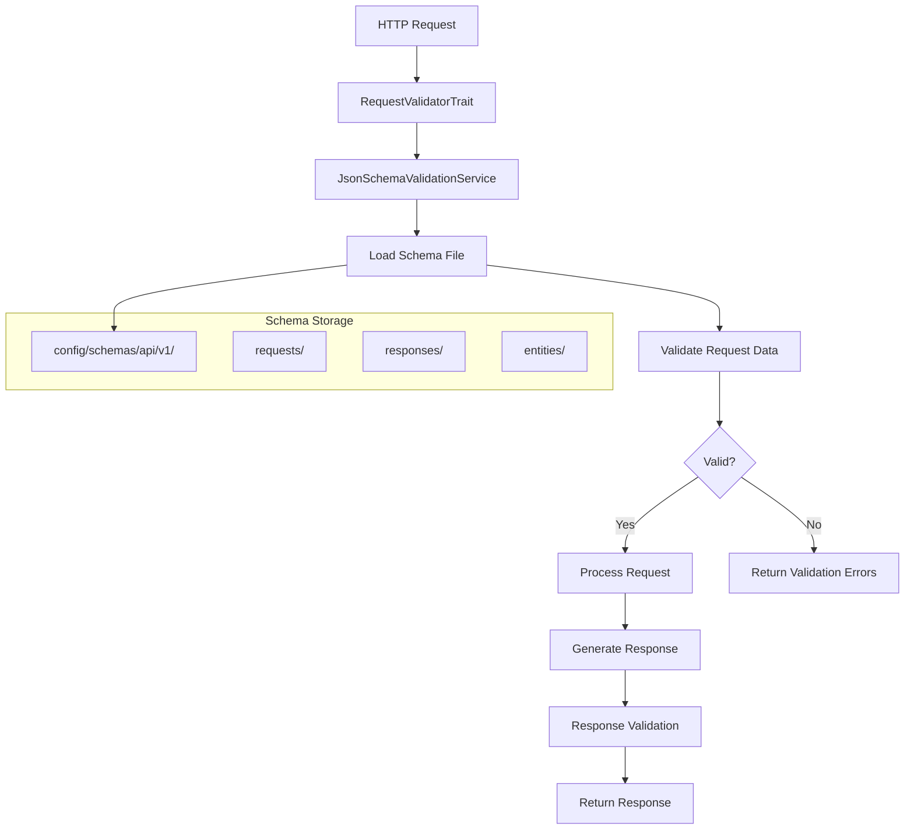

# JSON Schema Validation

## 📋 Overview

The SelfHelp Symfony Backend implements comprehensive JSON Schema validation for all API requests and responses. This ensures data consistency, clear API contracts, and automatic validation with detailed error messages.

## 🏗️ Validation Architecture



## 📁 Schema Organization

### Directory Structure
```
config/schemas/api/v1/
├── entities/                    # Base entity schemas
│   ├── pageEntity.json         # Core page entity structure
│   ├── userEntity.json         # User entity structure
│   ├── lookupEntity.json       # Reusable lookup type entity
│   └── sectionEntity.json      # Section entity structure
├── requests/                   # Request validation schemas
│   ├── admin/                  # Admin API endpoints
│   │   ├── create_page.json
│   │   ├── update_page.json
│   │   ├── create_user.json
│   │   ├── create_asset.json
│   │   └── create_section.json
│   ├── auth/                   # Authentication endpoints
│   │   ├── login.json
│   │   └── refresh_token.json
│   └── frontend/               # Frontend API endpoints
│       └── contact_form.json
├── responses/                  # Response validation schemas
│   ├── admin/                  # Admin API responses
│   │   ├── page.json
│   │   ├── pages.json
│   │   ├── user.json
│   │   ├── users.json
│   │   └── asset.json
│   ├── frontend/               # Frontend API responses
│   │   ├── page.json
│   │   └── pages.json
│   ├── common/                 # Shared response components
│   │   ├── _response_envelope.json
│   │   ├── _error_response_envelope.json
│   │   └── _pagination.json
│   └── errors/                 # Error response schemas
│       ├── not_found_error.json
│       ├── bad_request_error.json
│       └── validation_error.json
└── shared/                     # Reusable schema components
    ├── definitions.json        # Common type definitions
    └── patterns.json          # Validation patterns
```

## 🔧 JsonSchemaValidationService

### Core Implementation
```php
<?php
namespace App\Service\JSON;

use JsonSchema\Validator;
use JsonSchema\Constraints\Constraint;
use JsonSchema\Uri\UriRetriever;
use JsonSchema\SchemaStorage;

class JsonSchemaValidationService
{
    private Validator $validator;
    private string $schemaBaseDir;
    private UriRetriever $retriever;
    private SchemaStorage $schemaStorage;

    public function __construct(KernelInterface $kernel)
    {
        $this->schemaBaseDir = $kernel->getProjectDir() . '/config/schemas/api/v1/';
        $this->retriever = new UriRetriever();
        $this->schemaStorage = new SchemaStorage($this->retriever);
        $factory = new Factory($this->schemaStorage);
        $this->validator = new Validator($factory);
    }

    /**
     * Validates data against a JSON schema
     *
     * @param object|array $data The data to validate
     * @param string $schemaName Schema path (e.g., "requests/admin/create_page")
     * @return array Validation error messages (empty if valid)
     */
    public function validate(object|array $data, string $schemaName): array
    {
        $schemaFilePath = $this->schemaBaseDir . $schemaName . '.json';
        
        if (!file_exists($schemaFilePath)) {
            throw new FileNotFoundException("Schema file not found: {$schemaName}");
        }

        $schemaUri = 'file://' . str_replace('\\', '/', realpath($schemaFilePath));
        
        // Pre-load referenced schemas
        $this->preLoadReferencedSchemas(dirname($schemaFilePath));
        
        $schemaObject = $this->retriever->retrieve($schemaUri);
        
        $this->validator->validate(
            $data, 
            $schemaObject, 
            Constraint::CHECK_MODE_VALIDATE_SCHEMA | 
            Constraint::CHECK_MODE_APPLY_DEFAULTS
        );
        
        $errors = [];
        if (!$this->validator->isValid()) {
            foreach ($this->validator->getErrors() as $error) {
                $pointer = $error['property'] ?? $error['pointer'] ?? 'object';
                $message = $error['message'] ?? 'Unknown validation error';
                $errors[] = sprintf(
                    "Field '%s': %s", 
                    str_replace('/', '.', ltrim($pointer, '/')), 
                    $message
                );
            }
        }
        
        $this->validator->reset();
        return $errors;
    }
}
```

## 📝 Request Validation

### RequestValidatorTrait
```php
<?php
namespace App\Controller\Trait;

use App\Exception\RequestValidationException;
use App\Service\JSON\JsonSchemaValidationService;

trait RequestValidatorTrait
{
    /**
     * Validates a request against a JSON schema
     */
    protected function validateRequest(
        Request $request,
        string $schemaName,
        JsonSchemaValidationService $jsonSchemaValidationService
    ): array {
        // Parse JSON request body
        $data = json_decode($request->getContent(), true);
        if (json_last_error() !== JSON_ERROR_NONE) {
            throw new \InvalidArgumentException('Invalid JSON payload: ' . json_last_error_msg());
        }

        // Validate against schema
        $validationErrors = $jsonSchemaValidationService->validate(
            $this->convertToObject($data), 
            $schemaName
        );
        
        if (!empty($validationErrors)) {
            throw new RequestValidationException(
                $validationErrors,
                $schemaName,
                $data,
                'Request validation failed for schema: ' . $schemaName
            );
        }

        return $data;
    }

    private function convertToObject(mixed $value): mixed
    {
        if (is_array($value)) {
            $object = new \stdClass();
            foreach ($value as $key => $val) {
                $object->{$key} = $this->convertToObject($val);
            }
            return $object;
        }
        return $value;
    }
}
```

### Controller Usage Example
```php
<?php
namespace App\Controller\Api\V1\Admin;

use App\Controller\Trait\RequestValidatorTrait;

class AdminPageController extends AbstractController
{
    use RequestValidatorTrait;

    public function createPage(Request $request): JsonResponse
    {
        try {
            // Validate request against schema
            $validatedData = $this->validateRequest(
                $request,
                'requests/admin/create_page',
                $this->jsonSchemaValidationService
            );
            
            // Process validated data
            $page = $this->adminPageService->createPage($validatedData);
            
            return $this->responseFormatter->formatSuccess(
                $page,
                'responses/admin/pages/page',
                Response::HTTP_CREATED
            );
            
        } catch (RequestValidationException $e) {
            return $this->responseFormatter->formatError(
                'Validation failed',
                Response::HTTP_BAD_REQUEST,
                $e->getValidationErrors()
            );
        }
    }
}
```

## 📤 Response Validation

### ApiResponseFormatter Integration
```php
<?php
namespace App\Service\Core;

class ApiResponseFormatter
{
    public function formatSuccess(
        $data = null, 
        ?string $schemaName = null, 
        int $status = Response::HTTP_OK
    ): JsonResponse {
        $responseData = [
            'status' => $status,
            'message' => Response::$statusTexts[$status] ?? 'OK',
            'error' => null,
            'logged_in' => $this->isUserLoggedIn(),
            'meta' => $this->buildMeta(),
            'data' => $data
        ];

        // Validate response in debug mode
        if ($this->kernel->getEnvironment() !== 'prod' && $schemaName) {
            $this->validateResponse($responseData, $schemaName);
        }

        return new JsonResponse($responseData, $status);
    }

    private function validateResponse(array $responseData, string $schemaName): void
    {
        try {
            $responseDataForValidation = $this->arrayToObject($responseData);
            
            $validationErrors = $this->jsonSchemaValidationService->validate(
                $responseDataForValidation, 
                $schemaName
            );

            if (!empty($validationErrors)) {
                $this->logger->error('API Response Schema Validation Failed.', [
                    'schema' => $schemaName,
                    'errors' => $validationErrors,
                ]);

                // Add debug info in non-prod environments
                $responseData['_debug'] = ['validation_errors' => $validationErrors];
            }
        } catch (\Exception $e) {
            $this->logger->error('Response validation error: ' . $e->getMessage());
        }
    }
}
```

## 📋 Schema Examples

### Request Schema Example
```json
{
  "$schema": "http://json-schema.org/draft-07/schema#",
  "title": "Create Page Request",
  "type": "object",
  "required": ["keyword", "pageType"],
  "properties": {
    "keyword": {
      "type": "string",
      "minLength": 1,
      "maxLength": 100,
      "pattern": "^[a-zA-Z0-9_-]+$",
      "description": "Unique page identifier"
    },
    "pageType": {
      "type": "integer",
      "minimum": 1,
      "description": "Page type ID from lookups table"
    },
    "url": {
      "type": "string",
      "maxLength": 255,
      "pattern": "^/[a-zA-Z0-9/_-]*$",
      "description": "Page URL path"
    },
    "protocol": {
      "type": "string",
      "enum": ["http", "https"],
      "default": "https"
    },
    "parentId": {
      "type": ["integer", "null"],
      "minimum": 1,
      "description": "Parent page ID for hierarchical pages"
    },
    "isHeadless": {
      "type": "boolean",
      "default": false,
      "description": "Whether page is headless (API-only)"
    },
    "navPosition": {
      "type": ["integer", "null"],
      "minimum": 0,
      "description": "Position in navigation menu"
    },
    "footerPosition": {
      "type": ["integer", "null"],
      "minimum": 0,
      "description": "Position in footer menu"
    },
    "isOpenAccess": {
      "type": "boolean",
      "default": false,
      "description": "Whether page allows anonymous access"
    },
    "isSystem": {
      "type": "boolean",
      "default": false,
      "description": "Whether page is system-managed"
    }
  },
  "additionalProperties": false
}
```

### Response Schema Example
```json
{
  "$schema": "http://json-schema.org/draft-07/schema#",
  "title": "Page Response",
  "type": "object",
  "required": ["status", "message", "logged_in", "meta", "data"],
  "properties": {
    "status": {
      "type": "integer",
      "enum": [200, 201]
    },
    "message": {
      "type": "string"
    },
    "error": {
      "type": "null"
    },
    "logged_in": {
      "type": "boolean"
    },
    "meta": {
      "$ref": "common/_response_meta.json"
    },
    "data": {
      "$ref": "../entities/pageEntity.json"
    }
  },
  "additionalProperties": false
}
```

### Entity Schema Example
```json
{
  "$schema": "http://json-schema.org/draft-07/schema#",
  "title": "Page Entity",
  "type": "object",
  "required": ["id", "keyword", "pageType", "isHeadless", "isOpenAccess", "isSystem"],
  "properties": {
    "id": {
      "type": "integer",
      "description": "Unique page identifier"
    },
    "keyword": {
      "type": "string",
      "description": "Unique page keyword"
    },
    "url": {
      "type": ["string", "null"],
      "description": "Page URL path"
    },
    "protocol": {
      "type": "string",
      "enum": ["http", "https"],
      "description": "URL protocol"
    },
    "parentPage": {
      "oneOf": [
        {"type": "null"},
        {"$ref": "#"}
      ],
      "description": "Parent page (recursive reference)"
    },
    "pageType": {
      "$ref": "lookupEntity.json",
      "description": "Page type lookup"
    },
    "pageAccessType": {
      "oneOf": [
        {"type": "null"},
        {"$ref": "lookupEntity.json"}
      ],
      "description": "Page access type lookup"
    },
    "isHeadless": {
      "type": "boolean",
      "description": "Whether page is headless"
    },
    "navPosition": {
      "type": ["integer", "null"],
      "description": "Navigation position"
    },
    "footerPosition": {
      "type": ["integer", "null"],
      "description": "Footer position"
    },
    "isOpenAccess": {
      "type": "boolean",
      "description": "Whether page allows anonymous access"
    },
    "isSystem": {
      "type": "boolean",
      "description": "Whether page is system-managed"
    }
  },
  "additionalProperties": false
}
```

### Common Response Envelope Schema
```json
{
  "$schema": "http://json-schema.org/draft-07/schema#",
  "title": "Standard API Response Envelope",
  "type": "object",
  "required": ["status", "message", "logged_in", "meta"],
  "properties": {
    "status": {
      "type": "integer",
      "description": "HTTP status code"
    },
    "message": {
      "type": "string",
      "description": "Human-readable status message"
    },
    "error": {
      "type": ["string", "null"],
      "description": "Error message (null for successful responses)"
    },
    "logged_in": {
      "type": "boolean",
      "description": "Whether user is authenticated"
    },
    "meta": {
      "type": "object",
      "required": ["version", "timestamp"],
      "properties": {
        "version": {
          "type": "string",
          "pattern": "^v\\d+$",
          "description": "API version"
        },
        "timestamp": {
          "type": "string",
          "format": "date-time",
          "description": "Response timestamp"
        },
        "request_id": {
          "type": "string",
          "description": "Unique request identifier"
        },
        "pagination": {
          "$ref": "_pagination.json"
        }
      },
      "additionalProperties": false
    },
    "data": {
      "description": "Response payload (varies by endpoint)"
    },
    "error_details": {
      "type": "object",
      "description": "Additional error information"
    },
    "_debug": {
      "type": "object",
      "description": "Debug information (non-production only)"
    }
  },
  "additionalProperties": false
}
```

## 🚨 Error Handling

### RequestValidationException
```php
<?php
namespace App\Exception;

class RequestValidationException extends \Exception
{
    private array $validationErrors;
    private string $schemaName;
    private array $requestData;

    public function __construct(
        array $validationErrors,
        string $schemaName,
        array $requestData,
        string $message = ''
    ) {
        $this->validationErrors = $validationErrors;
        $this->schemaName = $schemaName;
        $this->requestData = $requestData;
        parent::__construct($message);
    }

    public function getValidationErrors(): array
    {
        return $this->validationErrors;
    }

    public function getSchemaName(): string
    {
        return $this->schemaName;
    }

    public function getRequestData(): array
    {
        return $this->requestData;
    }
}
```

### Error Response Format
```json
{
  "status": 400,
  "message": "Bad Request",
  "error": "Validation failed",
  "logged_in": true,
  "meta": {
    "version": "v1",
    "timestamp": "2025-01-23T10:30:00Z"
  },
  "data": null,
  "error_details": {
    "schema": "requests/admin/create_page",
    "validation_errors": [
      "Field 'keyword': This field is required",
      "Field 'pageType': Must be a positive integer",
      "Field 'url': Does not match pattern ^/[a-zA-Z0-9/_-]*$"
    ]
  }
}
```

## 🔧 Schema Development Best Practices

### 1. Entity-Schema Alignment
- Request/response schemas should mirror entity structures
- Property names should match entity field names (camelCase)
- Property types should align with entity field types
- Required fields should correspond to non-nullable entity fields

### 2. Naming Conventions
- Use camelCase for all property names in schemas
- Schema files use snake_case (e.g., `create_page.json`)
- Entity schemas use entityName + "Entity.json"
- Response schemas match the data structure they validate

### 3. Schema Reusability
- Create entity schemas for reusable data structures
- Use `$ref` to reference common schemas
- Define shared patterns in `shared/patterns.json`
- Create common definitions in `shared/definitions.json`

### 4. Validation Rules
- Always define `required` fields
- Use appropriate `type` constraints
- Add `minLength`/`maxLength` for strings
- Use `minimum`/`maximum` for numbers
- Define `enum` values for limited options
- Add `pattern` for format validation
- Set `additionalProperties: false` to prevent extra fields

### 5. Documentation
- Include `description` for all properties
- Add `title` to schema root
- Document complex validation rules
- Provide examples where helpful

## 🧪 Testing Schema Validation

### Unit Testing Schemas
```php
<?php
namespace App\Tests\Service\JSON;

class JsonSchemaValidationServiceTest extends KernelTestCase
{
    private JsonSchemaValidationService $validationService;

    protected function setUp(): void
    {
        $this->validationService = static::getContainer()
            ->get(JsonSchemaValidationService::class);
    }

    public function testValidPageCreationRequest(): void
    {
        $validData = (object) [
            'keyword' => 'test-page',
            'pageType' => 1,
            'url' => '/test-page',
            'isHeadless' => false
        ];

        $errors = $this->validationService->validate(
            $validData,
            'requests/admin/create_page'
        );

        $this->assertEmpty($errors);
    }

    public function testInvalidPageCreationRequest(): void
    {
        $invalidData = (object) [
            'keyword' => '', // Invalid: empty string
            'pageType' => -1, // Invalid: negative number
            'url' => 'invalid-url' // Invalid: doesn't start with /
        ];

        $errors = $this->validationService->validate(
            $invalidData,
            'requests/admin/create_page'
        );

        $this->assertNotEmpty($errors);
        $this->assertCount(3, $errors);
    }
}
```

### Integration Testing
```php
<?php
public function testCreatePageValidation(): void
{
    $invalidData = [
        'keyword' => '',
        'pageType' => 'invalid'
    ];

    $response = $this->client->request('POST', '/cms-api/v1/admin/pages', [
        'json' => $invalidData,
        'headers' => ['Authorization' => 'Bearer ' . $this->getAuthToken()]
    ]);

    $this->assertResponseStatusCodeSame(400);
    $data = json_decode($response->getContent(), true);
    $this->assertEquals('Validation failed', $data['error']);
    $this->assertArrayHasKey('error_details', $data);
    $this->assertArrayHasKey('validation_errors', $data['error_details']);
}
```

## 🔄 Schema Versioning

### Version Management
- Schemas are organized by API version (`v1`, `v2`)
- New API versions get new schema directories
- Backward compatibility maintained through versioned schemas
- Migration guides provided for schema changes

### Schema Evolution
```
config/schemas/api/
├── v1/
│   ├── requests/admin/create_page.json    # Original schema
│   └── responses/admin/pages/page.json
└── v2/
    ├── requests/admin/create_page.json    # Updated schema
    └── responses/admin/pages/page.json
```

---

**Next**: [Versioning Strategy](./07-versioning-strategy.md)