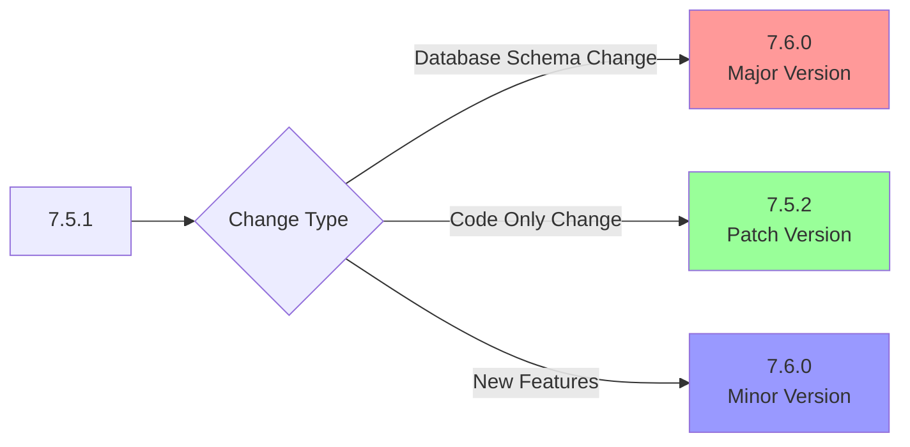
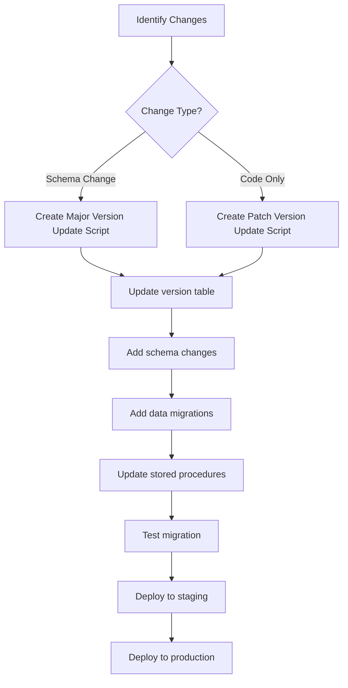
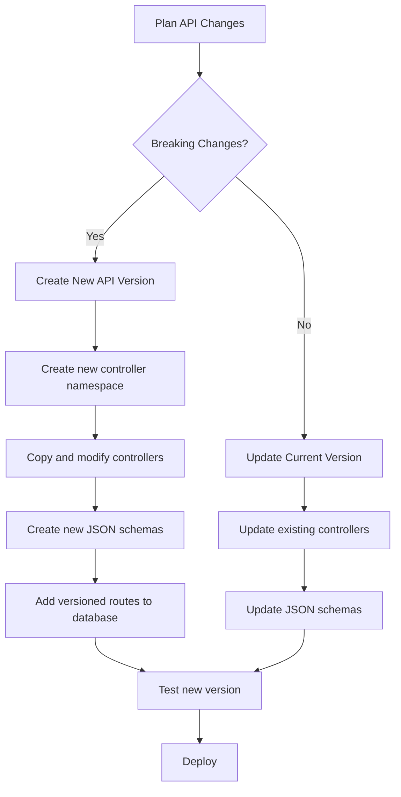

# Versioning Strategy

## 🔄 Overview

The SelfHelp Symfony Backend implements a comprehensive versioning strategy that covers database schema, API endpoints, and system components. This ensures smooth evolution while maintaining backward compatibility.

## 📊 Version Types & Semantic Versioning

### Version Format: `MAJOR.MINOR.PATCH`



### Version Increment Rules

| Change Type | Version Impact | Example |
|-------------|----------------|---------|
| **Database Schema Changes** | Major Version | 7.5.1 → 7.6.0 |
| **New Tables/Columns** | Major Version | 7.5.1 → 7.6.0 |
| **API Breaking Changes** | Major Version | 7.5.1 → 7.6.0 |
| **New Features (Non-breaking)** | Minor Version | 7.5.1 → 7.5.2 |
| **Bug Fixes** | Patch Version | 7.5.1 → 7.5.2 |
| **Code Refactoring** | Patch Version | 7.5.1 → 7.5.2 |

## 🗄️ Database Versioning

### Version Tracking
Database version is stored in the `version` table:

```sql
CREATE TABLE `version` (
  `id`      INT AUTO_INCREMENT NOT NULL,
  `version` VARCHAR(100) NULL,
  PRIMARY KEY (`id`)
) ENGINE=InnoDB DEFAULT CHARSET=utf8mb4;

-- Current version
INSERT INTO `version` (`version`) VALUES ('v8.0.0');
```

### Update Script Naming Convention
```
db/update_scripts/
├── 39_update_v7.6.0_v8.0.0.sql    # Major version update
├── 40_update_v8.0.0_v8.0.1.sql    # Patch version update
├── 41_update_v8.0.1_v8.1.0.sql    # Minor version update
└── api_routes.sql                   # Route definitions
```

### Update Script Structure
```sql
-- File: 39_update_v7.6.0_v8.0.0.sql

-- Set DB version (ALWAYS FIRST)
UPDATE version SET version = 'v8.0.0';

-- Add new features for v8.0.0
-- Description of changes and new features

-- 1. Schema Changes
CREATE TABLE `new_feature_table` (
  `id` INT AUTO_INCREMENT NOT NULL,
  `name` VARCHAR(255) NOT NULL,
  PRIMARY KEY (`id`)
) ENGINE=InnoDB DEFAULT CHARSET=utf8mb4;

-- 2. Data Migrations
INSERT INTO `lookups` (`type_code`, `code`, `description`) VALUES
('NEW_FEATURE_TYPES', 'TYPE_A', 'Feature Type A'),
('NEW_FEATURE_TYPES', 'TYPE_B', 'Feature Type B');

-- 3. Index Creation
CALL add_index('new_feature_table', 'idx_name', 'name', FALSE);

-- 4. Stored Procedure Updates
DELIMITER //
DROP PROCEDURE IF EXISTS new_feature_procedure //
CREATE PROCEDURE new_feature_procedure(IN param INT)
BEGIN
    -- Procedure logic
END //
DELIMITER ;
```

## 🌐 API Versioning

### URL-Based Versioning
All API endpoints include version in the URL:

```
/cms-api/v1/admin/pages    # Version 1
/cms-api/v2/admin/pages    # Version 2
```

### Database Route Versioning
Routes are versioned in the `api_routes` table:

```sql
CREATE TABLE `api_routes` (
  `id`           INT AUTO_INCREMENT NOT NULL,
  `route_name`   VARCHAR(100) NOT NULL,
  `version`      VARCHAR(10) NOT NULL DEFAULT 'v1',
  `path`         VARCHAR(255) NOT NULL,
  `controller`   VARCHAR(255) NOT NULL,
  `methods`      VARCHAR(50) NOT NULL,
  PRIMARY KEY (`id`),
  UNIQUE KEY `uniq_route_name_version` (`route_name`, `version`)
);

-- Example versioned routes
INSERT INTO `api_routes` (`route_name`, `version`, `path`, `controller`, `methods`) VALUES
('admin_get_pages', 'v1', '/admin/pages', 'App\\Controller\\AdminPageController::getPages', 'GET'),
('admin_get_pages', 'v2', '/admin/pages', 'App\\Controller\\AdminPageController::getPagesV2', 'GET');
```

### Controller Versioning
Controllers are organized in versioned namespaces:

```
src/Controller/Api/
├── V1/
│   ├── Admin/
│   │   ├── AdminPageController.php
│   │   └── AdminUserController.php
│   ├── Auth/
│   │   └── AuthController.php
│   └── Frontend/
│       └── PageController.php
└── V2/
    ├── Admin/
    │   ├── AdminPageController.php    # V2 implementation
    │   └── AdminUserController.php
    └── Auth/
        └── AuthController.php
```

### Namespace Mapping
The system automatically maps database controller references to versioned namespaces:

```php
<?php
// ApiRouteLoader::mapControllerToVersionedNamespace()
private function mapControllerToVersionedNamespace(string $controller, string $version): string
{
    // Database: App\Controller\AdminPageController::getPages
    // Maps to: App\Controller\Api\V1\Admin\AdminPageController::getPages
    
    if (str_starts_with($controller, 'App\\Controller\\Api\\')) {
        return $controller; // Already versioned
    }
    
    $parts = explode('::', $controller);
    $controllerPath = $parts[0];
    $method = $parts[1] ?? null;
    
    // Map to versioned namespace
    $versionedController = str_replace(
        'App\\Controller\\',
        'App\\Controller\\Api\\' . strtoupper($version) . '\\',
        $controllerPath
    );
    
    return $method ? $versionedController . '::' . $method : $versionedController;
}
```

## 📋 JSON Schema Versioning

### Schema Organization
Schemas are organized by API version:

```
config/schemas/api/
├── v1/
│   ├── requests/
│   │   ├── admin/
│   │   │   ├── create_page.json
│   │   │   └── update_page.json
│   │   └── auth/
│   │       └── login.json
│   └── responses/
│       ├── admin/
│       │   ├── page.json
│       │   └── pages.json
│       └── common/
│           └── _response_envelope.json
└── v2/
    ├── requests/
    └── responses/
```

### Schema Evolution
When creating a new API version, schemas can be:

1. **Copied and Modified**: Copy v1 schema and modify for v2
2. **Extended**: Add new optional fields
3. **Restructured**: Change field names or structure (breaking change)

### Schema Validation by Version
```php
<?php
public function validateRequest(Request $request, string $schemaName): array
{
    $version = $request->attributes->get('_version', 'v1');
    $fullSchemaPath = "api/{$version}/{$schemaName}";
    
    return $this->jsonSchemaValidationService->validate(
        json_decode($request->getContent()),
        $fullSchemaPath
    );
}
```

## 🔄 Migration Process

### Database Migration Workflow


### API Migration Workflow


### Backward Compatibility Strategy
1. **Maintain Old Versions**: Keep v1 controllers and schemas
2. **Gradual Migration**: Allow clients to migrate at their own pace
3. **Deprecation Notices**: Add deprecation headers to old versions
4. **Documentation**: Maintain migration guides

## 🚀 Deployment Strategy

### Environment-Specific Versioning
```php
<?php
// Different versions per environment
return [
    'development' => 'v8.1.0-dev',
    'staging' => 'v8.0.0',
    'production' => 'v7.9.0'
];
```

### Version Detection
```php
<?php
namespace App\Service\Core;

class VersionService
{
    public function getCurrentVersion(): string
    {
        $version = $this->entityManager
            ->getRepository(Version::class)
            ->findOneBy([], ['id' => 'DESC']);
            
        return $version ? $version->getVersion() : 'unknown';
    }
    
    public function isVersionCompatible(string $requiredVersion): bool
    {
        $current = $this->getCurrentVersion();
        return version_compare($current, $requiredVersion, '>=');
    }
}
```

### Deployment Checks
```php
<?php
// Pre-deployment version check
public function checkVersionCompatibility(): bool
{
    $dbVersion = $this->getDbVersion();
    $codeVersion = $this->getCodeVersion();
    
    if (version_compare($dbVersion, $codeVersion, '<')) {
        throw new \Exception("Database version {$dbVersion} is behind code version {$codeVersion}");
    }
    
    return true;
}
```

## 📊 Version Monitoring

### Version Tracking in Responses
```json
{
    "status": 200,
    "message": "OK",
    "meta": {
        "version": "v1",
        "api_version": "1.0.0",
        "database_version": "v8.0.0",
        "timestamp": "2025-01-23T10:30:00Z"
    },
    "data": {}
}
```

### Health Check Endpoint
```php
<?php
public function healthCheck(): JsonResponse
{
    return $this->responseFormatter->formatSuccess([
        'status' => 'healthy',
        'database_version' => $this->versionService->getCurrentVersion(),
        'api_version' => $this->getParameter('app.version'),
        'environment' => $this->kernel->getEnvironment(),
        'timestamp' => new \DateTime()
    ]);
}
```

## 🔧 Version Management Tools

### Version Update Command
```php
<?php
namespace App\Command;

class UpdateVersionCommand extends Command
{
    protected function execute(InputInterface $input, OutputInterface $output): int
    {
        $newVersion = $input->getArgument('version');
        
        // Validate version format
        if (!preg_match('/^v\d+\.\d+\.\d+$/', $newVersion)) {
            $output->writeln('<error>Invalid version format</error>');
            return Command::FAILURE;
        }
        
        // Update database version
        $this->versionService->updateVersion($newVersion);
        
        $output->writeln("<info>Version updated to {$newVersion}</info>");
        return Command::SUCCESS;
    }
}
```

### Migration Validation
```php
<?php
public function validateMigration(string $scriptPath): array
{
    $errors = [];
    $content = file_get_contents($scriptPath);
    
    // Check if version update is first
    if (!preg_match('/^UPDATE version SET version/', trim($content))) {
        $errors[] = 'Version update must be the first statement';
    }
    
    // Check for dangerous operations
    if (preg_match('/DROP TABLE.*(?!IF EXISTS)/', $content)) {
        $errors[] = 'DROP TABLE without IF EXISTS detected';
    }
    
    return $errors;
}
```

## 🧪 Testing Versioning

### Version Compatibility Testing
```php
<?php
public function testVersionCompatibility(): void
{
    // Test current version
    $response = $this->client->request('GET', '/cms-api/v1/admin/pages');
    $this->assertResponseIsSuccessful();
    
    // Test that v2 doesn't exist yet
    $response = $this->client->request('GET', '/cms-api/v2/admin/pages');
    $this->assertResponseStatusCodeSame(404);
}
```

### Migration Testing
```php
<?php
public function testDatabaseMigration(): void
{
    $initialVersion = $this->versionService->getCurrentVersion();
    
    // Run migration
    $this->runMigrationScript('39_update_v7.6.0_v8.0.0.sql');
    
    // Verify version updated
    $newVersion = $this->versionService->getCurrentVersion();
    $this->assertEquals('v8.0.0', $newVersion);
    
    // Verify schema changes
    $this->assertTrue($this->schemaExists('new_feature_table'));
}
```

## 📚 Best Practices

### Database Versioning
1. **Always update version first** in migration scripts
2. **Use IF EXISTS/IF NOT EXISTS** for safe operations
3. **Test migrations** on copy of production data
4. **Document breaking changes** thoroughly
5. **Backup before major versions**

### API Versioning
1. **Maintain backward compatibility** when possible
2. **Use semantic versioning** for API changes
3. **Provide migration guides** for breaking changes
4. **Version JSON schemas** alongside APIs
5. **Monitor usage** of deprecated versions

### Code Versioning
1. **Tag releases** in version control
2. **Maintain changelogs** for each version
3. **Use feature flags** for gradual rollouts
4. **Test cross-version compatibility**
5. **Automate version updates** where possible

---

**Next**: [CMS Architecture](./08-cms-architecture.md)