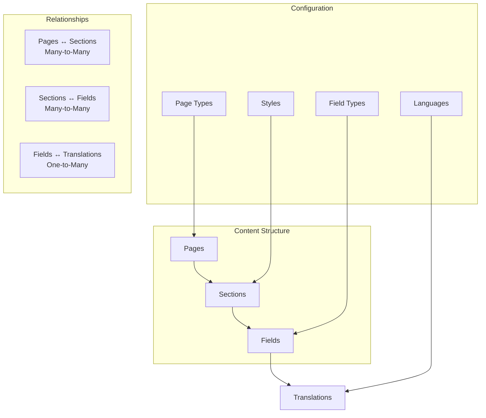
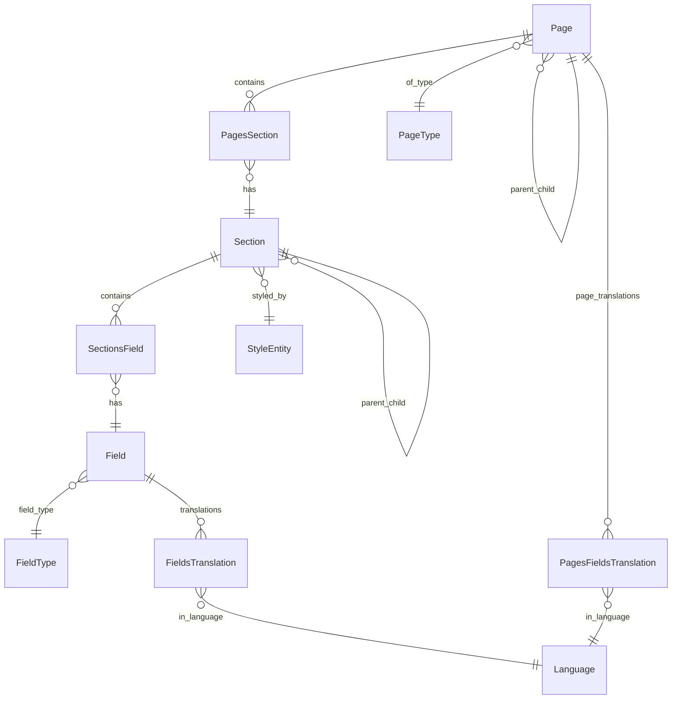
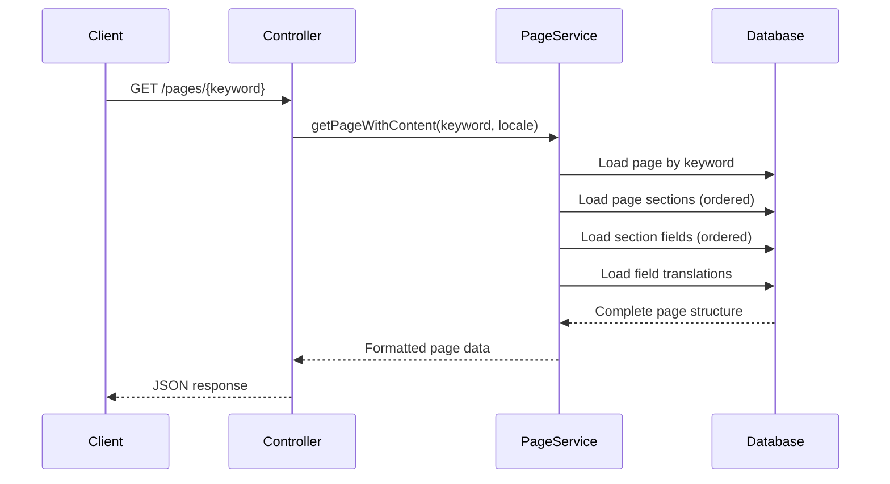

# CMS Architecture

## 📄 Overview

The SelfHelp Symfony Backend includes a sophisticated Content Management System (CMS) built on a hierarchical structure of Pages, Sections, and Fields. This architecture provides flexible content organization with multi-language support, dynamic styling, and fine-grained access control.

## 🏗️ CMS Hierarchy



## 📊 Entity Relationships

### Core CMS Entities


## 📄 Page Management

### Page Entity Structure
```php
<?php
namespace App\Entity;

#[ORM\Entity]
#[ORM\Table(name: 'pages')]
class Page
{
    #[ORM\Id]
    #[ORM\GeneratedValue]
    #[ORM\Column(type: 'integer')]
    private ?int $id = null;

    #[ORM\Column(name: 'keyword', type: 'string', length: 100, unique: true)]
    private ?string $keyword = null;

    #[ORM\Column(name: 'url', type: 'string', length: 255, nullable: true)]
    private ?string $url = null;

    #[ORM\Column(name: 'protocol', type: 'string', length: 10, options: ['default' => 'https'])]
    private string $protocol = 'https';

    #[ORM\ManyToOne(targetEntity: Page::class)]
    #[ORM\JoinColumn(name: 'parent', referencedColumnName: 'id', nullable: true, onDelete: 'CASCADE')]
    private ?Page $parentPage = null;

    #[ORM\ManyToOne(targetEntity: PageType::class)]
    #[ORM\JoinColumn(name: 'id_type', referencedColumnName: 'id', nullable: false, onDelete: 'CASCADE')]
    private ?PageType $pageType = null;

    #[ORM\Column(name: 'is_headless', type: 'boolean', options: ['default' => 0])]
    private bool $is_headless = false;

    #[ORM\Column(name: 'nav_position', type: 'integer', nullable: true)]
    private ?int $nav_position = null;

    #[ORM\Column(name: 'is_open_access', type: 'boolean', options: ['default' => 0], nullable: true)]
    private ?bool $is_open_access = false;

    #[ORM\Column(name: 'is_system', type: 'boolean', options: ['default' => 0], nullable: true)]
    private ?bool $is_system = false;
}
// ENTITY RULE
```

### Page Types
Pages are categorized by types stored in the `pageTypes` table:

```sql
CREATE TABLE `pageTypes` (
  `id` int NOT NULL AUTO_INCREMENT,
  `name` varchar(100) NOT NULL,
  `description` varchar(255) DEFAULT NULL,
  `is_active` tinyint(1) NOT NULL DEFAULT '1',
  PRIMARY KEY (`id`)
) ENGINE=InnoDB DEFAULT CHARSET=utf8mb3;

-- Common page types
INSERT INTO `pageTypes` (`name`, `description`) VALUES
('standard', 'Standard content page'),
('landing', 'Landing page with special layout'),
('system', 'System-generated page'),
('redirect', 'Redirect to another URL');
```

### Page Features
- **Hierarchical Structure**: Pages can have parent-child relationships
- **URL Management**: Custom URLs with protocol specification
- **Access Control**: Open access vs. authenticated access
- **Navigation Integration**: Position in navigation and footer menus
- **Headless Support**: API-only pages without header and footer rendering (content only)
- **System Pages**: Special pages managed by the system

#### Page Types and Rendering
- **Standard Pages**: Full page with header, footer, and navigation
- **Headless Pages**: Content-only rendering without header/footer (for modals, embedded content)
- **Landing Pages**: Special layout pages with custom styling
- **System Pages**: Auto-generated pages (login, error pages)
- **Redirect Pages**: Pages that redirect to other URLs

## 📋 Section Management

### Section Entity Structure
```php
<?php
namespace App\Entity;

#[ORM\Entity]
#[ORM\Table(name: 'sections')]
class Section
{
    #[ORM\Id]
    #[ORM\GeneratedValue]
    #[ORM\Column(type: 'integer')]
    private ?int $id = null;

    #[ORM\Column(name: 'name', type: 'string', length: 100)]
    private ?string $name = null;

    #[ORM\ManyToOne(targetEntity: Style::class)]
    #[ORM\JoinColumn(name: 'id_styles', referencedColumnName: 'id', nullable: false, onDelete: 'CASCADE')]
    private ?Style $style = null;

    #[ORM\ManyToOne(targetEntity: Section::class)]
    #[ORM\JoinColumn(name: 'parent', referencedColumnName: 'id', nullable: true, onDelete: 'CASCADE')]
    private ?Section $parent = null;

    #[ORM\Column(name: 'position', type: 'integer', nullable: true)]
    private ?int $position = null;
}
// ENTITY RULE
```

### Pages-Sections Relationship
```php
<?php
namespace App\Entity;

#[ORM\Entity]
#[ORM\Table(name: 'pages_sections')]
class PagesSection
{
    #[ORM\Id]
    #[ORM\ManyToOne(targetEntity: Page::class)]
    #[ORM\JoinColumn(name: 'id_pages', referencedColumnName: 'id', onDelete: 'CASCADE')]
    private ?Page $page = null;

    #[ORM\Id]
    #[ORM\ManyToOne(targetEntity: Section::class)]
    #[ORM\JoinColumn(name: 'id_sections', referencedColumnName: 'id', onDelete: 'CASCADE')]
    private ?Section $section = null;

    #[ORM\Column(name: 'position', type: 'integer', nullable: true)]
    private ?int $position = null;
}
// ENTITY RULE
```

### Section Features
- **Hierarchical Sections**: Sections can contain child sections
- **Style Integration**: Each section has an associated style
- **Position Management**: Ordered positioning within pages and parent sections
- **Limited Reusability**: Only sections with style `refContainer` can be reused across multiple pages
- **Content Flexibility**: Within a `refContainer` section, any content can be added and styled

#### Section Reusability Rules
- **`refContainer` Style**: These sections can be added to multiple pages
- **Other Styles**: Regular sections are typically page-specific
- **Content Management**: Reusable sections maintain their content across all pages where used
- **Style Consistency**: The `refContainer` style ensures consistent appearance across pages

## 🎨 Style System

### Style Entity
```php
<?php
namespace App\Entity;

#[ORM\Entity]
#[ORM\Table(name: 'styles')]
class Style
{
    #[ORM\Id]
    #[ORM\GeneratedValue]
    #[ORM\Column(type: 'integer')]
    private ?int $id = null;

    #[ORM\Column(name: 'name', type: 'string', length: 100)]
    private ?string $name = null;

    #[ORM\Column(name: 'description', type: 'string', length: 255, nullable: true)]
    private ?string $description = null;

    #[ORM\Column(name: 'css_class', type: 'string', length: 255, nullable: true)]
    private ?string $cssClass = null;

    #[ORM\Column(name: 'template', type: 'string', length: 255, nullable: true)]
    private ?string $template = null;

    #[ORM\Column(name: 'is_active', type: 'boolean', options: ['default' => 1])]
    private bool $isActive = true;
}
// ENTITY RULE
```

### Style Features
- **CSS Integration**: Styles define CSS classes for frontend rendering
- **Template Association**: Link to specific templates for complex layouts
- **Reusability**: Styles can be applied to multiple sections
- **Active State**: Enable/disable styles system-wide

## 📝 Field Management

### Field Entity Structure
```php
<?php
namespace App\Entity;

#[ORM\Entity]
#[ORM\Table(name: 'fields')]
class Field
{
    #[ORM\Id]
    #[ORM\GeneratedValue]
    #[ORM\Column(type: 'integer')]
    private ?int $id = null;

    #[ORM\Column(name: 'name', type: 'string', length: 100)]
    private ?string $name = null;

    #[ORM\ManyToOne(targetEntity: Lookup::class)]
    #[ORM\JoinColumn(name: 'id_fieldTypes', referencedColumnName: 'id', nullable: false, onDelete: 'CASCADE')]
    private ?Lookup $fieldType = null;

    #[ORM\Column(name: 'default_value', type: 'text', nullable: true)]
    private ?string $defaultValue = null;

    #[ORM\Column(name: 'help', type: 'string', length: 1000, nullable: true)]
    private ?string $help = null;

    #[ORM\Column(name: 'disabled', type: 'boolean', options: ['default' => 0])]
    private bool $disabled = false;

    #[ORM\Column(name: 'hidden', type: 'boolean', options: ['default' => 0])]
    private bool $hidden = false;
}
// ENTITY RULE
```

### Field Types
Field types are managed through the dedicated `fieldTypes` table:

```sql
CREATE TABLE `fieldTypes` (
  `id` int NOT NULL AUTO_INCREMENT,
  `name` varchar(100) NOT NULL,
  `description` varchar(255) DEFAULT NULL,
  `input_type` varchar(50) NOT NULL,
  `validation_rules` json DEFAULT NULL,
  `is_active` tinyint(1) NOT NULL DEFAULT '1',
  PRIMARY KEY (`id`),
  UNIQUE KEY `UNIQ_FIELD_TYPE_NAME` (`name`)
) ENGINE=InnoDB DEFAULT CHARSET=utf8mb4;

-- Field types for CMS content management
INSERT INTO `fieldTypes` (`name`, `description`, `input_type`) VALUES
('TEXT', 'Single line text input', 'text'),
('TEXTAREA', 'Multi-line text area', 'textarea'),
('HTML', 'Rich text HTML editor', 'html'),
('SELECT', 'Dropdown selection', 'select'),
('CHECKBOX', 'Checkbox input', 'checkbox'),
('RADIO', 'Radio button group', 'radio'),
('IMAGE', 'Image upload field', 'file'),
('FILE', 'File upload field', 'file'),
('DATE', 'Date picker', 'date'),
('NUMBER', 'Numeric input', 'number');
```

### Sections-Fields Relationship
```php
<?php
namespace App\Entity;

#[ORM\Entity]
#[ORM\Table(name: 'sections_fields')]
class SectionsField
{
    #[ORM\Id]
    #[ORM\ManyToOne(targetEntity: Section::class)]
    #[ORM\JoinColumn(name: 'id_sections', referencedColumnName: 'id', onDelete: 'CASCADE')]
    private ?Section $section = null;

    #[ORM\Id]
    #[ORM\ManyToOne(targetEntity: Field::class)]
    #[ORM\JoinColumn(name: 'id_fields', referencedColumnName: 'id', onDelete: 'CASCADE')]
    private ?Field $field = null;

    #[ORM\Column(name: 'position', type: 'integer', nullable: true)]
    private ?int $position = null;

    #[ORM\Column(name: 'display', type: 'boolean', options: ['default' => 1])]
    private bool $display = true;
}
// ENTITY RULE
```

## 🌍 Multi-language Support

### Translation System
```php
<?php
namespace App\Entity;

#[ORM\Entity]
#[ORM\Table(name: 'fieldsTranslations')]
class FieldsTranslation
{
    #[ORM\Id]
    #[ORM\GeneratedValue]
    #[ORM\Column(type: 'integer')]
    private ?int $id = null;

    #[ORM\ManyToOne(targetEntity: Field::class)]
    #[ORM\JoinColumn(name: 'id_fields', referencedColumnName: 'id', nullable: false, onDelete: 'CASCADE')]
    private ?Field $field = null;

    #[ORM\ManyToOne(targetEntity: Language::class)]
    #[ORM\JoinColumn(name: 'id_languages', referencedColumnName: 'id', nullable: false, onDelete: 'CASCADE')]
    private ?Language $language = null;

    #[ORM\Column(name: 'content', type: 'text', nullable: true)]
    private ?string $content = null;

    #[ORM\Column(name: 'meta', type: 'text', nullable: true)]
    private ?string $meta = null;
}
// ENTITY RULE
```

### Language Management
```php
<?php
namespace App\Entity;

#[ORM\Entity]
#[ORM\Table(name: 'languages')]
class Language
{
    #[ORM\Id]
    #[ORM\GeneratedValue]
    #[ORM\Column(type: 'integer')]
    private ?int $id = null;

    #[ORM\Column(name: 'language', type: 'string', length: 100)]
    private ?string $language = null;

    #[ORM\Column(name: 'locale', type: 'string', length: 10, unique: true)]
    private ?string $locale = null;

    #[ORM\Column(name: 'is_active', type: 'boolean', options: ['default' => 1])]
    private bool $isActive = true;

    #[ORM\Column(name: 'is_default', type: 'boolean', options: ['default' => 0])]
    private bool $isDefault = false;
}
// ENTITY RULE
```

### Page Title Translations
```php
<?php
namespace App\Entity;

#[ORM\Entity]
#[ORM\Table(name: 'pagesFieldsTranslations')]
class PagesFieldsTranslation
{
    #[ORM\Id]
    #[ORM\GeneratedValue]
    #[ORM\Column(type: 'integer')]
    private ?int $id = null;

    #[ORM\ManyToOne(targetEntity: Page::class)]
    #[ORM\JoinColumn(name: 'id_pages', referencedColumnName: 'id', nullable: false, onDelete: 'CASCADE')]
    private ?Page $page = null;

    #[ORM\ManyToOne(targetEntity: Language::class)]
    #[ORM\JoinColumn(name: 'id_languages', referencedColumnName: 'id', nullable: false, onDelete: 'CASCADE')]
    private ?Language $language = null;

    #[ORM\Column(name: 'title', type: 'string', length: 255, nullable: true)]
    private ?string $title = null;

    #[ORM\Column(name: 'meta_description', type: 'text', nullable: true)]
    private ?string $metaDescription = null;
}
// ENTITY RULE
```

## 🔧 CMS Services

### AdminPageService
```php
<?php
namespace App\Service\CMS\Admin;

class AdminPageService extends BaseService
{
    public function createPage(array $pageData): Page
    {
        $this->entityManager->beginTransaction();
        
        try {
            $page = new Page();
            $page->setKeyword($pageData['keyword']);
            $page->setUrl($pageData['url'] ?? null);
            $page->setProtocol($pageData['protocol'] ?? 'https');
            
            // Set page type
            $pageType = $this->pageTypeRepository->find($pageData['pageType']);
            $page->setPageType($pageType);
            
            // Set parent if specified
            if (!empty($pageData['parentId'])) {
                $parent = $this->pageRepository->find($pageData['parentId']);
                $page->setParentPage($parent);
            }
            
            $page->setIsHeadless($pageData['isHeadless'] ?? false);
            $page->setNavPosition($pageData['navPosition'] ?? null);
            $page->setIsOpenAccess($pageData['isOpenAccess'] ?? false);
            $page->setIsSystem($pageData['isSystem'] ?? false);
            
            $this->entityManager->persist($page);
            $this->entityManager->flush();
            
            // Log transaction
            $this->transactionService->logTransaction(
                LookupService::TRANSACTION_TYPES_INSERT,
                LookupService::TRANSACTION_BY_BY_USER,
                'pages',
                $page->getId(),
                $page,
                'Page created: ' . $page->getKeyword()
            );
            
            $this->entityManager->commit();
            return $page;
            
        } catch (\Exception $e) {
            $this->entityManager->rollback();
            throw $e;
        }
    }
}
```

### SectionCreationService
```php
<?php
namespace App\Service\CMS\Admin;

class SectionCreationService extends BaseService
{
    public function createPageSection(string $pageKeyword, int $styleId, ?int $position): array
    {
        // Permission check
        $this->checkAccess($pageKeyword, 'update');
        $page = $this->pageRepository->findOneBy(['keyword' => $pageKeyword]);
        
        $this->entityManager->beginTransaction();
        try {
            $style = $this->styleRepository->find($styleId);
            
            // Create new section
            $section = new Section();
            $section->setName(time() . '-' . $style->getName());
            $section->setStyle($style);
            $this->entityManager->persist($section);
            $this->entityManager->flush();

            // Add section to page
            $pagesSection = new PagesSection();
            $pagesSection->setPage($page);
            $pagesSection->setSection($section);
            $pagesSection->setPosition($position);
            $this->entityManager->persist($pagesSection);
            $this->entityManager->flush();

            // Normalize positions
            $this->positionManagementService->normalizePageSectionPositions($page->getId(), true);

            $this->entityManager->commit();
            
            return [
                'id' => $section->getId(),
                'position' => $pagesSection->getPosition()
            ];
            
        } catch (\Exception $e) {
            $this->entityManager->rollback();
            throw $e;
        }
    }
}
```

## 📊 Content Loading Process

### Frontend Page Loading


### Content Response Formats

#### Frontend Response (User-facing)
Returns content with translated values in the selected language only:

```json
{
  "page": {
    "id": 1,
    "keyword": "welcome",
    "url": "/welcome",
    "title": "Welcome to SelfHelp",
    "sections": [
      {
        "id": 10,
        "name": "header-section",
        "style": {
          "name": "hero",
          "cssClass": "hero-section",
          "template": "hero.html.twig"
        },
        "position": 1,
        "fields": [
          {
            "name": "title",
            "type": "TEXT",
            "content": "Welcome to Our Platform"
          },
          {
            "name": "subtitle", 
            "type": "TEXTAREA",
            "content": "Discover amazing features..."
          }
        ]
      }
    ]
  }
}
```

#### CMS Response (Admin editing)
Returns all field IDs, values, and translations for editing:

```json
{
  "page": {
    "id": 1,
    "keyword": "welcome",
    "url": "/welcome",
    "title": {
      "en": "Welcome to SelfHelp",
      "de-CH": "Willkommen bei SelfHelp"
    },
    "sections": [
      {
        "id": 10,
        "name": "header-section",
        "style": {
          "id": 5,
          "name": "hero",
          "cssClass": "hero-section",
          "template": "hero.html.twig"
        },
        "position": 1,
        "fields": [
          {
            "id": 100,
            "name": "title",
            "fieldType": {
              "id": 1,
              "name": "TEXT",
              "inputType": "text"
            },
            "position": 1,
            "disabled": false,
            "hidden": false,
            "translations": [
              {
                "id": 200,
                "language": {"id": 1, "locale": "en"},
                "content": "Welcome to Our Platform"
              },
              {
                "id": 201,
                "language": {"id": 2, "locale": "de-CH"},
                "content": "Willkommen auf unserer Plattform"
              }
            ]
          }
        ]
      }
    ]
  }
}
```

## 🔄 Section Export/Import System

### Export Functionality
```php
<?php
namespace App\Service\CMS\Admin;

class AdminSectionService extends BaseService
{
    public function exportPageSections(string $pageKeyword): array
    {
        $page = $this->pageRepository->findOneBy(['keyword' => $pageKeyword]);
        $sections = $this->getSectionsWithFieldsAndTranslations($page->getId());
        
        return $this->buildExportStructure($sections);
    }
    
    private function buildExportStructure(array $sections): array
    {
        $exportData = [];
        
        foreach ($sections as $section) {
            $sectionData = [
                'name' => $section->getName(),
                'style_name' => $section->getStyle()->getName(),
                'fields' => $this->exportSectionFields($section),
                'children' => $this->exportChildSections($section)
            ];
            
            $exportData[] = $sectionData;
        }
        
        return $exportData;
    }
}
```

### Import Functionality
```php
public function importSectionsToPage(string $pageKeyword, array $sectionsData, ?int $position = null): array
{
    $page = $this->pageRepository->findOneBy(['keyword' => $pageKeyword]);
    
    $this->entityManager->beginTransaction();
    try {
        $importedSections = [];
        
        foreach ($sectionsData as $sectionData) {
            $section = $this->createSectionFromImportData($sectionData);
            $this->addSectionToPage($page, $section, $position);
            $importedSections[] = $section;
        }
        
        $this->entityManager->commit();
        return $importedSections;
        
    } catch (\Exception $e) {
        $this->entityManager->rollback();
        throw $e;
    }
}
```

## 🔒 Access Control Integration

### Page-Level ACL
- Users and groups can have specific permissions for each page
- Permissions include: select (view), insert (create), update (modify), delete (remove)
- ACL rules are checked using stored procedures for performance

### Permission Checking in Services
```php
protected function checkAccess(string $pageKeyword, string $accessType): void
{
    $page = $this->pageRepository->findOneBy(['keyword' => $pageKeyword]);
    $userId = $this->userContextService->getCurrentUser()->getId();
    
    if (!$this->aclService->hasAccess($userId, $page->getId(), $accessType)) {
        throw new AccessDeniedException('Insufficient permissions for page: ' . $pageKeyword);
    }
}
```

## 🎯 Best Practices

### Content Organization
1. **Hierarchical Structure**: Use parent-child relationships for logical content organization
2. **Reusable Sections**: Create sections that can be used across multiple pages
3. **Consistent Styling**: Use standardized styles for consistent appearance
4. **Position Management**: Maintain proper ordering for content presentation

### Performance Optimization
1. **Eager Loading**: Load related entities in single queries
2. **Caching**: Cache frequently accessed content
3. **Pagination**: Implement pagination for large content lists
4. **Index Optimization**: Proper database indexing for content queries

### Multi-language Considerations
1. **Default Language**: Always provide content in the default language
2. **Fallback Strategy**: Show default language content when translations are missing
3. **Translation Management**: Provide tools for managing translations
4. **Locale-Aware URLs**: Support locale-specific URLs where needed

---

**Next**: [Asset Management](./09-asset-management.md)