# Asset Management

## 🎨 Overview

The SelfHelp Symfony Backend includes a comprehensive asset management system for handling file uploads, storage, and serving. The system supports various file types including images, documents, CSS, JavaScript, and other media files.

## 🏗️ Asset Architecture

```mermaid
graph TD
    A[File Upload Request] --> B[AdminAssetController]
    B --> C[File Validation]
    C --> D[AdminAssetService]
    D --> E[File Storage]
    E --> F[Database Record]
    F --> G[Asset Response]
    
    subgraph "File Types"
        H[Images<br/>jpg, png, gif, webp, svg]
        I[Documents<br/>pdf, doc, xls, ppt]
        J[Web Assets<br/>css, js, json]
        K[Archives<br/>zip, rar, 7z]
        L[Media<br/>mp4, avi, mov]
    end
    
    subgraph "Storage Structure"
        M[uploads/assets/]
        N[├── general/]
        O[├── images/]
        P[├── documents/]
        Q[└── custom_folder/]
    end
    
    C --> H
    C --> I
    C --> J
    C --> K
    C --> L
    
    E --> M
```



## 🗄️ Database Schema

### Asset Entity
```php
<?php
namespace App\Entity;

#[ORM\Entity]
#[ORM\Table(name: 'assets')]
class Asset
{
    #[ORM\Id]
    #[ORM\GeneratedValue]
    #[ORM\Column(name: 'id', type: 'integer')]
    private ?int $id = null;

    #[ORM\ManyToOne(targetEntity: Lookup::class)]
    #[ORM\JoinColumn(name: 'id_assetTypes', referencedColumnName: 'id', nullable: false, onDelete: 'CASCADE')]
    private Lookup $assetType;

    #[ORM\Column(name: 'folder', type: 'string', length: 100, nullable: true)]
    private ?string $folder = null;

    #[ORM\Column(name: 'file_name', type: 'string', length: 100, unique: true, nullable: true)]
    private ?string $fileName = null;

    #[ORM\Column(name: 'file_path', type: 'string', length: 1000)]
    private string $filePath;

    // Getters and setters...
}
// ENTITY RULE
```

### Database Table Structure
```sql
CREATE TABLE `assets` (
  `id` int NOT NULL AUTO_INCREMENT,
  `id_assetTypes` int NOT NULL,
  `folder` varchar(100) DEFAULT NULL,
  `file_name` varchar(100) DEFAULT NULL,
  `file_path` varchar(1000) NOT NULL,
  PRIMARY KEY (`id`),
  UNIQUE KEY `UNIQ_79D17D8ED7DF1668` (`file_name`),
  FOREIGN KEY (`id_assetTypes`) REFERENCES `lookups` (`id`) ON DELETE CASCADE
) ENGINE=InnoDB DEFAULT CHARSET=utf8mb3;
```

### Asset Types (Lookup System)
```sql
-- Asset types in lookups table
INSERT INTO `lookups` (`type_code`, `code`, `description`) VALUES
('ASSET_TYPES', 'IMAGE', 'Image files (jpg, png, gif, webp, svg)'),
('ASSET_TYPES', 'DOCUMENT', 'Document files (pdf, doc, xls, ppt)'),
('ASSET_TYPES', 'CSS', 'Stylesheet files'),
('ASSET_TYPES', 'JAVASCRIPT', 'JavaScript files'),
('ASSET_TYPES', 'VIDEO', 'Video files (mp4, avi, mov, wmv)'),
('ASSET_TYPES', 'AUDIO', 'Audio files (mp3, wav, ogg)'),
('ASSET_TYPES', 'ARCHIVE', 'Archive files (zip, rar, 7z)'),
('ASSET_TYPES', 'ASSET', 'General asset files');
```

## 🔧 AdminAssetService

### Core Implementation
```php
<?php
namespace App\Service\CMS\Admin;

class AdminAssetService extends BaseService
{
    private const UPLOAD_DIR = 'uploads/assets/';
    private const ALLOWED_EXTENSIONS = [
        'jpg', 'jpeg', 'png', 'gif', 'webp', 'svg', // Images
        'pdf', // Documents
        'mp4', 'avi', 'mov', 'wmv', 'flv', 'webm', // Videos
        'css', 'js', // Web files
        'zip', 'rar', '7z', // Archives
        'json', // JSON files
        'txt', 'doc', 'docx', 'xls', 'xlsx', 'ppt', 'pptx' // Office files
    ];

    public function __construct(
        private readonly AssetRepository $assetRepository,
        private readonly EntityManagerInterface $entityManager,
        private readonly TransactionService $transactionService,
        private readonly LookupService $lookupService,
        private readonly string $projectDir
    ) {}

    /**
     * Create/Upload new asset
     */
    public function createAsset(UploadedFile $file, array $data, bool $overwrite = false): array
    {
        $this->entityManager->beginTransaction();
        
        try {
            // Validate file
            if (!$file->isValid()) {
                throw new ServiceException('File upload failed: ' . $file->getErrorMessage());
            }

            // Validate extension
            $extension = strtolower($file->getClientOriginalExtension());
            if (!in_array($extension, self::ALLOWED_EXTENSIONS)) {
                throw new ServiceException(
                    'File type not allowed. Allowed types: ' . implode(', ', self::ALLOWED_EXTENSIONS)
                );
            }

            // Determine asset type
            $assetType = $this->determineAssetType($extension);
            
            // Get folder and filename
            $folder = $data['folder'] ?? 'general';
            $fileName = !empty($data['file_name']) ? $data['file_name'] : $file->getClientOriginalName();
            
            // Check if file exists
            $existingAsset = $this->assetRepository->findByFileName($fileName);
            if ($existingAsset && !$overwrite) {
                throw new ServiceException('File already exists. Use overwrite option to replace it.');
            }

            // Create upload directory
            $uploadPath = $this->projectDir . '/public/' . self::UPLOAD_DIR . $folder;
            if (!is_dir($uploadPath)) {
                mkdir($uploadPath, 0755, true);
            }

            // Move file
            $filePath = self::UPLOAD_DIR . $folder . '/' . $fileName;
            $file->move($uploadPath, $fileName);

            // Create or update asset entity
            if ($existingAsset && $overwrite) {
                $asset = $existingAsset;
                $transactionType = LookupService::TRANSACTION_TYPES_UPDATE;
                $logMessage = 'Asset updated (overwrite): ' . $fileName;
            } else {
                $asset = new Asset();
                $transactionType = LookupService::TRANSACTION_TYPES_INSERT;
                $logMessage = 'Asset created: ' . $fileName;
            }

            $asset->setAssetType($assetType);
            $asset->setFolder($folder);
            $asset->setFileName($fileName);
            $asset->setFilePath($filePath);

            $this->entityManager->persist($asset);
            $this->entityManager->flush();

            // Log transaction
            $this->transactionService->logTransaction(
                $transactionType,
                LookupService::TRANSACTION_BY_BY_USER,
                'assets',
                $asset->getId(),
                $asset,
                $logMessage
            );

            $this->entityManager->commit();
            return $this->getAssetById($asset->getId());
            
        } catch (\Exception $e) {
            $this->entityManager->rollback();
            throw $e;
        }
    }

    /**
     * Determine asset type based on file extension
     */
    private function determineAssetType(string $extension): Lookup
    {
        $typeCode = match ($extension) {
            'jpg', 'jpeg', 'png', 'gif', 'webp', 'svg' => LookupService::ASSET_TYPES_IMAGE,
            'pdf', 'doc', 'docx', 'xls', 'xlsx', 'ppt', 'pptx' => LookupService::ASSET_TYPES_DOCUMENT,
            'css' => LookupService::ASSET_TYPES_CSS,
            'js' => LookupService::ASSET_TYPES_JAVASCRIPT,
            'mp4', 'avi', 'mov', 'wmv', 'flv', 'webm' => LookupService::ASSET_TYPES_VIDEO,
            'zip', 'rar', '7z' => LookupService::ASSET_TYPES_ARCHIVE,
            default => LookupService::ASSET_TYPES_ASSET
        };

        return $this->lookupService->findByTypeAndCode(LookupService::ASSET_TYPES, $typeCode);
    }

    /**
     * Get assets with pagination and search
     */
    public function getAssets(array $filters = [], int $page = 1, int $perPage = 20): array
    {
        $queryBuilder = $this->assetRepository->createQueryBuilder('a')
            ->leftJoin('a.assetType', 'at')
            ->addSelect('at');

        // Apply filters
        if (!empty($filters['search'])) {
            $queryBuilder->andWhere('a.fileName LIKE :search OR a.folder LIKE :search')
                ->setParameter('search', '%' . $filters['search'] . '%');
        }

        if (!empty($filters['folder'])) {
            $queryBuilder->andWhere('a.folder = :folder')
                ->setParameter('folder', $filters['folder']);
        }

        if (!empty($filters['asset_type'])) {
            $queryBuilder->andWhere('at.code = :assetType')
                ->setParameter('assetType', $filters['asset_type']);
        }

        // Pagination
        $totalItems = (clone $queryBuilder)->select('COUNT(a.id)')->getQuery()->getSingleScalarResult();
        $totalPages = ceil($totalItems / $perPage);

        $assets = $queryBuilder
            ->setFirstResult(($page - 1) * $perPage)
            ->setMaxResults($perPage)
            ->orderBy('a.id', 'DESC')
            ->getQuery()
            ->getResult();

        return [
            'data' => array_map([$this, 'formatAssetForResponse'], $assets),
            'pagination' => [
                'current_page' => $page,
                'per_page' => $perPage,
                'total_items' => $totalItems,
                'total_pages' => $totalPages,
                'has_next' => $page < $totalPages,
                'has_previous' => $page > 1
            ]
        ];
    }

    /**
     * Format asset for API response
     */
    private function formatAssetForResponse(Asset $asset): array
    {
        return [
            'id' => $asset->getId(),
            'fileName' => $asset->getFileName(),
            'folder' => $asset->getFolder(),
            'filePath' => $asset->getFilePath(),
            'assetType' => [
                'id' => $asset->getAssetType()->getId(),
                'code' => $asset->getAssetType()->getCode(),
                'description' => $asset->getAssetType()->getDescription()
            ],
            'url' => '/' . $asset->getFilePath(),
            'fullUrl' => $this->getFullAssetUrl($asset)
        ];
    }

    private function getFullAssetUrl(Asset $asset): string
    {
        // In production, this might be a CDN URL
        return 'https://your-domain.com/' . $asset->getFilePath();
    }
}
```

## 🎮 AdminAssetController

### Controller Implementation
```php
<?php
namespace App\Controller\Api\V1\Admin;

class AdminAssetController extends AbstractController
{
    use RequestValidatorTrait;

    public function __construct(
        private readonly AdminAssetService $adminAssetService,
        private readonly ApiResponseFormatter $responseFormatter,
        private readonly JsonSchemaValidationService $jsonSchemaValidationService
    ) {}

    /**
     * Get all assets with pagination and search
     * @route /admin/assets
     * @method GET
     */
    public function getAssets(Request $request): JsonResponse
    {
        try {
            $filters = [
                'search' => $request->query->get('search'),
                'folder' => $request->query->get('folder'),
                'asset_type' => $request->query->get('asset_type')
            ];
            
            $page = (int)$request->query->get('page', 1);
            $perPage = min((int)$request->query->get('per_page', 20), 100);

            $result = $this->adminAssetService->getAssets($filters, $page, $perPage);

            return $this->responseFormatter->formatSuccess(
                $result['data'],
                'responses/admin/assets'
            );
        } catch (\Exception $e) {
            return $this->responseFormatter->formatError(
                $e->getMessage(),
                $e->getCode() ?: Response::HTTP_INTERNAL_SERVER_ERROR
            );
        }
    }

    /**
     * Upload/Create new asset(s) - supports single or multiple files
     * @route /admin/assets
     * @method POST
     */
    public function createAsset(Request $request): JsonResponse
    {
        try {
            // Validate form data
            $formData = $this->validateAssetFormData($request);
            
            $files = $request->files->get('files', []);
            $singleFile = $request->files->get('file');
            
            // Handle both single file and multiple files
            if ($singleFile) {
                $files = [$singleFile];
            } elseif (!is_array($files)) {
                $files = [$files];
            }

            if (empty($files) || (count($files) === 1 && !$files[0])) {
                return $this->responseFormatter->formatError('At least one file is required');
            }

            $data = [
                'folder' => $formData['folder'] ?? null,
                'file_name' => $formData['file_name'] ?? null,
                'file_names' => $formData['file_names'] ?? []
            ];

            $overwrite = $formData['overwrite'] ?? false;

            if (count($files) === 1) {
                // Single file upload
                $asset = $this->adminAssetService->createAsset($files[0], $data, $overwrite);
                return $this->responseFormatter->formatSuccess(
                    $asset,
                    'responses/admin/asset',
                    Response::HTTP_CREATED
                );
            } else {
                // Multiple file upload
                $assets = $this->adminAssetService->createMultipleAssets($files, $data, $overwrite);
                return $this->responseFormatter->formatSuccess(
                    $assets,
                    'responses/admin/assets',
                    Response::HTTP_CREATED
                );
            }
        } catch (\Exception $e) {
            return $this->responseFormatter->formatError(
                $e->getMessage(),
                $e->getCode() ?: Response::HTTP_INTERNAL_SERVER_ERROR
            );
        }
    }

    /**
     * Delete an asset
     * @route /admin/assets/{assetId}
     * @method DELETE
     */
    public function deleteAsset(int $assetId): JsonResponse
    {
        try {
            $this->adminAssetService->deleteAsset($assetId);
            return $this->responseFormatter->formatSuccess(
                null,
                null,
                Response::HTTP_NO_CONTENT
            );
        } catch (\Exception $e) {
            return $this->responseFormatter->formatError(
                $e->getMessage(),
                $e->getCode() ?: Response::HTTP_INTERNAL_SERVER_ERROR
            );
        }
    }

    /**
     * Validate asset form data
     */
    private function validateAssetFormData(Request $request): array
    {
        // For file uploads, we validate form data instead of JSON
        $formData = [
            'folder' => $request->request->get('folder'),
            'file_name' => $request->request->get('file_name'),
            'file_names' => $request->request->get('file_names', []),
            'overwrite' => $request->request->getBoolean('overwrite', false)
        ];

        // Basic validation
        if ($formData['folder'] && !preg_match('/^[a-zA-Z0-9_-]+$/', $formData['folder'])) {
            throw new \InvalidArgumentException('Invalid folder name');
        }

        return $formData;
    }
}
```

## 📁 File Storage Structure

### Directory Organization
```
public/uploads/assets/
├── general/           # Default folder for miscellaneous files
├── images/           # Image files
├── documents/        # PDF, Office documents
├── css/             # Stylesheet files
├── js/              # JavaScript files
├── videos/          # Video files
├── archives/        # ZIP, RAR files
└── custom_folders/  # User-defined folders
```

### File Naming Strategy
- **Original Names**: Preserve original filenames when possible
- **Unique Names**: Ensure uniqueness in database (unique constraint on `file_name`)
- **Overwrite Protection**: Require explicit overwrite flag for existing files
- **Safe Characters**: Validate filenames for filesystem compatibility

## 🔒 Security Considerations

### File Validation
```php
private function validateFile(UploadedFile $file): void
{
    // Check file upload status
    if (!$file->isValid()) {
        throw new ServiceException('File upload failed: ' . $file->getErrorMessage());
    }

    // Validate file extension
    $extension = strtolower($file->getClientOriginalExtension());
    if (!in_array($extension, self::ALLOWED_EXTENSIONS)) {
        throw new ServiceException('File type not allowed');
    }

    // Check file size (example: 10MB limit)
    if ($file->getSize() > 10 * 1024 * 1024) {
        throw new ServiceException('File size exceeds limit (10MB)');
    }

    // Validate MIME type (additional security)
    $allowedMimeTypes = [
        'image/jpeg', 'image/png', 'image/gif', 'image/webp', 'image/svg+xml',
        'application/pdf',
        'text/css', 'application/javascript',
        'application/zip', 'application/x-rar-compressed'
    ];
    
    if (!in_array($file->getMimeType(), $allowedMimeTypes)) {
        throw new ServiceException('Invalid file type');
    }
}
```

### Access Control
- **Upload Permissions**: Only authenticated admin users can upload files
- **File Access**: Public files served directly, private files through controller
- **Path Traversal Protection**: Validate folder names and file paths
- **Virus Scanning**: Consider integrating virus scanning for uploaded files

## 📋 JSON Schema Validation

### Create Asset Request Schema
```json
{
  "$schema": "http://json-schema.org/draft-07/schema#",
  "title": "Create Asset Request",
  "type": "object",
  "properties": {
    "folder": {
      "type": "string",
      "pattern": "^[a-zA-Z0-9_-]+$",
      "maxLength": 100,
      "description": "Folder name for organizing assets"
    },
    "file_name": {
      "type": "string",
      "maxLength": 100,
      "description": "Custom filename (optional)"
    },
    "file_names": {
      "type": "array",
      "items": {
        "type": "string",
        "maxLength": 100
      },
      "description": "Custom filenames for multiple uploads"
    },
    "overwrite": {
      "type": "boolean",
      "default": false,
      "description": "Whether to overwrite existing files"
    }
  },
  "additionalProperties": false
}
```

### Asset Response Schema
```json
{
  "$schema": "http://json-schema.org/draft-07/schema#",
  "title": "Asset Response",
  "type": "object",
  "required": ["id", "fileName", "filePath", "assetType", "url"],
  "properties": {
    "id": {
      "type": "integer",
      "description": "Asset ID"
    },
    "fileName": {
      "type": "string",
      "description": "Original filename"
    },
    "folder": {
      "type": ["string", "null"],
      "description": "Folder name"
    },
    "filePath": {
      "type": "string",
      "description": "Relative file path"
    },
    "assetType": {
      "type": "object",
      "required": ["id", "code", "description"],
      "properties": {
        "id": {"type": "integer"},
        "code": {"type": "string"},
        "description": {"type": "string"}
      }
    },
    "url": {
      "type": "string",
      "description": "Relative URL to access file"
    },
    "fullUrl": {
      "type": "string",
      "description": "Full URL to access file"
    }
  },
  "additionalProperties": false
}
```

## 🔄 Multiple File Upload

### Batch Upload Implementation
```php
public function createMultipleAssets(array $files, array $data, bool $overwrite = false): array
{
    $this->entityManager->beginTransaction();
    
    try {
        $assets = [];
        $fileNames = $data['file_names'] ?? [];
        
        foreach ($files as $index => $file) {
            $fileData = $data;
            
            // Use custom filename if provided
            if (isset($fileNames[$index])) {
                $fileData['file_name'] = $fileNames[$index];
            }
            
            $asset = $this->createSingleAsset($file, $fileData, $overwrite);
            $assets[] = $asset;
        }
        
        $this->entityManager->commit();
        return $assets;
        
    } catch (\Exception $e) {
        $this->entityManager->rollback();
        throw $e;
    }
}
```

## 📊 Asset Management Features

### Asset Listing with Filters
- **Search**: Search by filename or folder
- **Folder Filter**: Filter by specific folder
- **Type Filter**: Filter by asset type (image, document, etc.)
- **Pagination**: Efficient pagination for large asset collections
- **Sorting**: Sort by upload date, filename, size

### Asset Operations
- **Upload**: Single and multiple file upload
- **Update**: Replace existing files with overwrite option
- **Delete**: Remove assets and associated files
- **Download**: Direct file access via URLs
- **Preview**: Generate thumbnails for images (future enhancement)

### Integration with CMS
- **Field Integration**: Assets can be referenced in CMS fields
- **Image Fields**: Special handling for image uploads in forms
- **File References**: Link assets to specific pages or sections
- **Media Library**: Browse and select assets in CMS interface

## 🚀 Performance Optimization

### File Serving
- **Direct Access**: Static files served directly by web server
- **CDN Integration**: Easy integration with CDN for better performance
- **Caching Headers**: Proper cache headers for static assets
- **Compression**: Enable gzip compression for text-based assets

### Storage Optimization
- **Folder Organization**: Organize files in folders to avoid filesystem limits
- **File Cleanup**: Remove orphaned files not referenced in database
- **Size Limits**: Enforce reasonable file size limits
- **Format Optimization**: Convert images to optimized formats

## 🧪 Testing Asset Management

### Unit Tests
```php
<?php
namespace App\Tests\Service\CMS\Admin;

class AdminAssetServiceTest extends KernelTestCase
{
    public function testCreateAsset(): void
    {
        $uploadedFile = $this->createTestUploadedFile('test.jpg', 'image/jpeg');
        $data = ['folder' => 'test', 'file_name' => 'test-image.jpg'];
        
        $asset = $this->adminAssetService->createAsset($uploadedFile, $data);
        
        $this->assertInstanceOf(Asset::class, $asset);
        $this->assertEquals('test-image.jpg', $asset['fileName']);
        $this->assertEquals('test', $asset['folder']);
    }

    public function testInvalidFileType(): void
    {
        $uploadedFile = $this->createTestUploadedFile('test.exe', 'application/octet-stream');
        
        $this->expectException(ServiceException::class);
        $this->expectExceptionMessage('File type not allowed');
        
        $this->adminAssetService->createAsset($uploadedFile, []);
    }
}
```

### Integration Tests
```php
public function testAssetUploadEndpoint(): void
{
    $file = $this->createTestFile('test.jpg');
    
    $this->client->request('POST', '/cms-api/v1/admin/assets', [
        'files' => ['file' => $file],
        'extra' => ['folder' => 'test']
    ], [
        'Authorization' => 'Bearer ' . $this->getAuthToken()
    ]);
    
    $this->assertResponseStatusCodeSame(201);
    $data = json_decode($this->client->getResponse()->getContent(), true);
    $this->assertArrayHasKey('data', $data);
    $this->assertEquals('test.jpg', $data['data']['fileName']);
}
```

---

**Next**: [Multi-language Support](./10-multi-language.md)