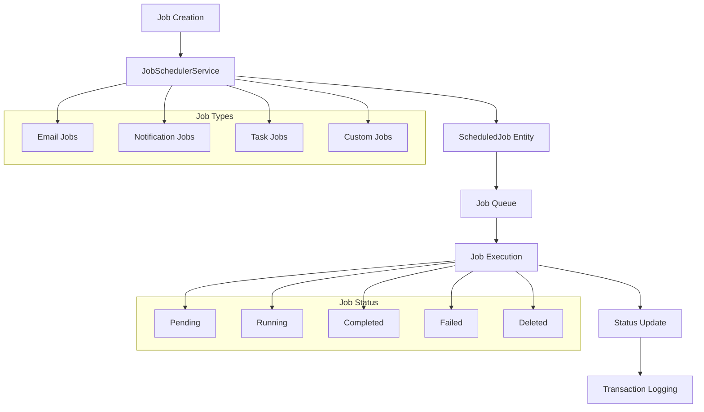
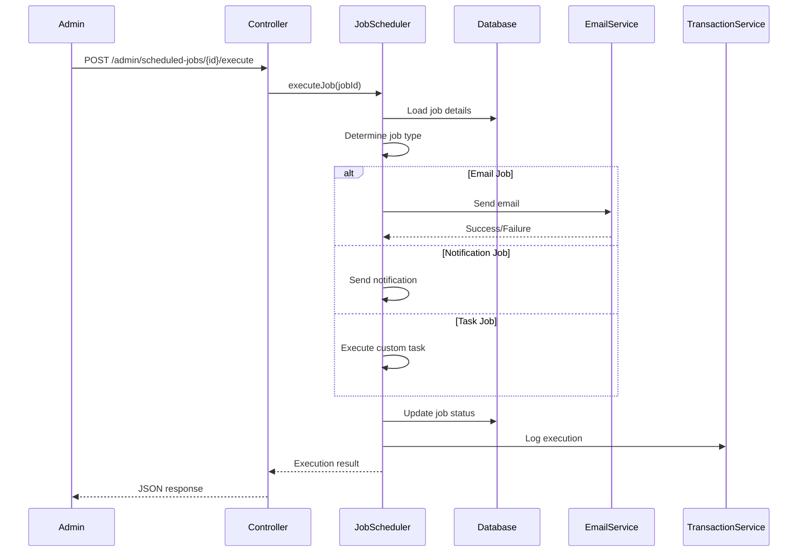

# Scheduled Jobs System

## ⚡ Overview

The SelfHelp Symfony Backend includes a comprehensive scheduled jobs system for managing background tasks such as email sending, push notifications, and custom task execution. The system provides job scheduling, execution tracking, and comprehensive audit trails.

## 🏗️ Job Architecture



## 🗄️ Database Schema

### ScheduledJob Entity
```php
<?php
namespace App\Entity;

#[ORM\Entity]
#[ORM\Table(name: 'scheduledJobs')]
class ScheduledJob
{
    #[ORM\Id]
    #[ORM\GeneratedValue]
    #[ORM\Column(name: 'id', type: 'integer')]
    private ?int $id = null;

    #[ORM\Column(name: 'description', type: 'string', length: 1000, nullable: true)]
    private ?string $description = null;

    #[ORM\Column(name: 'date_create', type: 'datetime')]
    private \DateTimeInterface $dateCreate;

    #[ORM\Column(name: 'date_to_be_executed', type: 'datetime', nullable: true)]
    private ?\DateTimeInterface $dateToBeExecuted = null;

    #[ORM\Column(name: 'date_executed', type: 'datetime', nullable: true)]
    private ?\DateTimeInterface $dateExecuted = null;

    #[ORM\Column(name: 'config', type: 'string', length: 1000, nullable: true)]
    private ?string $config = null;

    #[ORM\ManyToOne(targetEntity: Lookup::class)]
    #[ORM\JoinColumn(name: 'id_jobStatus', referencedColumnName: 'id', nullable: false, onDelete: 'CASCADE')]
    private ?Lookup $status = null;

    #[ORM\ManyToOne(targetEntity: Lookup::class)]
    #[ORM\JoinColumn(name: 'id_jobTypes', referencedColumnName: 'id', nullable: false, onDelete: 'CASCADE')]
    private ?Lookup $jobType = null;

    #[ORM\OneToMany(targetEntity: ScheduledJobsTask::class, mappedBy: 'scheduledJob', cascade: ['persist', 'remove'])]
    private \Doctrine\Common\Collections\Collection $scheduledJobsTasks;

    #[ORM\OneToMany(targetEntity: ScheduledJobsUser::class, mappedBy: 'scheduledJob', cascade: ['persist', 'remove'])]
    private \Doctrine\Common\Collections\Collection $scheduledJobsUsers;

    #[ORM\OneToMany(targetEntity: ScheduledJobsMailQueue::class, mappedBy: 'scheduledJob', cascade: ['persist', 'remove'])]
    private \Doctrine\Common\Collections\Collection $scheduledJobsMailQueues;

    public function __construct()
    {
        $this->scheduledJobsTasks = new ArrayCollection();
        $this->scheduledJobsUsers = new ArrayCollection();
        $this->scheduledJobsMailQueues = new ArrayCollection();
        $this->dateCreate = new \DateTime();
    }

    // Getters and setters...
}
// ENTITY RULE
```

### Related Entities

#### ScheduledJobsUser - Job User Assignment
```php
<?php
namespace App\Entity;

#[ORM\Entity]
#[ORM\Table(name: 'scheduledJobsUsers')]
class ScheduledJobsUser
{
    #[ORM\Id]
    #[ORM\ManyToOne(targetEntity: ScheduledJob::class, inversedBy: 'scheduledJobsUsers')]
    #[ORM\JoinColumn(name: 'id_scheduledJobs', referencedColumnName: 'id', onDelete: 'CASCADE')]
    private ?ScheduledJob $scheduledJob = null;

    #[ORM\Id]
    #[ORM\ManyToOne(targetEntity: User::class)]
    #[ORM\JoinColumn(name: 'id_users', referencedColumnName: 'id', onDelete: 'CASCADE')]
    private ?User $user = null;
}
// ENTITY RULE
```

#### ScheduledJobsTask - Task Configuration
```php
<?php
namespace App\Entity;

#[ORM\Entity]
#[ORM\Table(name: 'scheduledJobsTasks')]
class ScheduledJobsTask
{
    #[ORM\Id]
    #[ORM\ManyToOne(targetEntity: ScheduledJob::class, inversedBy: 'scheduledJobsTasks')]
    #[ORM\JoinColumn(name: 'id_scheduledJobs', referencedColumnName: 'id', onDelete: 'CASCADE')]
    private ?ScheduledJob $scheduledJob = null;

    #[ORM\Id]
    #[ORM\ManyToOne(targetEntity: Task::class)]
    #[ORM\JoinColumn(name: 'id_tasks', referencedColumnName: 'id', onDelete: 'CASCADE')]
    private ?Task $task = null;
}
// ENTITY RULE
```

### Job Types and Statuses (Lookup System)
```sql
-- Job Types
INSERT INTO `lookups` (`type_code`, `code`, `description`) VALUES
('JOB_TYPES', 'EMAIL', 'Email sending job'),
('JOB_TYPES', 'NOTIFICATION', 'Push notification job'),
('JOB_TYPES', 'TASK', 'Custom task execution'),
('JOB_TYPES', 'MAINTENANCE', 'System maintenance job'),
('JOB_TYPES', 'IMPORT', 'Data import job'),
('JOB_TYPES', 'EXPORT', 'Data export job');

-- Job Statuses
INSERT INTO `lookups` (`type_code`, `code`, `description`) VALUES
('JOB_STATUS', 'PENDING', 'Job is pending execution'),
('JOB_STATUS', 'RUNNING', 'Job is currently running'),
('JOB_STATUS', 'COMPLETED', 'Job completed successfully'),
('JOB_STATUS', 'FAILED', 'Job execution failed'),
('JOB_STATUS', 'CANCELLED', 'Job was cancelled'),
('JOB_STATUS', 'DELETED', 'Job was deleted (soft delete)');
```

## 🔧 JobSchedulerService

### Core Implementation
```php
<?php
namespace App\Service\Core;

use App\Entity\ScheduledJob;
use App\Entity\ScheduledJobsUser;
use App\Entity\ScheduledJobsMailQueue;
use App\Entity\ScheduledJobsTask;
use App\Service\Core\TransactionService;
use App\Service\Core\LookupService;

/**
 * Service responsible for scheduling and executing jobs
 */
class JobSchedulerService extends BaseService
{
    public function __construct(
        private readonly EntityManagerInterface $em,
        private readonly TransactionService $transactionService,
        private readonly LookupService $lookupService,
        private readonly LoggerInterface $logger
    ) {}

    /**
     * Schedule a job for execution
     */
    public function scheduleJob(array $jobData, string $transactionBy): ScheduledJob|false
    {
        try {
            $this->em->beginTransaction();
            
            $job = $this->createScheduledJob($jobData);
            if (!$job) {
                throw new \Exception('Failed to create scheduled job');
            }

            // Schedule specific job type
            $success = match ($jobData['type']) {
                $this->lookupService::JOB_TYPES_EMAIL => $this->scheduleEmailJob($job, $jobData),
                $this->lookupService::JOB_TYPES_NOTIFICATION => $this->scheduleNotificationJob($job, $jobData),
                $this->lookupService::JOB_TYPES_TASK => $this->scheduleTaskJob($job, $jobData),
                default => throw new \Exception('Unknown job type: ' . $jobData['type'])
            };

            if (!$success) {
                throw new \Exception('Failed to schedule job of type: ' . $jobData['type']);
            }

            // Add users to the job
            if (isset($jobData['users']) && is_array($jobData['users'])) {
                $this->addUsersToJob($job, $jobData['users']);
            }

            // Log the transaction
            $this->transactionService->logTransaction(
                LookupService::TRANSACTION_TYPES_INSERT,
                $transactionBy,
                'scheduledJobs',
                $job->getId(),
                $job,
                'Job scheduled: ' . ($jobData['description'] ?? $jobData['type'])
            );

            $this->em->commit();
            return $job;

        } catch (\Exception $e) {
            $this->em->rollback();
            $this->logger->error('Failed to schedule job', [
                'jobData' => $jobData,
                'error' => $e->getMessage()
            ]);
            return false;
        }
    }

    /**
     * Execute a scheduled job
     */
    public function executeJob(int $jobId, string $transactionBy): ScheduledJob|false
    {
        try {
            $this->em->beginTransaction();

            $job = $this->em->getRepository(ScheduledJob::class)->find($jobId);
            if (!$job) {
                throw new \Exception('Job not found: ' . $jobId);
            }

            // Determine job type and execute accordingly
            $jobTypeId = $job->getJobType()->getId();
            $jobTypeName = $this->lookupService->getLookupCodeById($jobTypeId);

            $success = match ($jobTypeName) {
                $this->lookupService::JOB_TYPES_EMAIL => $this->executeEmailJob($job, $transactionBy),
                $this->lookupService::JOB_TYPES_NOTIFICATION => $this->executeNotificationJob($job, $transactionBy),
                $this->lookupService::JOB_TYPES_TASK => $this->executeTaskJob($job, $transactionBy),
                default => throw new \Exception('Unknown job type: ' . $jobTypeName)
            };

            // Update job status
            $status = $this->lookupService->findByTypeAndCode(
                $this->lookupService::SCHEDULED_JOBS_STATUS, 
                $success ? $this->lookupService::SCHEDULED_JOBS_STATUS_DONE : $this->lookupService::SCHEDULED_JOBS_STATUS_FAILED
            );
            
            $job->setStatus($status);
            $job->setDateExecuted(new \DateTime());
            $this->em->flush();

            // Log the execution
            $this->transactionService->logTransaction(
                LookupService::TRANSACTION_TYPES_UPDATE,
                $transactionBy,
                'scheduledJobs',
                $jobId,
                $job,
                'Job executed: ' . ($success ? 'completed' : 'failed')
            );

            $this->em->commit();
            return $job;

        } catch (\Exception $e) {
            $this->em->rollback();
            $this->logger->error('Failed to execute job', [
                'jobId' => $jobId,
                'error' => $e->getMessage()
            ]);
            return false;
        }
    }

    /**
     * Create a scheduled job entity
     */
    private function createScheduledJob(array $jobData): ScheduledJob
    {
        $job = new ScheduledJob();
        $job->setDescription($jobData['description'] ?? '');
        $job->setDateToBeExecuted($jobData['execute_at'] ?? new \DateTime());
        $job->setConfig(json_encode($jobData['config'] ?? []));

        // Set job type
        $jobType = $this->lookupService->findByTypeAndCode(
            LookupService::JOB_TYPES,
            $jobData['type']
        );
        $job->setJobType($jobType);

        // Set initial status
        $status = $this->lookupService->findByTypeAndCode(
            LookupService::SCHEDULED_JOBS_STATUS,
            LookupService::SCHEDULED_JOBS_STATUS_PENDING
        );
        $job->setStatus($status);

        $this->em->persist($job);
        $this->em->flush();

        return $job;
    }

    /**
     * Schedule an email job
     */
    private function scheduleEmailJob(ScheduledJob $job, array $jobData): bool
    {
        try {
            $emailConfig = $jobData['email_config'];
            
            $mailQueue = new MailQueue();
            $mailQueue->setToEmail($emailConfig['to_email']);
            $mailQueue->setFromEmail($emailConfig['from_email'] ?? 'noreply@selfhelp.com');
            $mailQueue->setSubject($emailConfig['subject']);
            $mailQueue->setBody($emailConfig['body']);
            $mailQueue->setIsHtml($emailConfig['is_html'] ?? true);

            $this->em->persist($mailQueue);
            $this->em->flush();

            // Link scheduled job to mail queue
            $scheduledJobMail = new ScheduledJobsMailQueue();
            $scheduledJobMail->setScheduledJob($job);
            $scheduledJobMail->setMailQueue($mailQueue);

            $this->em->persist($scheduledJobMail);
            $this->em->flush();

            return true;

        } catch (\Exception $e) {
            $this->logger->error('Failed to schedule email job', ['error' => $e->getMessage()]);
            return false;
        }
    }

    /**
     * Schedule a notification job
     */
    private function scheduleNotificationJob(ScheduledJob $job, array $jobData): bool
    {
        try {
            $notificationConfig = $jobData['notification_config'];
            
            $notification = new Notification();
            $notification->setTitle($notificationConfig['title']);
            $notification->setMessage($notificationConfig['message']);
            $notification->setType($notificationConfig['type'] ?? 'info');

            $this->em->persist($notification);
            $this->em->flush();

            // Link scheduled job to notification
            $scheduledJobNotification = new ScheduledJobsNotification();
            $scheduledJobNotification->setScheduledJob($job);
            $scheduledJobNotification->setNotification($notification);

            $this->em->persist($scheduledJobNotification);
            $this->em->flush();

            return true;

        } catch (\Exception $e) {
            $this->logger->error('Failed to schedule notification job', ['error' => $e->getMessage()]);
            return false;
        }
    }

    /**
     * Schedule a task job
     */
    private function scheduleTaskJob(ScheduledJob $job, array $jobData): bool
    {
        try {
            $taskConfig = $jobData['task_config'];
            
            $task = new Task();
            $task->setConfig(json_encode($taskConfig));

            $this->em->persist($task);
            $this->em->flush();

            // Link scheduled job to task
            $scheduledJobTask = new ScheduledJobsTask();
            $scheduledJobTask->setScheduledJob($job);
            $scheduledJobTask->setTask($task);

            $this->em->persist($scheduledJobTask);
            $this->em->flush();

            return true;

        } catch (\Exception $e) {
            $this->logger->error('Failed to schedule task job', ['error' => $e->getMessage()]);
            return false;
        }
    }

    /**
     * Add users to a scheduled job
     */
    private function addUsersToJob(ScheduledJob $job, array $userIds): void
    {
        foreach ($userIds as $userId) {
            $scheduledJobUser = new ScheduledJobsUser();
            $scheduledJobUser->setScheduledJob($job);
            $user = $this->em->getRepository(User::class)->find($userId);
            $scheduledJobUser->setUser($user);

            $this->em->persist($scheduledJobUser);
        }
        
        $this->em->flush();
    }

    /**
     * Execute an email job
     */
    private function executeEmailJob(ScheduledJob $job, string $transactionBy): bool
    {
        // Implementation would integrate with email service
        // For now, just log the execution
        $this->logger->info('Email job execution', ['jobId' => $job->getId()]);
        return true;
    }

    /**
     * Execute a notification job
     */
    private function executeNotificationJob(ScheduledJob $job, string $transactionBy): bool
    {
        // Implementation would integrate with push notification service
        $this->logger->info('Notification job execution', ['jobId' => $job->getId()]);
        return true;
    }

    /**
     * Execute a task job
     */
    private function executeTaskJob(ScheduledJob $job, string $transactionBy): bool
    {
        // Implementation would execute custom task logic
        $this->logger->info('Task job execution', ['jobId' => $job->getId()]);
        return true;
    }
}
```

## 🎮 AdminScheduledJobController

### Controller Implementation
```php
<?php
namespace App\Controller\Api\V1\Admin;

class AdminScheduledJobController extends AbstractController
{
    use RequestValidatorTrait;

    public function __construct(
        private readonly AdminScheduledJobService $adminScheduledJobService,
        private readonly JobSchedulerService $jobSchedulerService,
        private readonly ApiResponseFormatter $responseFormatter,
        private readonly JsonSchemaValidationService $jsonSchemaValidationService
    ) {}

    /**
     * Get scheduled jobs with filtering and pagination
     * @route /admin/scheduled-jobs
     * @method GET
     */
    public function getScheduledJobs(Request $request): JsonResponse
    {
        try {
            $filters = [
                'status' => $request->query->get('status'),
                'job_type' => $request->query->get('job_type'),
                'date_type' => $request->query->get('date_type', 'create'),
                'date_from' => $request->query->get('date_from'),
                'date_to' => $request->query->get('date_to'),
                'search' => $request->query->get('search')
            ];

            $page = (int)$request->query->get('page', 1);
            $perPage = min((int)$request->query->get('per_page', 20), 100);
            $sort = $request->query->get('sort', 'dateCreate');
            $order = $request->query->get('order', 'desc');

            $result = $this->adminScheduledJobService->getScheduledJobs(
                $filters, 
                $page, 
                $perPage, 
                $sort, 
                $order
            );

            return $this->responseFormatter->formatSuccess(
                $result['data'],
                'responses/admin/scheduled_jobs/scheduled_jobs'
            );
        } catch (\Exception $e) {
            return $this->responseFormatter->formatError(
                $e->getMessage(),
                $e->getCode() ?: Response::HTTP_INTERNAL_SERVER_ERROR
            );
        }
    }

    /**
     * Get specific scheduled job details
     * @route /admin/scheduled-jobs/{jobId}
     * @method GET
     */
    public function getScheduledJob(int $jobId): JsonResponse
    {
        try {
            $job = $this->adminScheduledJobService->getScheduledJobById($jobId);
            return $this->responseFormatter->formatSuccess(
                $job,
                'responses/admin/scheduled_jobs/scheduled_job'
            );
        } catch (\Exception $e) {
            return $this->responseFormatter->formatError(
                $e->getMessage(),
                $e->getCode() ?: Response::HTTP_INTERNAL_SERVER_ERROR
            );
        }
    }

    /**
     * Execute a scheduled job
     * @route /admin/scheduled-jobs/{jobId}/execute
     * @method POST
     */
    public function executeScheduledJob(int $jobId): JsonResponse
    {
        try {
            $job = $this->jobSchedulerService->executeJob(
                $jobId, 
                LookupService::TRANSACTION_BY_BY_USER
            );

            if (!$job) {
                return $this->responseFormatter->formatError(
                    'Failed to execute job',
                    Response::HTTP_INTERNAL_SERVER_ERROR
                );
            }

            return $this->responseFormatter->formatSuccess(
                $this->adminScheduledJobService->formatJobForResponse($job),
                'responses/admin/scheduled_jobs/scheduled_job'
            );
        } catch (\Exception $e) {
            return $this->responseFormatter->formatError(
                $e->getMessage(),
                $e->getCode() ?: Response::HTTP_INTERNAL_SERVER_ERROR
            );
        }
    }

    /**
     * Delete (soft delete) a scheduled job
     * @route /admin/scheduled-jobs/{jobId}
     * @method DELETE
     */
    public function deleteScheduledJob(int $jobId): JsonResponse
    {
        try {
            $this->adminScheduledJobService->deleteScheduledJob($jobId);
            return $this->responseFormatter->formatSuccess(
                null,
                null,
                Response::HTTP_NO_CONTENT
            );
        } catch (\Exception $e) {
            return $this->responseFormatter->formatError(
                $e->getMessage(),
                $e->getCode() ?: Response::HTTP_INTERNAL_SERVER_ERROR
            );
        }
    }

    /**
     * Get job statuses for filtering
     * @route /admin/scheduled-jobs/statuses
     * @method GET
     */
    public function getJobStatuses(): JsonResponse
    {
        try {
            $statuses = $this->adminScheduledJobService->getJobStatuses();
            return $this->responseFormatter->formatSuccess(
                $statuses,
                'responses/admin/lookups'
            );
        } catch (\Exception $e) {
            return $this->responseFormatter->formatError(
                $e->getMessage(),
                $e->getCode() ?: Response::HTTP_INTERNAL_SERVER_ERROR
            );
        }
    }

    /**
     * Get job types for filtering
     * @route /admin/scheduled-jobs/types
     * @method GET
     */
    public function getJobTypes(): JsonResponse
    {
        try {
            $types = $this->adminScheduledJobService->getJobTypes();
            return $this->responseFormatter->formatSuccess(
                $types,
                'responses/admin/lookups'
            );
        } catch (\Exception $e) {
            return $this->responseFormatter->formatError(
                $e->getMessage(),
                $e->getCode() ?: Response::HTTP_INTERNAL_SERVER_ERROR
            );
        }
    }
}
```

## 📊 Job Management Features

### Job Filtering and Search
```php
public function getScheduledJobs(array $filters, int $page, int $perPage, string $sort, string $order): array
{
    $queryBuilder = $this->scheduledJobRepository->createQueryBuilder('sj')
        ->leftJoin('sj.status', 'status')
        ->leftJoin('sj.jobType', 'jobType')
        ->addSelect('status', 'jobType');

    // Status filter
    if (!empty($filters['status'])) {
        $queryBuilder->andWhere('status.code = :status')
            ->setParameter('status', $filters['status']);
    }

    // Job type filter
    if (!empty($filters['job_type'])) {
        $queryBuilder->andWhere('jobType.code = :jobType')
            ->setParameter('jobType', $filters['job_type']);
    }

    // Date range filtering
    if (!empty($filters['date_from']) || !empty($filters['date_to'])) {
        $dateField = match ($filters['date_type']) {
            'execute' => 'sj.dateToBeExecuted',
            'executed' => 'sj.dateExecuted',
            default => 'sj.dateCreate'
        };

        if (!empty($filters['date_from'])) {
            $queryBuilder->andWhere($dateField . ' >= :dateFrom')
                ->setParameter('dateFrom', new \DateTime($filters['date_from']));
        }

        if (!empty($filters['date_to'])) {
            $queryBuilder->andWhere($dateField . ' <= :dateTo')
                ->setParameter('dateTo', new \DateTime($filters['date_to']));
        }
    }

    // Search functionality
    if (!empty($filters['search'])) {
        $queryBuilder->andWhere('sj.description LIKE :search')
            ->setParameter('search', '%' . $filters['search'] . '%');
    }

    // Pagination and sorting
    $totalItems = (clone $queryBuilder)->select('COUNT(sj.id)')->getQuery()->getSingleScalarResult();
    $totalPages = ceil($totalItems / $perPage);

    $jobs = $queryBuilder
        ->setFirstResult(($page - 1) * $perPage)
        ->setMaxResults($perPage)
        ->orderBy('sj.' . $sort, $order)
        ->getQuery()
        ->getResult();

    return [
        'data' => array_map([$this, 'formatJobForResponse'], $jobs),
        'pagination' => [
            'current_page' => $page,
            'per_page' => $perPage,
            'total_items' => $totalItems,
            'total_pages' => $totalPages,
            'has_next' => $page < $totalPages,
            'has_previous' => $page > 1
        ]
    ];
}
```

### Job Response Formatting
```php
public function formatJobForResponse(ScheduledJob $job): array
{
    return [
        'id' => $job->getId(),
        'description' => $job->getDescription(),
        'dateCreate' => $job->getDateCreate()->format('Y-m-d H:i:s'),
        'dateToBeExecuted' => $job->getDateToBeExecuted()?->format('Y-m-d H:i:s'),
        'dateExecuted' => $job->getDateExecuted()?->format('Y-m-d H:i:s'),
        'config' => $job->getConfig() ? json_decode($job->getConfig(), true) : null,
        'status' => [
            'id' => $job->getStatus()->getId(),
            'code' => $job->getStatus()->getCode(),
            'description' => $job->getStatus()->getDescription()
        ],
        'jobType' => [
            'id' => $job->getJobType()->getId(),
            'code' => $job->getJobType()->getCode(),
            'description' => $job->getJobType()->getDescription()
        ],
        'users' => $this->getJobUsers($job),
        'canExecute' => $this->canExecuteJob($job),
        'canDelete' => $this->canDeleteJob($job)
    ];
}
```

## 🔄 Job Execution Process

### Job Execution Flow


## 📋 JSON Schema Examples

### Scheduled Job Response Schema
```json
{
  "$schema": "http://json-schema.org/draft-07/schema#",
  "title": "Scheduled Job Response",
  "type": "object",
  "required": ["id", "description", "dateCreate", "status", "jobType"],
  "properties": {
    "id": {
      "type": "integer",
      "description": "Job ID"
    },
    "description": {
      "type": ["string", "null"],
      "description": "Job description"
    },
    "dateCreate": {
      "type": "string",
      "format": "date-time",
      "description": "Job creation date"
    },
    "dateToBeExecuted": {
      "type": ["string", "null"],
      "format": "date-time",
      "description": "Scheduled execution date"
    },
    "dateExecuted": {
      "type": ["string", "null"],
      "format": "date-time",
      "description": "Actual execution date"
    },
    "config": {
      "type": ["object", "null"],
      "description": "Job configuration"
    },
    "status": {
      "$ref": "../entities/lookupEntity.json",
      "description": "Job status"
    },
    "jobType": {
      "$ref": "../entities/lookupEntity.json",
      "description": "Job type"
    },
    "users": {
      "type": "array",
      "items": {
        "$ref": "../entities/userEntity.json"
      },
      "description": "Assigned users"
    },
    "canExecute": {
      "type": "boolean",
      "description": "Whether job can be executed"
    },
    "canDelete": {
      "type": "boolean",
      "description": "Whether job can be deleted"
    }
  },
  "additionalProperties": false
}
```

## 🚀 Job Scheduling Examples

### Email Job Scheduling
```php
$jobData = [
    'type' => LookupService::JOB_TYPES_EMAIL,
    'description' => 'Welcome email for new user',
    'execute_at' => new \DateTime('+1 hour'),
    'email_config' => [
        'to_email' => 'user@example.com',
        'from_email' => 'welcome@selfhelp.com',
        'subject' => 'Welcome to SelfHelp!',
        'body' => '<h1>Welcome!</h1><p>Thank you for joining us.</p>',
        'is_html' => true
    ],
    'users' => [123] // User IDs to associate with this job
];

$job = $this->jobSchedulerService->scheduleJob($jobData, LookupService::TRANSACTION_BY_BY_USER);
```

### Task Job Scheduling
```php
$jobData = [
    'type' => LookupService::JOB_TYPES_TASK,
    'description' => 'Data cleanup task',
    'execute_at' => new \DateTime('tomorrow 02:00'),
    'task_config' => [
        'task_type' => 'cleanup',
        'parameters' => [
            'table' => 'old_logs',
            'older_than' => '30 days'
        ]
    ]
];

$job = $this->jobSchedulerService->scheduleJob($jobData, LookupService::TRANSACTION_BY_SYSTEM);
```

## 🔒 Security and Permissions

### Job Access Control
- Only admin users can view and manage scheduled jobs
- Job execution requires appropriate permissions
- All job operations are logged via TransactionService
- Sensitive job configurations are properly handled

### Job Validation
- Job types must be valid lookup values
- Execution dates must be in the future (for new jobs)
- Job configurations are validated based on job type
- User assignments are validated against existing users

## 🧪 Testing Scheduled Jobs

### Unit Tests
```php
<?php
namespace App\Tests\Service\Core;

class JobSchedulerServiceTest extends KernelTestCase
{
    public function testScheduleEmailJob(): void
    {
        $jobData = [
            'type' => LookupService::JOB_TYPES_EMAIL,
            'description' => 'Test email job',
            'email_config' => [
                'to_email' => 'test@example.com',
                'subject' => 'Test Subject',
                'body' => 'Test Body'
            ]
        ];

        $job = $this->jobSchedulerService->scheduleJob($jobData, 'test');

        $this->assertInstanceOf(ScheduledJob::class, $job);
        $this->assertEquals('Test email job', $job->getDescription());
        $this->assertEquals('EMAIL', $job->getJobType()->getCode());
    }

    public function testExecuteJob(): void
    {
        $job = $this->createTestJob();
        $executedJob = $this->jobSchedulerService->executeJob($job->getId(), 'test');

        $this->assertNotNull($executedJob->getDateExecuted());
        $this->assertEquals('COMPLETED', $executedJob->getStatus()->getCode());
    }
}
```

### Integration Tests
```php
public function testScheduledJobsEndpoint(): void
{
    $this->client->request('GET', '/cms-api/v1/admin/scheduled-jobs', [], [
        'Authorization' => 'Bearer ' . $this->getAuthToken()
    ]);

    $this->assertResponseIsSuccessful();
    $data = json_decode($this->client->getResponse()->getContent(), true);
    $this->assertArrayHasKey('data', $data);
    $this->assertArrayHasKey('pagination', $data['meta']);
}
```

---

**Next**: [Transaction Logging](./12-transaction-logging.md)