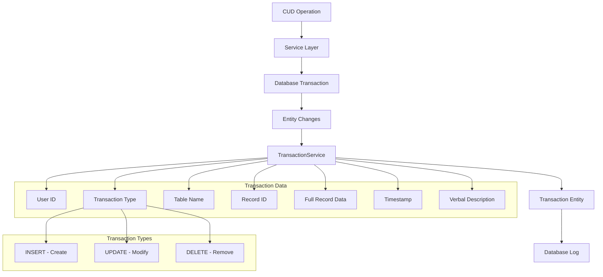

# Transaction Logging

## 📈 Overview

The SelfHelp Symfony Backend implements comprehensive transaction logging to track all create, update, and delete operations throughout the application. This provides a complete audit trail of changes made to the system, enhancing security, accountability, and debugging capabilities.

## 🏗️ Transaction Logging Architecture



## 🗄️ Database Schema

### Transaction Entity
```php
<?php
namespace App\Entity;

#[ORM\Entity(repositoryClass: TransactionRepository::class)]
#[ORM\Table(name: 'transactions')]
class Transaction
{
    #[ORM\Id]
    #[ORM\GeneratedValue]
    #[ORM\Column(name: 'id', type: 'integer')]
    private ?int $id = null;

    #[ORM\ManyToOne(targetEntity: User::class)]
    #[ORM\JoinColumn(name: 'id_users', referencedColumnName: 'id', nullable: true, onDelete: 'SET NULL')]
    private ?User $user = null;

    #[ORM\ManyToOne(targetEntity: Lookup::class)]
    #[ORM\JoinColumn(name: 'id_transactionTypes', referencedColumnName: 'id', nullable: true, onDelete: 'SET NULL')]
    private ?Lookup $transactionType = null;

    #[ORM\ManyToOne(targetEntity: Lookup::class)]
    #[ORM\JoinColumn(name: 'id_transactionBy', referencedColumnName: 'id', nullable: true, onDelete: 'SET NULL')]
    private ?Lookup $transactionBy = null;

    #[ORM\Column(name: 'table_name', type: 'string', length: 100, nullable: true)]
    private ?string $tableName = null;

    #[ORM\Column(name: 'id_table_name', type: 'integer', nullable: true)]
    private ?int $idTableName = null;

    #[ORM\Column(name: 'transaction_log', type: 'text', nullable: true)]
    private ?string $transactionLog = null;

    #[ORM\Column(name: 'transaction_time', type: 'datetime')]
    private \DateTimeInterface $transactionTime;

    public function __construct()
    {
        $this->transactionTime = new \DateTime();
    }

    // Getters and setters...
}
// ENTITY RULE
```

### Database Table Structure
```sql
CREATE TABLE `transactions` (
  `id` int NOT NULL AUTO_INCREMENT,
  `id_users` int DEFAULT NULL,
  `id_transactionTypes` int DEFAULT NULL,
  `id_transactionBy` int DEFAULT NULL,
  `table_name` varchar(100) DEFAULT NULL,
  `id_table_name` int DEFAULT NULL,
  `transaction_log` longtext,
  `transaction_time` datetime NOT NULL,
  PRIMARY KEY (`id`),
  KEY `IDX_EAA81A4CFA06E4D9` (`id_users`),
  KEY `IDX_EAA81A4C8B8E8428` (`id_transactionTypes`),
  KEY `IDX_EAA81A4C5A8C7B02` (`id_transactionBy`),
  KEY `idx_transactions_table` (`table_name`,`id_table_name`),
  KEY `idx_transactions_time` (`transaction_time`),
  CONSTRAINT `FK_EAA81A4C5A8C7B02` FOREIGN KEY (`id_transactionBy`) REFERENCES `lookups` (`id`) ON DELETE SET NULL,
  CONSTRAINT `FK_EAA81A4C8B8E8428` FOREIGN KEY (`id_transactionTypes`) REFERENCES `lookups` (`id`) ON DELETE SET NULL,
  CONSTRAINT `FK_EAA81A4CFA06E4D9` FOREIGN KEY (`id_users`) REFERENCES `users` (`id`) ON DELETE SET NULL
) ENGINE=InnoDB DEFAULT CHARSET=utf8mb3;
```

### Transaction Types and Sources (Lookup System)
```sql
-- Transaction Types
INSERT INTO `lookups` (`type_code`, `code`, `description`) VALUES
('TRANSACTION_TYPES', 'INSERT', 'Record creation'),
('TRANSACTION_TYPES', 'UPDATE', 'Record modification'),
('TRANSACTION_TYPES', 'DELETE', 'Record deletion'),
('TRANSACTION_TYPES', 'SELECT', 'Record access (read)'),
('TRANSACTION_TYPES', 'LOGIN', 'User login'),
('TRANSACTION_TYPES', 'LOGOUT', 'User logout');

-- Transaction Sources
INSERT INTO `lookups` (`type_code`, `code`, `description`) VALUES
('TRANSACTION_BY', 'USER', 'Action performed by user'),
('TRANSACTION_BY', 'SYSTEM', 'System-generated action'),
('TRANSACTION_BY', 'ADMIN', 'Administrative action'),
('TRANSACTION_BY', 'API', 'API-triggered action'),
('TRANSACTION_BY', 'SCHEDULED', 'Scheduled job action'),
('TRANSACTION_BY', 'MIGRATION', 'Database migration');
```

## 🔧 TransactionService Implementation

### Core Service
```php
<?php
namespace App\Service\Core;

use App\Entity\Transaction;
use App\Service\Auth\UserContextService;
use App\Service\Core\LookupService;
use App\Util\EntityUtil;

/**
 * Service for logging transactions in the system
 */
class TransactionService
{
    public function __construct(
        private readonly EntityManagerInterface $entityManager,
        private readonly UserContextService $userContextService,
        private readonly RequestStack $requestStack,
        private readonly LookupService $lookupService
    ) {}

    /**
     * Log a transaction in the system
     *
     * @param string $tranType Transaction type code (e.g., 'INSERT', 'UPDATE', 'DELETE')
     * @param string $tranBy Transaction source code (e.g., 'USER', 'SYSTEM')
     * @param string|null $tableName The table name affected by the transaction
     * @param int|null $entryId The ID of the affected record
     * @param bool|object $logRow Whether to log the entire row data or the actual row object
     * @param string|null $verbalLog Custom verbal log message
     * @return Transaction The created transaction entity
     */
    public function logTransaction(
        string $tranType = LookupService::TRANSACTION_TYPES_INSERT,
        string $tranBy = LookupService::TRANSACTION_BY_BY_USER,
        ?string $tableName = null,
        ?int $entryId = null,
        $logRow = false,
        ?string $verbalLog = null
    ): Transaction {
        // Get current user ID
        $userId = $this->userContextService->getCurrentUser()?->getId() ?? null;
        
        // Create log data
        $log = [
            'verbal_log' => $verbalLog ?: $this->generateDefaultVerbalLog($tranType, $tableName, $tranBy),
            'url' => $userId > 0 ? ($this->requestStack->getCurrentRequest()?->getRequestUri() ?? '') : '',
            'session' => $userId > 0 ? session_id() : '',
            'ip_address' => $this->getClientIpAddress(),
            'user_agent' => $this->requestStack->getCurrentRequest()?->headers->get('User-Agent') ?? ''
        ];
        
        // Handle row data logging
        if ($tableName && $entryId) {
            if (is_object($logRow)) {
                // Handle Doctrine entities and other objects
                $entityData = EntityUtil::convertEntityToArray($logRow);
                $log['table_row_entry'] = $entityData;
            } elseif ($logRow === true) {
                // Fetch the row data from the database
                $conn = $this->entityManager->getConnection();
                $stmt = $conn->prepare('SELECT * FROM ' . $tableName . ' WHERE id = :id');
                $stmt->bindValue('id', $entryId, \PDO::PARAM_INT);
                $result = $stmt->executeQuery();
                $entry = $result->fetchAssociative();
                
                if ($entry) {
                    $log['table_row_entry'] = $entry;
                }
            }
        }
        
        // Create transaction entity
        $transaction = new Transaction();
        
        // Set lookup relationships if not in active transaction
        if (!$this->entityManager->getConnection()->isTransactionActive()) {
            $transactionType = $this->lookupService->findByTypeAndCode(
                LookupService::TRANSACTION_TYPES,
                $tranType
            );
            
            $transactionBy = $this->lookupService->findByTypeAndCode(
                LookupService::TRANSACTION_BY,
                $tranBy
            );
            
            if ($transactionType) {
                $transaction->setTransactionType($transactionType);
            }
            
            if ($transactionBy) {
                $transaction->setTransactionBy($transactionBy);
            }
        } else {
            // In active transaction, use hardcoded IDs to avoid additional queries
            $typeId = $this->getTransactionTypeIdByCode($tranType);
            $byId = $this->getTransactionByIdByCode($tranBy);
            
            if ($typeId) {
                $transactionType = $this->entityManager->getReference(Lookup::class, $typeId);
                $transaction->setTransactionType($transactionType);
            }
            
            if ($byId) {
                $transactionBy = $this->entityManager->getReference(Lookup::class, $byId);
                $transaction->setTransactionBy($transactionBy);
            }
        }
        
        // Set user if available
        if ($userId) {
            $user = $this->entityManager->getReference(User::class, $userId);
            $transaction->setUser($user);
        }
        
        $transaction->setTableName($tableName);
        $transaction->setIdTableName($entryId);
        $transaction->setTransactionLog(json_encode($log));
        $transaction->setTransactionTime(new \DateTime());
        
        // Persist the transaction
        $this->entityManager->persist($transaction);
        $this->entityManager->flush();
        
        return $transaction;
    }

    /**
     * Generate default verbal log message
     */
    private function generateDefaultVerbalLog(string $tranType, ?string $tableName, string $tranBy): string
    {
        $action = match ($tranType) {
            LookupService::TRANSACTION_TYPES_INSERT => 'created',
            LookupService::TRANSACTION_TYPES_UPDATE => 'updated',
            LookupService::TRANSACTION_TYPES_DELETE => 'deleted',
            default => 'modified'
        };

        $source = match ($tranBy) {
            LookupService::TRANSACTION_BY_BY_USER => 'by user',
            LookupService::TRANSACTION_BY_BY_SYSTEM => 'by system',
            LookupService::TRANSACTION_BY_BY_ADMIN => 'by admin',
            default => 'by ' . $tranBy
        };

        return "Record {$action} in table '{$tableName}' {$source}";
    }

    /**
     * Get client IP address
     */
    private function getClientIpAddress(): string
    {
        $request = $this->requestStack->getCurrentRequest();
        if (!$request) {
            return '';
        }

        // Check for various headers that might contain the real IP
        $headers = [
            'HTTP_X_FORWARDED_FOR',
            'HTTP_X_REAL_IP',
            'HTTP_CLIENT_IP',
            'REMOTE_ADDR'
        ];

        foreach ($headers as $header) {
            $ip = $request->server->get($header);
            if ($ip && $ip !== 'unknown') {
                // Handle comma-separated IPs (X-Forwarded-For can contain multiple IPs)
                if (str_contains($ip, ',')) {
                    $ip = trim(explode(',', $ip)[0]);
                }
                return $ip;
            }
        }

        return $request->getClientIp() ?? '';
    }

    /**
     * Get transaction type ID by code without doing database queries
     */
    private function getTransactionTypeIdByCode(string $code): ?int
    {
        // Hardcoded mapping for common transaction types to avoid DB queries during transactions
        return match ($code) {
            LookupService::TRANSACTION_TYPES_INSERT => 1,
            LookupService::TRANSACTION_TYPES_UPDATE => 2,
            LookupService::TRANSACTION_TYPES_DELETE => 3,
            LookupService::TRANSACTION_TYPES_SELECT => 4,
            default => null
        };
    }

    /**
     * Get transaction by ID by code without doing database queries
     */
    private function getTransactionByIdByCode(string $code): ?int
    {
        // Hardcoded mapping for common transaction sources
        return match ($code) {
            LookupService::TRANSACTION_BY_BY_USER => 10,
            LookupService::TRANSACTION_BY_BY_SYSTEM => 11,
            LookupService::TRANSACTION_BY_BY_ADMIN => 12,
            default => null
        };
    }

    /**
     * Get transactions for a specific table and record
     */
    public function getTransactionsForRecord(string $tableName, int $recordId): array
    {
        return $this->entityManager->getRepository(Transaction::class)
            ->createQueryBuilder('t')
            ->leftJoin('t.user', 'u')
            ->leftJoin('t.transactionType', 'tt')
            ->leftJoin('t.transactionBy', 'tb')
            ->addSelect('u', 'tt', 'tb')
            ->where('t.tableName = :tableName')
            ->andWhere('t.idTableName = :recordId')
            ->setParameter('tableName', $tableName)
            ->setParameter('recordId', $recordId)
            ->orderBy('t.transactionTime', 'DESC')
            ->getQuery()
            ->getResult();
    }

    /**
     * Get recent transactions for audit purposes
     */
    public function getRecentTransactions(int $limit = 100): array
    {
        return $this->entityManager->getRepository(Transaction::class)
            ->createQueryBuilder('t')
            ->leftJoin('t.user', 'u')
            ->leftJoin('t.transactionType', 'tt')
            ->leftJoin('t.transactionBy', 'tb')
            ->addSelect('u', 'tt', 'tb')
            ->orderBy('t.transactionTime', 'DESC')
            ->setMaxResults($limit)
            ->getQuery()
            ->getResult();
    }
}
```

## 🔄 Service Integration Pattern

### Standard Service Transaction Pattern
```php
<?php
namespace App\Service\CMS\Admin;

class AdminPageService extends BaseService
{
    public function createPage(array $pageData): Page
    {
        $this->entityManager->beginTransaction();
        
        try {
            // Create page entity
            $page = new Page();
            $page->setKeyword($pageData['keyword']);
            $page->setUrl($pageData['url'] ?? null);
            // ... set other properties
            
            $this->entityManager->persist($page);
            $this->entityManager->flush();
            
            // Log the transaction
            $this->transactionService->logTransaction(
                LookupService::TRANSACTION_TYPES_INSERT,
                LookupService::TRANSACTION_BY_BY_USER,
                'pages',
                $page->getId(),
                $page, // Pass the entity object for full logging
                'Page created: ' . $page->getKeyword()
            );
            
            $this->entityManager->commit();
            return $page;
            
        } catch (\Exception $e) {
            $this->entityManager->rollback();
            throw $e;
        }
    }

    public function updatePage(Page $page, array $updateData): Page
    {
        $this->entityManager->beginTransaction();
        
        try {
            // Store original data for comparison
            $originalData = [
                'keyword' => $page->getKeyword(),
                'url' => $page->getUrl(),
                // ... other fields
            ];
            
            // Update page properties
            if (isset($updateData['keyword'])) {
                $page->setKeyword($updateData['keyword']);
            }
            if (isset($updateData['url'])) {
                $page->setUrl($updateData['url']);
            }
            // ... update other properties
            
            $this->entityManager->flush();
            
            // Log the transaction with both original and new data
            $this->transactionService->logTransaction(
                LookupService::TRANSACTION_TYPES_UPDATE,
                LookupService::TRANSACTION_BY_BY_USER,
                'pages',
                $page->getId(),
                $page,
                'Page updated: ' . $page->getKeyword() . ' (changed fields: ' . 
                implode(', ', array_keys($updateData)) . ')'
            );
            
            $this->entityManager->commit();
            return $page;
            
        } catch (\Exception $e) {
            $this->entityManager->rollback();
            throw $e;
        }
    }

    public function deletePage(int $pageId): bool
    {
        $this->entityManager->beginTransaction();
        
        try {
            $page = $this->pageRepository->find($pageId);
            if (!$page) {
                throw new \Exception('Page not found');
            }
            
            // Log the transaction BEFORE deletion (with full entity data)
            $this->transactionService->logTransaction(
                LookupService::TRANSACTION_TYPES_DELETE,
                LookupService::TRANSACTION_BY_BY_USER,
                'pages',
                $page->getId(),
                $page, // Log full entity before deletion
                'Page deleted: ' . $page->getKeyword()
            );
            
            // Delete the page
            $this->entityManager->remove($page);
            $this->entityManager->flush();
            
            $this->entityManager->commit();
            return true;
            
        } catch (\Exception $e) {
            $this->entityManager->rollback();
            throw $e;
        }
    }
}
```

## 📊 Transaction Log Data Structure

### Log JSON Structure
```json
{
  "verbal_log": "Page created: welcome-page by user",
  "url": "/cms-api/v1/admin/pages",
  "session": "sess_abc123def456",
  "ip_address": "192.168.1.100",
  "user_agent": "Mozilla/5.0 (Windows NT 10.0; Win64; x64) AppleWebKit/537.36",
  "table_row_entry": {
    "id": 123,
    "keyword": "welcome-page",
    "url": "/welcome",
    "protocol": "https",
    "is_headless": false,
    "nav_position": 1,
    "is_open_access": false,
    "is_system": false,
    "created_at": "2025-01-23T10:30:00Z"
  },
  "changes": {
    "before": {
      "keyword": "old-welcome",
      "url": "/old-welcome"
    },
    "after": {
      "keyword": "welcome-page",
      "url": "/welcome"
    }
  }
}
```

### EntityUtil for Object Conversion
```php
<?php
namespace App\Util;

class EntityUtil
{
    /**
     * Convert Doctrine entity to array for logging
     */
    public static function convertEntityToArray($entity): array
    {
        if (!is_object($entity)) {
            return [];
        }

        $data = [];
        $reflection = new \ReflectionClass($entity);
        
        foreach ($reflection->getProperties() as $property) {
            $property->setAccessible(true);
            $value = $property->getValue($entity);
            
            // Handle different types of values
            if ($value instanceof \DateTimeInterface) {
                $data[$property->getName()] = $value->format('Y-m-d H:i:s');
            } elseif (is_object($value)) {
                // For related entities, just store the ID
                if (method_exists($value, 'getId')) {
                    $data[$property->getName() . '_id'] = $value->getId();
                }
            } elseif (is_array($value) || $value instanceof \Traversable) {
                // Handle collections
                $data[$property->getName()] = 'Collection[' . count($value) . ' items]';
            } else {
                $data[$property->getName()] = $value;
            }
        }
        
        return $data;
    }

    /**
     * Compare two entities and return changed fields
     */
    public static function getChangedFields($originalEntity, $updatedEntity): array
    {
        $originalData = self::convertEntityToArray($originalEntity);
        $updatedData = self::convertEntityToArray($updatedEntity);
        
        $changes = [];
        foreach ($updatedData as $field => $newValue) {
            $oldValue = $originalData[$field] ?? null;
            if ($oldValue !== $newValue) {
                $changes[$field] = [
                    'before' => $oldValue,
                    'after' => $newValue
                ];
            }
        }
        
        return $changes;
    }
}
```

## 🎮 Transaction Viewing API

### AdminTransactionController
```php
<?php
namespace App\Controller\Api\V1\Admin;

class AdminTransactionController extends AbstractController
{
    public function __construct(
        private readonly TransactionService $transactionService,
        private readonly ApiResponseFormatter $responseFormatter
    ) {}

    /**
     * Get transactions for a specific record
     * @route /admin/transactions/{tableName}/{recordId}
     * @method GET
     */
    public function getRecordTransactions(string $tableName, int $recordId): JsonResponse
    {
        try {
            $transactions = $this->transactionService->getTransactionsForRecord($tableName, $recordId);
            
            $formattedTransactions = array_map(function (Transaction $transaction) {
                return $this->formatTransactionForResponse($transaction);
            }, $transactions);
            
            return $this->responseFormatter->formatSuccess(
                $formattedTransactions,
                'responses/admin/transactions'
            );
        } catch (\Exception $e) {
            return $this->responseFormatter->formatError(
                $e->getMessage(),
                $e->getCode() ?: Response::HTTP_INTERNAL_SERVER_ERROR
            );
        }
    }

    /**
     * Get recent transactions for audit
     * @route /admin/transactions/recent
     * @method GET
     */
    public function getRecentTransactions(Request $request): JsonResponse
    {
        try {
            $limit = min((int)$request->query->get('limit', 100), 500);
            $transactions = $this->transactionService->getRecentTransactions($limit);
            
            $formattedTransactions = array_map(function (Transaction $transaction) {
                return $this->formatTransactionForResponse($transaction);
            }, $transactions);
            
            return $this->responseFormatter->formatSuccess(
                $formattedTransactions,
                'responses/admin/transactions'
            );
        } catch (\Exception $e) {
            return $this->responseFormatter->formatError(
                $e->getMessage(),
                $e->getCode() ?: Response::HTTP_INTERNAL_SERVER_ERROR
            );
        }
    }

    /**
     * Format transaction for API response
     */
    private function formatTransactionForResponse(Transaction $transaction): array
    {
        $logData = $transaction->getTransactionLog() ? 
            json_decode($transaction->getTransactionLog(), true) : [];

        return [
            'id' => $transaction->getId(),
            'user' => $transaction->getUser() ? [
                'id' => $transaction->getUser()->getId(),
                'username' => $transaction->getUser()->getUsername()
            ] : null,
            'transactionType' => $transaction->getTransactionType() ? [
                'code' => $transaction->getTransactionType()->getCode(),
                'description' => $transaction->getTransactionType()->getDescription()
            ] : null,
            'transactionBy' => $transaction->getTransactionBy() ? [
                'code' => $transaction->getTransactionBy()->getCode(),
                'description' => $transaction->getTransactionBy()->getDescription()
            ] : null,
            'tableName' => $transaction->getTableName(),
            'recordId' => $transaction->getIdTableName(),
            'transactionTime' => $transaction->getTransactionTime()->format('Y-m-d H:i:s'),
            'verbalLog' => $logData['verbal_log'] ?? '',
            'url' => $logData['url'] ?? '',
            'ipAddress' => $logData['ip_address'] ?? '',
            'userAgent' => $logData['user_agent'] ?? '',
            'recordData' => $logData['table_row_entry'] ?? null,
            'changes' => $logData['changes'] ?? null
        ];
    }
}
```

## 📋 Transaction Analysis

### Transaction Statistics
```php
public function getTransactionStatistics(\DateTime $from, \DateTime $to): array
{
    $queryBuilder = $this->entityManager->getRepository(Transaction::class)
        ->createQueryBuilder('t')
        ->leftJoin('t.transactionType', 'tt')
        ->leftJoin('t.transactionBy', 'tb')
        ->where('t.transactionTime BETWEEN :from AND :to')
        ->setParameter('from', $from)
        ->setParameter('to', $to);

    // Total transactions
    $total = (clone $queryBuilder)->select('COUNT(t.id)')->getQuery()->getSingleScalarResult();

    // By transaction type
    $byType = (clone $queryBuilder)
        ->select('tt.code as type, COUNT(t.id) as count')
        ->groupBy('tt.code')
        ->getQuery()
        ->getResult();

    // By table
    $byTable = (clone $queryBuilder)
        ->select('t.tableName as table_name, COUNT(t.id) as count')
        ->groupBy('t.tableName')
        ->orderBy('count', 'DESC')
        ->getQuery()
        ->getResult();

    // By user (top 10)
    $byUser = (clone $queryBuilder)
        ->leftJoin('t.user', 'u')
        ->select('u.username, COUNT(t.id) as count')
        ->groupBy('u.id')
        ->orderBy('count', 'DESC')
        ->setMaxResults(10)
        ->getQuery()
        ->getResult();

    return [
        'total' => $total,
        'by_type' => $byType,
        'by_table' => $byTable,
        'by_user' => $byUser,
        'period' => [
            'from' => $from->format('Y-m-d H:i:s'),
            'to' => $to->format('Y-m-d H:i:s')
        ]
    ];
}
```

## 🔒 Security and Privacy

### Data Sensitivity
- **Sensitive Data**: Passwords and tokens are never logged
- **PII Protection**: Personal information is logged only when necessary
- **Data Retention**: Consider implementing log retention policies
- **Access Control**: Transaction logs are only accessible to admin users

### Log Sanitization
```php
private function sanitizeLogData(array $data): array
{
    $sensitiveFields = ['password', 'token', 'api_key', 'secret'];
    
    foreach ($sensitiveFields as $field) {
        if (isset($data[$field])) {
            $data[$field] = '[REDACTED]';
        }
    }
    
    return $data;
}
```

## 🧪 Testing Transaction Logging

### Unit Tests
```php
<?php
namespace App\Tests\Service\Core;

class TransactionServiceTest extends KernelTestCase
{
    public function testLogTransaction(): void
    {
        $transaction = $this->transactionService->logTransaction(
            LookupService::TRANSACTION_TYPES_INSERT,
            LookupService::TRANSACTION_BY_BY_USER,
            'test_table',
            123,
            false,
            'Test transaction'
        );

        $this->assertInstanceOf(Transaction::class, $transaction);
        $this->assertEquals('test_table', $transaction->getTableName());
        $this->assertEquals(123, $transaction->getIdTableName());
        
        $logData = json_decode($transaction->getTransactionLog(), true);
        $this->assertEquals('Test transaction', $logData['verbal_log']);
    }

    public function testLogTransactionWithEntity(): void
    {
        $page = new Page();
        $page->setKeyword('test-page');
        
        $transaction = $this->transactionService->logTransaction(
            LookupService::TRANSACTION_TYPES_INSERT,
            LookupService::TRANSACTION_BY_BY_USER,
            'pages',
            1,
            $page,
            'Page created'
        );

        $logData = json_decode($transaction->getTransactionLog(), true);
        $this->assertArrayHasKey('table_row_entry', $logData);
        $this->assertEquals('test-page', $logData['table_row_entry']['keyword']);
    }
}
```

### Integration Tests
```php
public function testServiceTransactionLogging(): void
{
    $pageData = ['keyword' => 'test-page', 'pageType' => 1];
    $page = $this->adminPageService->createPage($pageData);

    // Verify transaction was logged
    $transactions = $this->transactionService->getTransactionsForRecord('pages', $page->getId());
    $this->assertCount(1, $transactions);
    
    $transaction = $transactions[0];
    $this->assertEquals('INSERT', $transaction->getTransactionType()->getCode());
    $this->assertEquals('pages', $transaction->getTableName());
}
```

## 📊 Performance Considerations

### Optimization Strategies
- **Batch Logging**: Group multiple transactions when possible
- **Async Logging**: Consider async processing for high-volume systems
- **Index Optimization**: Proper indexing on frequently queried fields
- **Data Archiving**: Archive old transactions to maintain performance
- **Selective Logging**: Log only necessary data to reduce storage

### Database Indexes
```sql
-- Optimize transaction queries
CREATE INDEX idx_transactions_user_time ON transactions(id_users, transaction_time);
CREATE INDEX idx_transactions_type_time ON transactions(id_transactionTypes, transaction_time);
CREATE INDEX idx_transactions_table_record ON transactions(table_name, id_table_name);
```

---

**Next**: [Access Control Lists (ACL)](./13-acl-system.md)