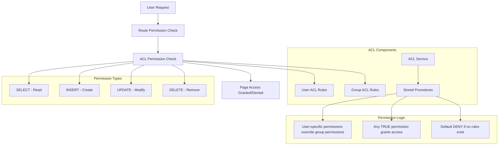

# Access Control Lists (ACL) System

## 🔍 Overview

The SelfHelp Symfony Backend implements a sophisticated Access Control List (ACL) system that provides fine-grained, page-level permissions. This system works alongside the route-level permissions to offer comprehensive access control with CRUD operations (Create, Read, Update, Delete) at the page level.

## 🏗️ ACL Architecture



## 🗄️ Database Schema

### ACL Tables Structure

#### `acl_users` - User-Level Page Permissions
```sql
CREATE TABLE `acl_users` (
  `id_users` int NOT NULL,
  `id_pages` int NOT NULL,
  `acl_select` tinyint(1) NOT NULL DEFAULT '1',
  `acl_insert` tinyint(1) NOT NULL DEFAULT '0',
  `acl_update` tinyint(1) NOT NULL DEFAULT '0',
  `acl_delete` tinyint(1) NOT NULL DEFAULT '0',
  PRIMARY KEY (`id_users`,`id_pages`),
  KEY `IDX_901AE856FA06E4D9` (`id_users`),
  KEY `IDX_901AE856CEF1A445` (`id_pages`),
  CONSTRAINT `FK_901AE856CEF1A445` FOREIGN KEY (`id_pages`) REFERENCES `pages` (`id`) ON DELETE CASCADE,
  CONSTRAINT `FK_901AE856FA06E4D9` FOREIGN KEY (`id_users`) REFERENCES `users` (`id`) ON DELETE CASCADE
) ENGINE=InnoDB DEFAULT CHARSET=utf8mb3;
```

#### `acl_groups` - Group-Level Page Permissions
```sql
CREATE TABLE `acl_groups` (
  `id_groups` int NOT NULL,
  `id_pages` int NOT NULL,
  `acl_select` tinyint(1) NOT NULL DEFAULT '1',
  `acl_insert` tinyint(1) NOT NULL DEFAULT '0',
  `acl_update` tinyint(1) NOT NULL DEFAULT '0',
  `acl_delete` tinyint(1) NOT NULL DEFAULT '0',
  PRIMARY KEY (`id_groups`,`id_pages`),
  KEY `IDX_AB370E20D65A8C9D` (`id_groups`),
  KEY `IDX_AB370E20CEF1A445` (`id_pages`),
  CONSTRAINT `FK_AB370E20CEF1A445` FOREIGN KEY (`id_pages`) REFERENCES `pages` (`id`) ON DELETE CASCADE,
  CONSTRAINT `FK_AB370E20D65A8C9D` FOREIGN KEY (`id_groups`) REFERENCES `groups` (`id`) ON DELETE CASCADE
) ENGINE=InnoDB DEFAULT CHARSET=utf8mb3;
```

### ACL Entities

#### AclUser Entity
```php
<?php
namespace App\Entity;

#[ORM\Entity]
#[ORM\Table(name: 'acl_users')]
class AclUser
{
    #[ORM\Id]
    #[ORM\ManyToOne(targetEntity: User::class)]
    #[ORM\JoinColumn(name: 'id_users', referencedColumnName: 'id', nullable: false, onDelete: 'CASCADE')]
    private ?User $user = null;

    #[ORM\Id]
    #[ORM\ManyToOne(targetEntity: Page::class)]
    #[ORM\JoinColumn(name: 'id_pages', referencedColumnName: 'id', nullable: false, onDelete: 'CASCADE')]
    private ?Page $page = null;

    #[ORM\Column(name: 'acl_select', type: 'boolean', options: ['default' => 1])]
    private bool $aclSelect = true;

    #[ORM\Column(name: 'acl_insert', type: 'boolean', options: ['default' => 0])]
    private bool $aclInsert = false;

    #[ORM\Column(name: 'acl_update', type: 'boolean', options: ['default' => 0])]
    private bool $aclUpdate = false;

    #[ORM\Column(name: 'acl_delete', type: 'boolean', options: ['default' => 0])]
    private bool $aclDelete = false;

    // Getters and setters...
    
    public function getUser(): ?User { return $this->user; }
    public function setUser(?User $user): self { $this->user = $user; return $this; }

    public function getPage(): ?Page { return $this->page; }
    public function setPage(?Page $page): self { $this->page = $page; return $this; }

    public function getAclSelect(): bool { return $this->aclSelect; }
    public function setAclSelect(bool $aclSelect): static { $this->aclSelect = $aclSelect; return $this; }

    public function getAclInsert(): bool { return $this->aclInsert; }
    public function setAclInsert(bool $aclInsert): static { $this->aclInsert = $aclInsert; return $this; }

    public function getAclUpdate(): bool { return $this->aclUpdate; }
    public function setAclUpdate(bool $aclUpdate): static { $this->aclUpdate = $aclUpdate; return $this; }

    public function getAclDelete(): bool { return $this->aclDelete; }
    public function setAclDelete(bool $aclDelete): static { $this->aclDelete = $aclDelete; return $this; }
}
// ENTITY RULE
```

#### AclGroup Entity
```php
<?php
namespace App\Entity;

#[ORM\Entity]
#[ORM\Table(name: 'acl_groups')]
class AclGroup
{
    #[ORM\Id]
    #[ORM\ManyToOne(targetEntity: Group::class)]
    #[ORM\JoinColumn(name: 'id_groups', referencedColumnName: 'id', nullable: false, onDelete: 'CASCADE')]
    private ?Group $group = null;

    #[ORM\Id]
    #[ORM\ManyToOne(targetEntity: Page::class)]
    #[ORM\JoinColumn(name: 'id_pages', referencedColumnName: 'id', nullable: false, onDelete: 'CASCADE')]
    private ?Page $page = null;

    #[ORM\Column(name: 'acl_select', type: 'boolean', options: ['default' => 1])]
    private bool $aclSelect = true;

    #[ORM\Column(name: 'acl_insert', type: 'boolean', options: ['default' => 0])]
    private bool $aclInsert = false;

    #[ORM\Column(name: 'acl_update', type: 'boolean', options: ['default' => 0])]
    private bool $aclUpdate = false;

    #[ORM\Column(name: 'acl_delete', type: 'boolean', options: ['default' => 0])]
    private bool $aclDelete = false;

    // Getters and setters similar to AclUser...
}
// ENTITY RULE
```

## 🔧 ACL Stored Procedure

### Core Permission Calculation
```sql
DELIMITER //
DROP PROCEDURE IF EXISTS get_user_acl //
CREATE PROCEDURE get_user_acl(IN userId INT, IN pageId INT)
BEGIN
    SELECT 
        COALESCE(MAX(au.acl_select), MAX(ag.acl_select), 0) as acl_select,
        COALESCE(MAX(au.acl_insert), MAX(ag.acl_insert), 0) as acl_insert,
        COALESCE(MAX(au.acl_update), MAX(ag.acl_update), 0) as acl_update,
        COALESCE(MAX(au.acl_delete), MAX(ag.acl_delete), 0) as acl_delete
    FROM users u
    LEFT JOIN acl_users au ON u.id = au.id_users AND au.id_pages = pageId
    LEFT JOIN users_groups ug ON u.id = ug.id_users
    LEFT JOIN acl_groups ag ON ug.id_groups = ag.id_groups AND ag.id_pages = pageId
    WHERE u.id = userId;
END //
DELIMITER ;
```

### Permission Logic Explanation
1. **User-Specific Rules**: Direct user-to-page ACL rules take precedence
2. **Group Rules**: User inherits permissions from all groups they belong to
3. **Maximum Permission**: Uses MAX() to grant access if ANY rule allows it
4. **Default Deny**: Returns 0 (deny) if no rules exist for the user/page combination

## 🔧 ACLService Implementation

### Core Service
```php
<?php
namespace App\Service\ACL;

use Doctrine\ORM\EntityManagerInterface;
use Psr\Log\LoggerInterface;

class ACLService
{
    public function __construct(
        private readonly EntityManagerInterface $entityManager,
        private readonly LoggerInterface $logger
    ) {}

    /**
     * Check if user has specific access to a page
     *
     * @param int $userId User ID
     * @param int $pageId Page ID  
     * @param string $accessType Access type: 'select', 'insert', 'update', 'delete'
     * @return bool True if access is granted, false otherwise
     */
    public function hasAccess(int $userId, int $pageId, string $accessType = 'select'): bool
    {
        try {
            $connection = $this->entityManager->getConnection();
            
            $sql = 'CALL get_user_acl(:userId, :pageId)';
            $stmt = $connection->prepare($sql);
            $result = $stmt->executeQuery([
                'userId' => $userId,
                'pageId' => $pageId
            ])->fetchAssociative();
            
            if (!$result) {
                $this->logger->warning('No ACL result returned', [
                    'userId' => $userId,
                    'pageId' => $pageId
                ]);
                return false;
            }
            
            $aclColumn = 'acl_' . $accessType;
            $hasAccess = ((int)$result[$aclColumn] === 1);
            
            $this->logger->debug('ACL check performed', [
                'userId' => $userId,
                'pageId' => $pageId,
                'accessType' => $accessType,
                'hasAccess' => $hasAccess,
                'aclResult' => $result
            ]);
            
            return $hasAccess;
            
        } catch (\Exception $e) {
            $this->logger->error('ACL check failed', [
                'userId' => $userId,
                'pageId' => $pageId,
                'accessType' => $accessType,
                'error' => $e->getMessage()
            ]);
            
            // Default deny on error
            return false;
        }
    }

    /**
     * Get all permissions for a user on a specific page
     *
     * @param int $userId User ID
     * @param int $pageId Page ID
     * @return array Associative array with all CRUD permissions
     */
    public function getUserPagePermissions(int $userId, int $pageId): array
    {
        try {
            $connection = $this->entityManager->getConnection();
            
            $sql = 'CALL get_user_acl(:userId, :pageId)';
            $stmt = $connection->prepare($sql);
            $result = $stmt->executeQuery([
                'userId' => $userId,
                'pageId' => $pageId
            ])->fetchAssociative();
            
            if (!$result) {
                return [
                    'select' => false,
                    'insert' => false,
                    'update' => false,
                    'delete' => false
                ];
            }
            
            return [
                'select' => (bool)($result['acl_select'] ?? 0),
                'insert' => (bool)($result['acl_insert'] ?? 0),
                'update' => (bool)($result['acl_update'] ?? 0),
                'delete' => (bool)($result['acl_delete'] ?? 0)
            ];
            
        } catch (\Exception $e) {
            $this->logger->error('Failed to get user page permissions', [
                'userId' => $userId,
                'pageId' => $pageId,
                'error' => $e->getMessage()
            ]);
            
            // Default deny all on error
            return [
                'select' => false,
                'insert' => false,
                'update' => false,
                'delete' => false
            ];
        }
    }

    /**
     * Get all pages a user has access to with their permission levels
     *
     * @param int $userId User ID
     * @param string $accessType Minimum access type required
     * @return array Array of page IDs the user can access
     */
    public function getUserAccessiblePages(int $userId, string $accessType = 'select'): array
    {
        try {
            $connection = $this->entityManager->getConnection();
            
            $aclColumn = 'acl_' . $accessType;
            
            $sql = "
                SELECT DISTINCT p.id, p.keyword, p.url,
                       COALESCE(MAX(au.{$aclColumn}), MAX(ag.{$aclColumn}), 0) as has_access
                FROM pages p
                LEFT JOIN acl_users au ON p.id = au.id_pages AND au.id_users = :userId
                LEFT JOIN acl_groups ag ON p.id = ag.id_pages
                LEFT JOIN users_groups ug ON ag.id_groups = ug.id_groups AND ug.id_users = :userId
                GROUP BY p.id, p.keyword, p.url
                HAVING has_access = 1
                ORDER BY p.keyword
            ";
            
            $stmt = $connection->prepare($sql);
            $result = $stmt->executeQuery(['userId' => $userId]);
            
            return $result->fetchAllAssociative();
            
        } catch (\Exception $e) {
            $this->logger->error('Failed to get user accessible pages', [
                'userId' => $userId,
                'accessType' => $accessType,
                'error' => $e->getMessage()
            ]);
            
            return [];
        }
    }

    /**
     * Set user-specific ACL permissions for a page
     */
    public function setUserPagePermissions(
        int $userId, 
        int $pageId, 
        bool $select = true, 
        bool $insert = false, 
        bool $update = false, 
        bool $delete = false
    ): bool {
        try {
            $this->entityManager->beginTransaction();
            
            // Find existing ACL rule or create new one
            $aclUser = $this->entityManager->getRepository(AclUser::class)
                ->findOneBy(['user' => $userId, 'page' => $pageId]);
            
            if (!$aclUser) {
                $aclUser = new AclUser();
                $user = $this->entityManager->getReference(User::class, $userId);
                $page = $this->entityManager->getReference(Page::class, $pageId);
                $aclUser->setUser($user);
                $aclUser->setPage($page);
            }
            
            $aclUser->setAclSelect($select);
            $aclUser->setAclInsert($insert);
            $aclUser->setAclUpdate($update);
            $aclUser->setAclDelete($delete);
            
            $this->entityManager->persist($aclUser);
            $this->entityManager->flush();
            $this->entityManager->commit();
            
            $this->logger->info('User ACL permissions updated', [
                'userId' => $userId,
                'pageId' => $pageId,
                'permissions' => compact('select', 'insert', 'update', 'delete')
            ]);
            
            return true;
            
        } catch (\Exception $e) {
            $this->entityManager->rollback();
            $this->logger->error('Failed to set user page permissions', [
                'userId' => $userId,
                'pageId' => $pageId,
                'error' => $e->getMessage()
            ]);
            
            return false;
        }
    }

    /**
     * Set group-specific ACL permissions for a page
     */
    public function setGroupPagePermissions(
        int $groupId, 
        int $pageId, 
        bool $select = true, 
        bool $insert = false, 
        bool $update = false, 
        bool $delete = false
    ): bool {
        try {
            $this->entityManager->beginTransaction();
            
            // Find existing ACL rule or create new one
            $aclGroup = $this->entityManager->getRepository(AclGroup::class)
                ->findOneBy(['group' => $groupId, 'page' => $pageId]);
            
            if (!$aclGroup) {
                $aclGroup = new AclGroup();
                $group = $this->entityManager->getReference(Group::class, $groupId);
                $page = $this->entityManager->getReference(Page::class, $pageId);
                $aclGroup->setGroup($group);
                $aclGroup->setPage($page);
            }
            
            $aclGroup->setAclSelect($select);
            $aclGroup->setAclInsert($insert);
            $aclGroup->setAclUpdate($update);
            $aclGroup->setAclDelete($delete);
            
            $this->entityManager->persist($aclGroup);
            $this->entityManager->flush();
            $this->entityManager->commit();
            
            $this->logger->info('Group ACL permissions updated', [
                'groupId' => $groupId,
                'pageId' => $pageId,
                'permissions' => compact('select', 'insert', 'update', 'delete')
            ]);
            
            return true;
            
        } catch (\Exception $e) {
            $this->entityManager->rollback();
            $this->logger->error('Failed to set group page permissions', [
                'groupId' => $groupId,
                'pageId' => $pageId,
                'error' => $e->getMessage()
            ]);
            
            return false;
        }
    }

    /**
     * Remove all ACL permissions for a user on a specific page
     */
    public function removeUserPagePermissions(int $userId, int $pageId): bool
    {
        try {
            $aclUser = $this->entityManager->getRepository(AclUser::class)
                ->findOneBy(['user' => $userId, 'page' => $pageId]);
            
            if ($aclUser) {
                $this->entityManager->remove($aclUser);
                $this->entityManager->flush();
                
                $this->logger->info('User ACL permissions removed', [
                    'userId' => $userId,
                    'pageId' => $pageId
                ]);
            }
            
            return true;
            
        } catch (\Exception $e) {
            $this->logger->error('Failed to remove user page permissions', [
                'userId' => $userId,
                'pageId' => $pageId,
                'error' => $e->getMessage()
            ]);
            
            return false;
        }
    }
}
```

## 🔄 Integration with Controllers

### Service Integration Pattern
```php
<?php
namespace App\Service\CMS\Admin;

class AdminPageService extends BaseService
{
    public function __construct(
        private readonly PageRepository $pageRepository,
        private readonly EntityManagerInterface $entityManager,
        private readonly ACLService $aclService,
        private readonly UserContextService $userContextService,
        private readonly TransactionService $transactionService
    ) {}

    /**
     * Check access before performing operations
     */
    protected function checkAccess(string $pageKeyword, string $accessType): void
    {
        $page = $this->pageRepository->findOneBy(['keyword' => $pageKeyword]);
        if (!$page) {
            throw new \Exception('Page not found: ' . $pageKeyword);
        }
        
        $userId = $this->userContextService->getCurrentUser()->getId();
        
        if (!$this->aclService->hasAccess($userId, $page->getId(), $accessType)) {
            throw new AccessDeniedException(
                "Insufficient {$accessType} permissions for page: {$pageKeyword}"
            );
        }
    }

    public function updatePage(string $pageKeyword, array $updateData): Page
    {
        // Check ACL permissions before update
        $this->checkAccess($pageKeyword, 'update');
        
        $page = $this->pageRepository->findOneBy(['keyword' => $pageKeyword]);
        
        $this->entityManager->beginTransaction();
        try {
            // Update page
            // ... update logic
            
            $this->entityManager->flush();
            
            // Log transaction
            $this->transactionService->logTransaction(
                LookupService::TRANSACTION_TYPES_UPDATE,
                LookupService::TRANSACTION_BY_BY_USER,
                'pages',
                $page->getId(),
                $page,
                'Page updated: ' . $page->getKeyword()
            );
            
            $this->entityManager->commit();
            return $page;
            
        } catch (\Exception $e) {
            $this->entityManager->rollback();
            throw $e;
        }
    }

    public function deletePage(string $pageKeyword): bool
    {
        // Check ACL permissions before delete
        $this->checkAccess($pageKeyword, 'delete');
        
        $page = $this->pageRepository->findOneBy(['keyword' => $pageKeyword]);
        
        $this->entityManager->beginTransaction();
        try {
            // Log before deletion
            $this->transactionService->logTransaction(
                LookupService::TRANSACTION_TYPES_DELETE,
                LookupService::TRANSACTION_BY_BY_USER,
                'pages',
                $page->getId(),
                $page,
                'Page deleted: ' . $page->getKeyword()
            );
            
            $this->entityManager->remove($page);
            $this->entityManager->flush();
            
            $this->entityManager->commit();
            return true;
            
        } catch (\Exception $e) {
            $this->entityManager->rollback();
            throw $e;
        }
    }
}
```

### Dynamic Controller Integration
```php
<?php
namespace App\Service\Dynamic;

class DynamicControllerService extends AbstractController
{
    public function handle(string $routeName, Request $request, array $attributes = []): JsonResponse
    {
        // Get route info
        $route = $this->getRouteInfo($routeName);
        
        if (!$route) {
            return $this->createApiResponse(null, 404, 'Route not found');
        }

        // ACL INTEGRATION
        $pageId = $request->attributes->get('page_id') ?? ($attributes['page_id'] ?? null);
        $accessMode = $request->attributes->get('access_mode') ?? ($attributes['access_mode'] ?? 'select');
        
        // Only perform ACL check if pageId is present
        if ($pageId !== null) {
            $userId = $this->userContextService->getCurrentUser()->getId();
            if (!$this->aclService->hasAccess($userId, $pageId, $accessMode)) {
                return $this->createApiResponse(
                    null,
                    Response::HTTP_FORBIDDEN,
                    'Access denied by ACL'
                );
            }
        }
        
        // Continue with controller execution...
        [$controllerClass, $method] = explode('::', $route['controller']);
        $controller = $this->container->get($controllerClass);
        
        return $controller->$method($request, ...$attributes);
    }
}
```

## 🎮 ACL Management API

### AdminACLController
```php
<?php
namespace App\Controller\Api\V1\Admin;

class AdminACLController extends AbstractController
{
    public function __construct(
        private readonly ACLService $aclService,
        private readonly ApiResponseFormatter $responseFormatter
    ) {}

    /**
     * Get user permissions for a specific page
     * @route /admin/acl/users/{userId}/pages/{pageId}
     * @method GET
     */
    public function getUserPagePermissions(int $userId, int $pageId): JsonResponse
    {
        try {
            $permissions = $this->aclService->getUserPagePermissions($userId, $pageId);
            
            return $this->responseFormatter->formatSuccess([
                'userId' => $userId,
                'pageId' => $pageId,
                'permissions' => $permissions
            ]);
        } catch (\Exception $e) {
            return $this->responseFormatter->formatError(
                $e->getMessage(),
                $e->getCode() ?: Response::HTTP_INTERNAL_SERVER_ERROR
            );
        }
    }

    /**
     * Set user permissions for a specific page
     * @route /admin/acl/users/{userId}/pages/{pageId}
     * @method PUT
     */
    public function setUserPagePermissions(Request $request, int $userId, int $pageId): JsonResponse
    {
        try {
            $data = json_decode($request->getContent(), true);
            
            $success = $this->aclService->setUserPagePermissions(
                $userId,
                $pageId,
                $data['select'] ?? true,
                $data['insert'] ?? false,
                $data['update'] ?? false,
                $data['delete'] ?? false
            );
            
            if (!$success) {
                return $this->responseFormatter->formatError(
                    'Failed to update permissions',
                    Response::HTTP_INTERNAL_SERVER_ERROR
                );
            }
            
            return $this->responseFormatter->formatSuccess([
                'message' => 'Permissions updated successfully',
                'userId' => $userId,
                'pageId' => $pageId
            ]);
        } catch (\Exception $e) {
            return $this->responseFormatter->formatError(
                $e->getMessage(),
                $e->getCode() ?: Response::HTTP_INTERNAL_SERVER_ERROR
            );
        }
    }

    /**
     * Get all pages accessible to a user
     * @route /admin/acl/users/{userId}/pages
     * @method GET
     */
    public function getUserAccessiblePages(Request $request, int $userId): JsonResponse
    {
        try {
            $accessType = $request->query->get('access_type', 'select');
            $pages = $this->aclService->getUserAccessiblePages($userId, $accessType);
            
            return $this->responseFormatter->formatSuccess([
                'userId' => $userId,
                'accessType' => $accessType,
                'pages' => $pages
            ]);
        } catch (\Exception $e) {
            return $this->responseFormatter->formatError(
                $e->getMessage(),
                $e->getCode() ?: Response::HTTP_INTERNAL_SERVER_ERROR
            );
        }
    }
}
```

## 📊 ACL Permission Matrix

### Example Permission Scenarios

#### Scenario 1: User with Group Permissions
```
User: john_doe (ID: 123)
Groups: editors (ID: 5)
Page: welcome-page (ID: 10)

Group ACL (editors -> welcome-page):
- acl_select: 1
- acl_insert: 0  
- acl_update: 1
- acl_delete: 0

User ACL (john_doe -> welcome-page): None

Result: User inherits group permissions
- SELECT: ✅ (from group)
- INSERT: ❌ (denied by group)
- UPDATE: ✅ (from group)
- DELETE: ❌ (denied by group)
```

#### Scenario 2: User Override of Group Permissions
```
User: jane_admin (ID: 456)
Groups: editors (ID: 5)
Page: admin-panel (ID: 20)

Group ACL (editors -> admin-panel):
- acl_select: 1
- acl_insert: 0
- acl_update: 0
- acl_delete: 0

User ACL (jane_admin -> admin-panel):
- acl_select: 1
- acl_insert: 1
- acl_update: 1
- acl_delete: 1

Result: User-specific permissions override group
- SELECT: ✅ (user override)
- INSERT: ✅ (user override)
- UPDATE: ✅ (user override)
- DELETE: ✅ (user override)
```

#### Scenario 3: Multiple Group Memberships
```
User: super_editor (ID: 789)
Groups: editors (ID: 5), moderators (ID: 6)
Page: content-page (ID: 30)

Group ACL (editors -> content-page):
- acl_select: 1, acl_insert: 1, acl_update: 0, acl_delete: 0

Group ACL (moderators -> content-page):
- acl_select: 1, acl_insert: 0, acl_update: 1, acl_delete: 1

Result: Maximum permissions from all groups
- SELECT: ✅ (both groups)
- INSERT: ✅ (editors group)
- UPDATE: ✅ (moderators group)
- DELETE: ✅ (moderators group)
```

## 🔒 Security Best Practices

### Permission Design Principles
1. **Principle of Least Privilege**: Grant minimum necessary permissions
2. **Default Deny**: No access unless explicitly granted
3. **User Override**: User-specific rules take precedence over group rules
4. **Audit Trail**: All permission changes logged via TransactionService
5. **Regular Review**: Periodic review of permission assignments

### ACL Security Considerations
- **Performance**: Use stored procedures for efficient permission checks
- **Caching**: Consider caching frequently accessed permissions
- **Logging**: Log all permission checks for security auditing
- **Validation**: Validate all permission changes before applying
- **Cleanup**: Remove orphaned ACL entries when users/pages are deleted

## 🧪 Testing ACL System

### Unit Tests
```php
<?php
namespace App\Tests\Service\ACL;

class ACLServiceTest extends KernelTestCase
{
    public function testUserHasSelectAccess(): void
    {
        $userId = 123;
        $pageId = 456;
        
        // Create test ACL rule
        $this->aclService->setUserPagePermissions($userId, $pageId, true, false, false, false);
        
        // Test access
        $this->assertTrue($this->aclService->hasAccess($userId, $pageId, 'select'));
        $this->assertFalse($this->aclService->hasAccess($userId, $pageId, 'update'));
    }

    public function testGroupPermissionInheritance(): void
    {
        $userId = 123;
        $groupId = 5;
        $pageId = 456;
        
        // Add user to group
        $this->addUserToGroup($userId, $groupId);
        
        // Set group permissions
        $this->aclService->setGroupPagePermissions($groupId, $pageId, true, true, false, false);
        
        // Test inherited permissions
        $this->assertTrue($this->aclService->hasAccess($userId, $pageId, 'select'));
        $this->assertTrue($this->aclService->hasAccess($userId, $pageId, 'insert'));
        $this->assertFalse($this->aclService->hasAccess($userId, $pageId, 'update'));
    }

    public function testUserOverrideGroupPermissions(): void
    {
        $userId = 123;
        $groupId = 5;
        $pageId = 456;
        
        // Add user to group with limited permissions
        $this->addUserToGroup($userId, $groupId);
        $this->aclService->setGroupPagePermissions($groupId, $pageId, true, false, false, false);
        
        // Override with user-specific permissions
        $this->aclService->setUserPagePermissions($userId, $pageId, true, true, true, true);
        
        // Test that user permissions override group permissions
        $this->assertTrue($this->aclService->hasAccess($userId, $pageId, 'select'));
        $this->assertTrue($this->aclService->hasAccess($userId, $pageId, 'insert'));
        $this->assertTrue($this->aclService->hasAccess($userId, $pageId, 'update'));
        $this->assertTrue($this->aclService->hasAccess($userId, $pageId, 'delete'));
    }
}
```

### Integration Tests
```php
public function testACLIntegrationInController(): void
{
    $user = $this->createTestUser();
    $page = $this->createTestPage();
    
    // Test without permissions
    $this->client->request('PUT', "/cms-api/v1/admin/pages/{$page->getKeyword()}", [
        'json' => ['title' => 'Updated Title'],
        'headers' => ['Authorization' => 'Bearer ' . $this->getAuthToken($user)]
    ]);
    
    $this->assertResponseStatusCodeSame(403);
    
    // Grant permissions
    $this->aclService->setUserPagePermissions($user->getId(), $page->getId(), true, false, true, false);
    
    // Test with permissions
    $this->client->request('PUT', "/cms-api/v1/admin/pages/{$page->getKeyword()}", [
        'json' => ['title' => 'Updated Title'],
        'headers' => ['Authorization' => 'Bearer ' . $this->getAuthToken($user)]
    ]);
    
    $this->assertResponseIsSuccessful();
}
```

---

**Next**: [Testing Guidelines](./15-testing-guidelines.md)