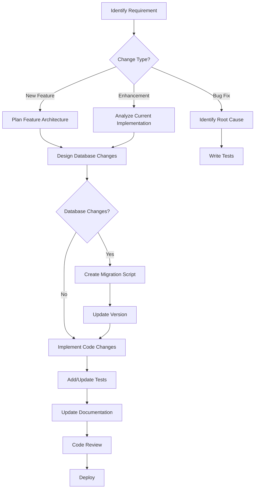

# Development Workflow

## 🚀 Getting Started

This guide outlines the development workflow for adding features, fixing bugs, and maintaining the SelfHelp Symfony Backend.

## 🔄 Development Process Overview



## 📋 Pre-Development Checklist

Before starting any development work:

1. **✅ Understand the Requirements**
   - Review specifications thoroughly
   - Identify affected components
   - Determine if database changes are needed

2. **✅ Check Existing Patterns**
   - Review similar implementations in the codebase
   - Follow established conventions and patterns
   - Reuse existing services and utilities

3. **✅ Plan the Implementation**
   - Identify required entities, services, controllers
   - Plan database schema changes
   - Design API endpoints and schemas

## 🗄️ Database Changes Workflow

### When Database Changes Are Needed

Database changes require a **major version increment** (e.g., 7.5.1 → 7.6.0):

1. **Create Update Script**
   ```bash
   # Create new update script
   touch db/update_scripts/40_update_v8.0.0_v8.1.0.sql
   ```

2. **Update Script Structure**
   ```sql
   -- File: 40_update_v8.0.0_v8.1.0.sql
   
   -- Set DB version (ALWAYS FIRST)
   UPDATE version SET version = 'v8.1.0';
   
   -- Add description of changes
   -- New Feature: User Profile Management
   -- - Added user_profiles table
   -- - Added profile_types lookup
   -- - Updated user entity relationships
   
   -- 1. Create new tables
   CREATE TABLE `user_profiles` (
     `id` INT AUTO_INCREMENT NOT NULL,
     `id_users` INT NOT NULL,
     `profile_data` JSON NULL,
     `created_at` DATETIME DEFAULT CURRENT_TIMESTAMP,
     PRIMARY KEY (`id`),
     FOREIGN KEY (`id_users`) REFERENCES `users` (`id`) ON DELETE CASCADE
   ) ENGINE=InnoDB DEFAULT CHARSET=utf8mb4;
   
   -- 2. Add indexes
   CALL add_index('user_profiles', 'idx_user_id', 'id_users', FALSE);
   
   -- 3. Insert lookup data
   INSERT INTO `lookups` (`type_code`, `code`, `description`) VALUES
   ('PROFILE_TYPES', 'PERSONAL', 'Personal Profile'),
   ('PROFILE_TYPES', 'BUSINESS', 'Business Profile');
   ```

3. **Update api_routes.sql**
   ```sql
   -- Add new API routes
   INSERT INTO `api_routes` (`route_name`, `version`, `path`, `controller`, `methods`, `params`) VALUES
   ('admin_get_user_profiles', 'v1', '/admin/users/{userId}/profiles', 'App\\Controller\\AdminUserProfileController::getProfiles', 'GET', 
   '{"userId": {"in": "path", "required": true, "type": "integer"}}'),
   ('admin_create_user_profile', 'v1', '/admin/users/{userId}/profiles', 'App\\Controller\\AdminUserProfileController::createProfile', 'POST',
   '{"userId": {"in": "path", "required": true, "type": "integer"}, "profile": {"in": "body", "required": true}}');
   ```

### When Only Code Changes Are Needed

Code-only changes require a **patch version increment** (e.g., 7.5.1 → 7.5.2):

- Bug fixes
- Performance improvements
- Code refactoring
- New features without database changes

## 🏗️ Entity Development

### Creating New Entities

1. **Follow Entity Rules** (print "ENTITY RULE" when designing):
   ```php
   <?php
   namespace App\Entity;
   
   use Doctrine\ORM\Mapping as ORM;
   
   #[ORM\Entity(repositoryClass: UserProfileRepository::class)]
   #[ORM\Table(name: 'user_profiles')]
   class UserProfile
   {
       #[ORM\Id]
       #[ORM\GeneratedValue]
       #[ORM\Column(type: 'integer')]
       private ?int $id = null;
   
       #[ORM\ManyToOne(targetEntity: User::class)]
       #[ORM\JoinColumn(name: 'id_users', referencedColumnName: 'id', onDelete: 'CASCADE')]
       private ?User $user = null;
   
       #[ORM\Column(type: 'json', nullable: true)]
       private ?array $profileData = null;
   
       // Getters and setters...
   }
   // ENTITY RULE
   ```

2. **Use Association Objects** (not primitive foreign keys):
   ```php
   // ❌ Wrong - primitive foreign key
   private ?int $idUsers = null;
   public function setIdUsers(?int $idUsers): self { }
   
   // ✅ Correct - association object
   private ?User $user = null;
   public function setUser(?User $user): self { }
   ```

3. **Sync with Database Structure**
   - Check `db/structure_db.sql` for table definitions
   - Ensure entity fields match database columns
   - Use correct data types and constraints

## 🔧 Service Development

### Service Architecture Pattern

1. **Extend BaseService**
   ```php
   <?php
   namespace App\Service\CMS\Admin;
   
   use App\Service\Core\BaseService;
   use App\Service\Core\TransactionService;
   
   class AdminUserProfileService extends BaseService
   {
       public function __construct(
           private readonly UserProfileRepository $userProfileRepository,
           private readonly EntityManagerInterface $entityManager,
           private readonly TransactionService $transactionService
       ) {}
   }
   ```

2. **Implement Transaction Management**
   ```php
   public function createUserProfile(User $user, array $profileData): UserProfile
   {
       $this->entityManager->beginTransaction();
       
       try {
           $profile = new UserProfile();
           $profile->setUser($user);
           $profile->setProfileData($profileData);
           
           $this->entityManager->persist($profile);
           $this->entityManager->flush();
           
           // Log transaction
           $this->transactionService->logTransaction(
               LookupService::TRANSACTION_TYPES_INSERT,
               LookupService::TRANSACTION_BY_BY_USER,
               'user_profiles',
               $profile->getId(),
               $profile,
               'User profile created for user: ' . $user->getUsername()
           );
           
           $this->entityManager->commit();
           return $profile;
           
       } catch (\Exception $e) {
           $this->entityManager->rollback();
           throw $e;
       }
   }
   ```

3. **Follow Service Patterns**
   - Wrap CUD operations in transactions
   - Log all transactions
   - Use proper error handling
   - Return entities or arrays, not responses

## 🎮 Controller Development

### Controller Architecture

1. **Follow Existing Patterns**
   ```php
   <?php
   namespace App\Controller\Api\V1\Admin;
   
   use App\Controller\Trait\RequestValidatorTrait;
   use Symfony\Bundle\FrameworkBundle\Controller\AbstractController;
   
   class AdminUserProfileController extends AbstractController
   {
       use RequestValidatorTrait;
       
       public function __construct(
           private readonly AdminUserProfileService $userProfileService,
           private readonly ApiResponseFormatter $responseFormatter,
           private readonly JsonSchemaValidationService $jsonSchemaValidationService
       ) {}
   }
   ```

2. **Implement Standard CRUD Operations**
   ```php
   /**
    * Get user profiles
    * @route /admin/users/{userId}/profiles
    * @method GET
    */
   public function getProfiles(int $userId): JsonResponse
   {
       try {
           $profiles = $this->userProfileService->getProfilesByUserId($userId);
           return $this->responseFormatter->formatSuccess(
               $profiles,
               'responses/admin/users/users'
           );
       } catch (\Exception $e) {
           return $this->responseFormatter->formatError(
               $e->getMessage(),
               $e->getCode() ?: Response::HTTP_INTERNAL_SERVER_ERROR
           );
       }
   }
   
   /**
    * Create user profile
    * @route /admin/users/{userId}/profiles
    * @method POST
    */
   public function createProfile(Request $request, int $userId): JsonResponse
   {
       try {
           $validatedData = $this->validateRequest(
               $request,
               'requests/admin/create_user_profile',
               $this->jsonSchemaValidationService
           );
           
           $profile = $this->userProfileService->createUserProfile($userId, $validatedData);
           
           return $this->responseFormatter->formatSuccess(
               $profile,
               'responses/admin/users/user',
               Response::HTTP_CREATED
           );
           
       } catch (RequestValidationException $e) {
           return $this->responseFormatter->formatError(
               'Validation failed',
               Response::HTTP_BAD_REQUEST,
               $e->getValidationErrors()
           );
       } catch (\Exception $e) {
           return $this->responseFormatter->formatError(
               $e->getMessage(),
               $e->getCode() ?: Response::HTTP_INTERNAL_SERVER_ERROR
           );
       }
   }
   ```

3. **Controller Best Practices**
   - Keep controllers thin (delegate to services)
   - Use consistent error handling
   - Validate all inputs with JSON schemas
   - Return standardized responses
   - Handle exceptions gracefully

## 📋 JSON Schema Development

### Request Schemas
```json
{
  "$schema": "http://json-schema.org/draft-07/schema#",
  "type": "object",
  "required": ["profileType", "profileData"],
  "properties": {
    "profileType": {
      "type": "string",
      "enum": ["PERSONAL", "BUSINESS"]
    },
    "profileData": {
      "type": "object",
      "properties": {
        "firstName": {"type": "string", "maxLength": 100},
        "lastName": {"type": "string", "maxLength": 100},
        "bio": {"type": "string", "maxLength": 1000}
      },
      "required": ["firstName", "lastName"]
    }
  }
}
```

### Response Schemas
```json
{
  "$schema": "http://json-schema.org/draft-07/schema#",
  "type": "object",
  "properties": {
    "id": {"type": "integer"},
    "userId": {"type": "integer"},
    "profileType": {"type": "string"},
    "profileData": {"type": "object"},
    "createdAt": {"type": "string", "format": "date-time"}
  },
  "required": ["id", "userId", "profileType", "createdAt"]
}
```

## 🧪 Testing Strategy

### Test Development Workflow

1. **Write Tests First** (TDD approach)
   ```php
   <?php
   namespace App\Tests\Service\CMS\Admin;
   
   class AdminUserProfileServiceTest extends KernelTestCase
   {
       public function testCreateUserProfile(): void
       {
           $user = $this->createTestUser();
           $profileData = [
               'profileType' => 'PERSONAL',
               'profileData' => [
                   'firstName' => 'John',
                   'lastName' => 'Doe'
               ]
           ];
           
           $profile = $this->userProfileService->createUserProfile($user, $profileData);
           
           $this->assertInstanceOf(UserProfile::class, $profile);
           $this->assertEquals($user->getId(), $profile->getUser()->getId());
           $this->assertEquals('PERSONAL', $profile->getProfileType());
       }
   }
   ```

2. **Test on Real Database** (no mocking data)
   ```php
   public function testApiEndpoint(): void
   {
       $this->client->request('POST', '/cms-api/v1/admin/users/1/profiles', [
           'json' => [
               'profileType' => 'PERSONAL',
               'profileData' => ['firstName' => 'John', 'lastName' => 'Doe']
           ],
           'headers' => ['Authorization' => 'Bearer ' . $this->getAuthToken()]
       ]);
       
       $this->assertResponseStatusCodeSame(201);
       $this->assertResponseHeaderSame('content-type', 'application/json');
   }
   ```

## 📚 Documentation Updates

### Required Documentation Updates

1. **Update API Routes List**
   - Add new routes to `db/update_scripts/api_routes.sql`
   - Document route parameters and responses

2. **Update Entity Documentation**
   - Document new entities and relationships
   - Update database schema documentation

3. **Update Service Documentation**
   - Document new service methods
   - Include usage examples

4. **Update README Files**
   - Update feature lists
   - Add migration notes for breaking changes

## 🔍 Code Review Checklist

### Before Submitting for Review

- [ ] **Database Changes**
  - [ ] Migration script created with proper version update
  - [ ] All changes documented in script comments
  - [ ] Indexes added for new columns
  - [ ] Foreign key constraints properly defined

- [ ] **Entity Development**
  - [ ] Entities follow established patterns
  - [ ] Association objects used (not primitive foreign keys)
  - [ ] Proper ORM annotations
  - [ ] "ENTITY RULE" comment added

- [ ] **Service Development**
  - [ ] Transaction management implemented
  - [ ] All CUD operations logged via TransactionService
  - [ ] Proper error handling with rollback
  - [ ] Services return entities/arrays, not responses

- [ ] **Controller Development**
  - [ ] Request validation with JSON schemas
  - [ ] Consistent error handling
  - [ ] Standardized response formatting
  - [ ] Proper HTTP status codes

- [ ] **API Development**
  - [ ] Routes added to database
  - [ ] JSON schemas created for requests/responses
  - [ ] Proper permissions assigned
  - [ ] Documentation updated

- [ ] **Testing**
  - [ ] Unit tests for services
  - [ ] Integration tests for controllers
  - [ ] Tests use real database (no mocking)
  - [ ] All tests pass

## 🚀 Deployment Process

### Pre-Deployment Checklist

1. **Version Management**
   ```bash
   # Check current version
   SELECT version FROM version ORDER BY id DESC LIMIT 1;
   
   # Verify migration script version matches
   grep "UPDATE version SET version" db/update_scripts/latest_script.sql
   ```

2. **Database Migration**
   ```bash
   # Run migration on staging first
   mysql -u user -p database < db/update_scripts/40_update_v8.0.0_v8.1.0.sql
   
   # Verify version updated
   SELECT version FROM version ORDER BY id DESC LIMIT 1;
   ```

3. **Code Deployment**
   ```bash
   # Deploy code
   git pull origin main
   
   # Clear caches
   php bin/console cache:clear --env=prod
   
   # Verify health
   curl -X GET https://api.example.com/cms-api/v1/health
   ```

### Post-Deployment Verification

1. **API Health Check**
   ```bash
   curl -X GET https://api.example.com/cms-api/v1/health
   ```

2. **Database Version Check**
   ```sql
   SELECT version FROM version ORDER BY id DESC LIMIT 1;
   ```

3. **New Feature Testing**
   ```bash
   # Test new endpoints
   curl -X GET https://api.example.com/cms-api/v1/admin/users/1/profiles \
        -H "Authorization: Bearer $TOKEN"
   ```

## 🔧 Development Tools & Commands

### Useful Symfony Commands
```bash
# Clear cache
php bin/console cache:clear

# Run tests
php bin/phpunit

# Check routes
php bin/console debug:router

# Generate entity
php bin/console make:entity

# Validate database schema
php bin/console doctrine:schema:validate
```

### Database Commands
```bash
# Connect to database
mysql -u username -p database_name

# Export structure
mysqldump -u username -p --no-data database_name > structure.sql

# Run migration
mysql -u username -p database_name < migration_script.sql
```

## 🚨 Common Pitfalls to Avoid

1. **❌ Don't Mock Data in Tests**
   - Always test against real database
   - Use test database for integration tests

2. **❌ Don't Skip Transaction Logging**
   - All CUD operations must be logged
   - Use TransactionService for audit trail

3. **❌ Don't Use Primitive Foreign Keys**
   - Use association objects for relationships
   - Follow established entity patterns

4. **❌ Don't Skip Version Updates**
   - Always update version in migration scripts
   - Follow semantic versioning rules

5. **❌ Don't Skip JSON Schema Validation**
   - Validate all API requests and responses
   - Create schemas for new endpoints

---

This development workflow ensures consistency, maintainability, and quality across the SelfHelp Symfony Backend codebase. Always refer to existing implementations for patterns and follow the established conventions.