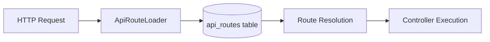
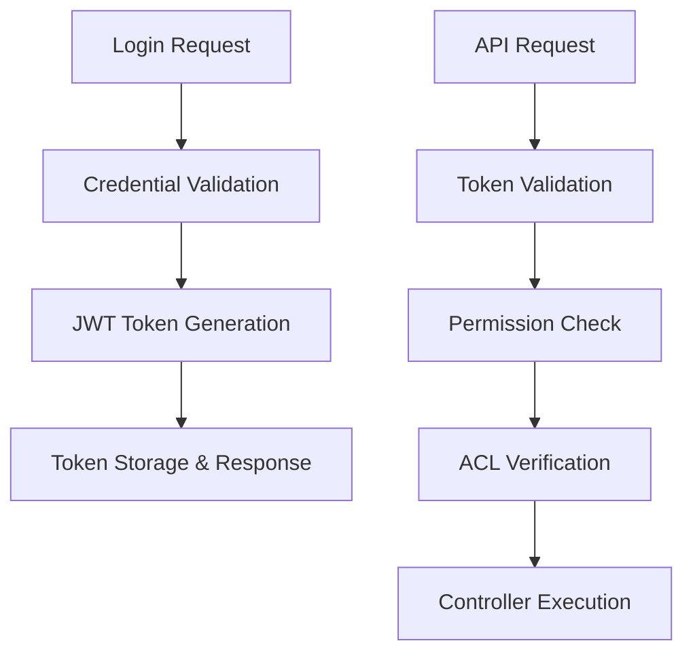
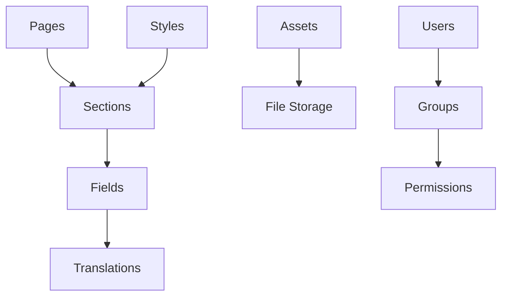

# SelfHelp Symfony Backend - Architecture Summary

## 🎯 Executive Summary

The SelfHelp Symfony Backend is a sophisticated, database-driven REST API system built with Symfony 7.2 and PHP 8.3. It implements a revolutionary approach to API development with dynamic routing, comprehensive security, and strict data integrity patterns.

## 🏗️ Core Architecture Principles

### 1. Database-Driven Configuration
- **Dynamic Routing**: All API routes stored in `api_routes` table, loaded at runtime
- **Permission Management**: Route permissions managed through database relationships
- **Configuration Flexibility**: System settings and behavior controlled via database
- **Zero-Downtime Updates**: Route changes without code deployment

### 2. Multi-Layer Security Architecture
```
Request → Firewall → JWT Auth → Route Permissions → ACL → Business Logic
```
- **JWT Authentication**: Stateless token-based authentication with refresh tokens
- **Route-Level Permissions**: Database-driven permission checks per endpoint
- **Fine-Grained ACL**: Page-level CRUD permissions using stored procedures
- **Comprehensive Audit**: All operations logged via TransactionService

### 3. Strict Version Management
- **Semantic Versioning**: Major (DB changes), Minor (code changes)
- **Database Versioning**: Tracked in `version` table with SQL update scripts
- **API Versioning**: URL-based versioning with namespace separation
- **Backward Compatibility**: Multiple API versions supported simultaneously

### 4. Transaction Integrity
- **ACID Compliance**: All CUD operations wrapped in database transactions
- **Audit Trail**: Complete change tracking via TransactionService
- **Rollback Safety**: Automatic rollback on failures
- **Data Consistency**: Entity-database synchronization enforced

## 📊 System Components Overview

### Dynamic Routing System


**Key Features:**
- Routes loaded from database at application boot
- Automatic controller namespace mapping
- Permission integration at route level
- Caching for performance optimization

### Authentication & Authorization


**Security Layers:**
1. **Symfony Security Firewall**: Basic route protection
2. **JWT Token Authentication**: User identity verification
3. **Route Permissions**: Database-driven endpoint access
4. **ACL System**: Fine-grained resource permissions
5. **Business Logic Validation**: Service-level checks

### Content Management System


**CMS Features:**
- Hierarchical page/section/field structure
- Multi-language content support
- Asset management with file upload
- User group and permission system
- Scheduled job processing

## 🔧 Development Patterns

### Entity Development Rules
```php
// ✅ Correct - Association objects
#[ORM\ManyToOne(targetEntity: User::class)]
private ?User $user = null;

// ❌ Wrong - Primitive foreign keys
private ?int $idUsers = null;
```

### Service Transaction Pattern
```php
public function createResource($data): Entity
{
    $this->entityManager->beginTransaction();
    try {
        // Create entity
        $entity = new Entity();
        $this->entityManager->persist($entity);
        $this->entityManager->flush();
        
        // Log transaction
        $this->transactionService->logTransaction(
            LookupService::TRANSACTION_TYPES_INSERT,
            LookupService::TRANSACTION_BY_BY_USER,
            'table_name',
            $entity->getId(),
            $entity
        );
        
        $this->entityManager->commit();
        return $entity;
    } catch (\Exception $e) {
        $this->entityManager->rollback();
        throw $e;
    }
}
```

### Controller Response Pattern
```php
public function createResource(Request $request): JsonResponse
{
    try {
        $validatedData = $this->validateRequest(
            $request,
            'requests/admin/create_resource',
            $this->jsonSchemaValidationService
        );
        
        $resource = $this->service->createResource($validatedData);
        
        return $this->responseFormatter->formatSuccess(
            $resource,
            'responses/admin/resource',
            Response::HTTP_CREATED
        );
    } catch (RequestValidationException $e) {
        return $this->responseFormatter->formatError(
            'Validation failed',
            Response::HTTP_BAD_REQUEST,
            $e->getValidationErrors()
        );
    }
}
```

## 📋 JSON Schema Validation

### Request/Response Validation
- All API requests validated against JSON schemas
- Response validation in debug mode
- Versioned schemas in `config/schemas/api/v1/`
- Automatic error reporting with detailed messages

### Schema Organization
```
config/schemas/api/v1/
├── requests/admin/create_page.json
├── responses/admin/pages/page.json
└── entities/pageEntity.json
```

## 🚀 Version Management Strategy

### Database Versioning
```sql
-- Major version update (7.5.1 → 7.6.0)
UPDATE version SET version = 'v7.6.0';

-- Schema changes
CREATE TABLE new_feature (...);
ALTER TABLE existing_table ADD COLUMN new_field VARCHAR(255);

-- Data migrations
INSERT INTO lookups (type_code, code, description) VALUES (...);
```

### API Versioning
```
/cms-api/v1/admin/pages  # Version 1
/cms-api/v2/admin/pages  # Version 2
```

Controllers organized in versioned namespaces:
```
src/Controller/Api/V1/Admin/
src/Controller/Api/V2/Admin/
```

## 🗄️ Database Architecture

### Core Tables
- **`api_routes`**: Dynamic route definitions
- **`users`, `groups`, `permissions`**: Authentication system
- **`pages`, `sections`, `fields`**: CMS content structure
- **`acl_users`, `acl_groups`**: Fine-grained access control
- **`transactions`**: Audit trail
- **`version`**: Database version tracking

### Key Relationships
- Users belong to Groups
- Groups have Permissions
- Routes require Permissions
- Pages have ACL rules
- All changes logged in Transactions

## 🧪 Testing Strategy

### Test Requirements
- **No Data Mocking**: All tests execute against real test database
- **API Testing**: Full integration tests for all endpoints
- **Schema Validation**: Request/response schema compliance
- **Transaction Testing**: Verify rollback behavior
- **Permission Testing**: Security layer validation

## 📚 Development Guidelines

### When to Increment Versions
- **Major Version (7.5.1 → 7.6.0)**: Database schema changes
- **Minor Version (7.5.1 → 7.5.2)**: Code-only changes

### Required Development Steps
1. **Plan Changes**: Identify affected components
2. **Create Migration**: SQL update script for DB changes
3. **Update Routes**: Add new routes to `api_routes.sql`
4. **Implement Code**: Follow established patterns
5. **Create Schemas**: JSON validation schemas
6. **Write Tests**: Comprehensive test coverage
7. **Update Documentation**: Keep docs current

### Code Quality Standards
- Follow PSR-4 autoloading standards
- Use Doctrine ORM best practices
- Implement comprehensive error handling
- Maintain consistent response formats
- Document all public APIs

## 🔍 Key Files & Directories

### Configuration
- `config/packages/security.yaml` - Security configuration
- `config/services.yaml` - Service definitions
- `config/routes/dynamic_api.yaml` - Dynamic route loading

### Database
- `db/structure_db.sql` - Complete database schema
- `db/update_scripts/` - Version migration scripts
- `db/update_scripts/api_routes.sql` - API route definitions

### Schemas
- `config/schemas/api/v1/` - JSON validation schemas
- `config/schemas/api/v1/requests/` - Request schemas
- `config/schemas/api/v1/responses/` - Response schemas

### Source Code
- `src/Controller/Api/V1/` - API controllers
- `src/Service/` - Business logic services
- `src/Entity/` - Doctrine entities
- `src/Security/` - Security components
- `src/Routing/` - Dynamic routing system

## 🎯 Future Expansion Guidelines

### Adding New Features
1. **Check Existing Patterns**: Review similar implementations
2. **Follow Architecture**: Use established patterns and services
3. **Maintain Standards**: Consistent coding and documentation
4. **Test Thoroughly**: Comprehensive test coverage
5. **Update Documentation**: Keep all docs current

### Scaling Considerations
- Database indexing for performance
- Caching strategies for frequently accessed data
- API rate limiting for protection
- Monitoring and logging for observability
- Load balancing for high availability

---

This architecture summary provides a comprehensive overview of the SelfHelp Symfony Backend system. For detailed implementation guidance, refer to the specific documentation files in this developer folder.